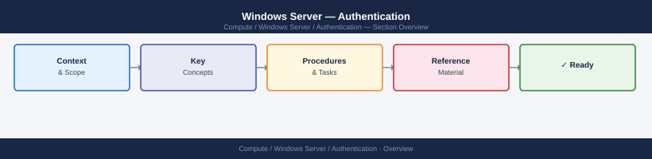
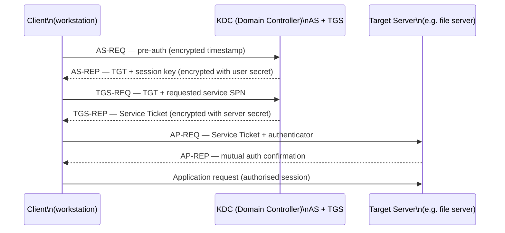
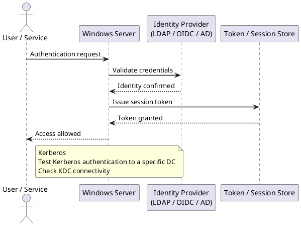

---
tags:
  - security
  - windows
---
# Windows Server — Authentication





```text



## Before you begin

- **Access:** Local Administrator or Domain Admin on target hosts
- **Change management:** security changes require CAB approval in most environments
- **Rollback plan:** document current state before any security control change
- **Testing:** validate in a non-production environment first where possible

---

## Kerberos

Kerberos is the default domain authentication protocol (port 88 TCP/UDP). The Key Distribution Center (KDC) runs on each domain controller.

### Verify Kerberos Tickets

```

```cmd
REM View current Kerberos tickets
klist

REM Purge ticket cache and re-authenticate
klist purge
klist -li 0x3e7   # SYSTEM account tickets
```
```powershell
## Test Kerberos authentication to a specific DC
nltest /sc_verify:CORP.LOCAL

## Check KDC connectivity
Test-NetConnection -ComputerName dc01.example.local -Port 88

## View Kerberos event log errors (Event ID 4769, 4771)
Get-WinEvent -FilterHashtable @{LogName='Security'; Id=4771} -MaxEvents 20 |
  Select-Object TimeCreated, Message
```
```powershell
## Find accounts with unconstrained delegation (high risk — should be DCs only)
Get-ADComputer -Filter {TrustedForDelegation -eq $true} -Properties TrustedForDelegation |
  Select-Object Name, TrustedForDelegation

Get-ADUser -Filter {TrustedForDelegation -eq $true} -Properties TrustedForDelegation |
  Select-Object Name

## Find accounts with constrained delegation
Get-ADComputer -Filter {msDS-AllowedToDelegateTo -ne "$null"} -Properties msDS-AllowedToDelegateTo |
  Select-Object Name, msDS-AllowedToDelegateTo
```
```powershell
## Enable NTLM auditing via GPO or directly in registry
## HKLM\SYSTEM\CurrentControlSet\Control\Lsa\MSV1_0
## AuditReceivingNTLMTraffic = 2 (audit all)
## AuditNTLMInDomain = 7 (audit all)

Set-ItemProperty -Path "HKLM:\SYSTEM\CurrentControlSet\Control\Lsa\MSV1_0" `
  -Name "AuditReceivingNTLMTraffic" -Value 2 -Type DWord
Set-ItemProperty -Path "HKLM:\SYSTEM\CurrentControlSet\Control\Lsa\MSV1_0" `
  -Name "AuditNTLMInDomain" -Value 7 -Type DWord

## Events appear in Applications and Services Logs > Microsoft > Windows > NTLM
Get-WinEvent -LogName "Microsoft-Windows-NTLM/Operational" -MaxEvents 50 |
  Select-Object TimeCreated, Message
```
```powershell
## Set LM authentication level to NTLMv2 only via registry
Set-ItemProperty -Path "HKLM:\SYSTEM\CurrentControlSet\Control\Lsa" `
  -Name "LmCompatibilityLevel" -Value 5 -Type DWord
```
```powershell
## On the management workstation — install LAPS tools
## Requires LAPS MSI or Windows LAPS (built into Windows Server 2019+ / Windows 11 22H2+)

## Extend the AD schema (run once as Schema Admin)
Update-LapsADSchema

## Grant computers permission to update their own password attribute
Set-LapsADComputerSelfPermission -Identity "OU=Servers,DC=corp,DC=local"

## Grant helpdesk group read access to LAPS passwords
Set-LapsADReadPasswordPermission -Identity "OU=Servers,DC=corp,DC=local" `
  -AllowedPrincipals "CORP\Helpdesk"

## Enable LAPS via GPO (Computer Configuration > Administrative Templates > LAPS)
## Or deploy via Windows LAPS settings
```
```powershell
## Retrieve the current local admin password for a computer
Get-LapsADPassword -Identity "SERVER01" -AsPlainText

## Force immediate rotation
Reset-LapsPassword -Identity "SERVER01"

## View password expiry
Get-LapsADPassword -Identity "SERVER01" | Select-Object ComputerName, ExpirationTimestamp
```
```powershell
## Require smart card for sensitive accounts (sets flag on AD object)
Set-ADUser -Identity jsmith -SmartcardLogonRequired $true

## Verify the flag
(Get-ADUser jsmith -Properties SmartcardLogonRequired).SmartcardLogonRequired

## List all users requiring smart card
Get-ADUser -Filter {SmartcardLogonRequired -eq $true} -Properties SmartcardLogonRequired |
  Select-Object Name, SamAccountName
```
```powershell
## Request a certificate from the enterprise CA
certreq -enroll -machine "ServerAuthentication"

## View installed machine certificates
Get-ChildItem Cert:\LocalMachine\My | Select-Object Subject, NotAfter, Thumbprint

## Check if smart card middleware is loaded
certutil -scinfo
```
```powershell
## Enable via registry (persistent, requires reboot)
## LsaCfgFlags: 1 = Credential Guard with UEFI lock, 2 = Credential Guard without lock
$path = "HKLM:\SYSTEM\CurrentControlSet\Control\DeviceGuard"
New-Item -Path $path -Force
Set-ItemProperty -Path $path -Name "EnableVirtualizationBasedSecurity" -Value 1 -Type DWord
Set-ItemProperty -Path $path -Name "RequirePlatformSecurityFeatures" -Value 3 -Type DWord

$lsaPath = "HKLM:\SYSTEM\CurrentControlSet\Control\Lsa"
Set-ItemProperty -Path $lsaPath -Name "LsaCfgFlags" -Value 1 -Type DWord

## Or via GPO:
## Computer Configuration > Administrative Templates > System > Device Guard
## Setting: Turn On Virtualization Based Security > Credential Guard: Enabled with UEFI lock
```
```powershell
## Verify Credential Guard is running
Get-ComputerInfo | Select-Object -Property DeviceGuard*

## Alternative check
msinfo32  # System Summary > look for "Virtualization-based security Services Running"
```
```powershell
## Create a Group Managed Service Account (gMSA) — preferred over regular service accounts
## gMSA passwords are managed automatically by AD

## Create the gMSA (run on DC)
New-ADServiceAccount -Name "svc-webapp" `
  -DNSHostName "svc-webapp.example.local" `
  -PrincipalsAllowedToRetrieveManagedPassword "WebServers"   # AD computer group

## Install gMSA on the target server
Install-ADServiceAccount -Identity "svc-webapp"

## Verify installation
Test-ADServiceAccount -Identity "svc-webapp"

## Configure the service to use the gMSA
## In Services: account = corp\svc-webapp$  (note the $ suffix, no password needed)
```
```powershell
## Recent failed logons
Get-WinEvent -FilterHashtable @{LogName='Security'; Id=4625} -MaxEvents 30 |
  Select-Object TimeCreated,
    @{N='User';E={$_.Properties[5].Value}},
    @{N='Workstation';E={$_.Properties[13].Value}},
    @{N='IP';E={$_.Properties[19].Value}}

## Account lockouts in the last 24 hours
Get-WinEvent -FilterHashtable @{
  LogName='Security'; Id=4740
  StartTime=(Get-Date).AddHours(-24)
} | Select-Object TimeCreated, Message
```

---

## See also

- [Windows Server — Access Control](../access-control/)
- [Windows Server — Hardening](../hardening/)
- [Windows Server — Encryption](../encryption/)
