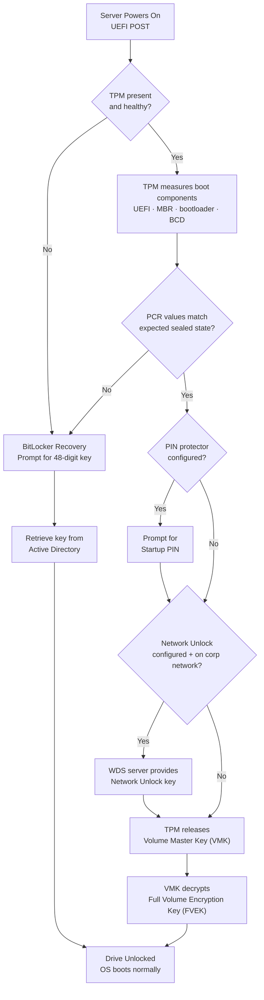

---
tags:
  - security
  - windows
---
# Windows Server — Encryption

<div class="kb-summary">
BitLocker with AD key escrow, Network Unlock, TLS hardening, EFS, and SMB signing.

*Applies to: Windows Server 2019 / 2022*
</div>

```d2
direction: down

bitlocker_drive_encryption: "BitLocker — Drive Encryption" {shape: rectangle}
bitlocker_network_unlock: "BitLocker Network Unlock" {shape: rectangle}
tls_hardening: "TLS Hardening" {shape: rectangle}
smb_signing_and_encryption: "SMB Signing and Encryption" {shape: rectangle}
encrypting_file_system_efs: "Encrypting File System (EFS)" {shape: rectangle}
certificate_management: "Certificate Management" {shape: rectangle}

bitlocker_drive_encryption -> bitlocker_network_unlock: hardens
bitlocker_network_unlock -> tls_hardening: hardens
tls_hardening -> smb_signing_and_encryption: hardens
smb_signing_and_encryption -> encrypting_file_system_efs: hardens
encrypting_file_system_efs -> certificate_management: hardens
```

## Before you begin

- **Access:** Local Administrator or Domain Admin on target hosts
- **Change management:** security changes require CAB approval in most environments
- **Rollback plan:** document current state before any security control change
- **Testing:** validate in a non-production environment first where possible

---

## BitLocker — Drive Encryption

BitLocker provides full-volume encryption for OS and data drives. On servers, it is typically combined with Active Directory key escrow so recovery keys are centrally stored.

### BitLocker Unlock Flow



### Enable BitLocker on Data Drives

```powershell
# Automatically unlock data drives when OS drive is unlocked
Enable-BitLocker -MountPoint "D:" -EncryptionMethod XtsAes256 -RecoveryPasswordProtector
Enable-BitLockerAutoUnlock -MountPoint "D:"

# Verify auto-unlock is configured
Get-BitLockerVolume -MountPoint "D:" | Select-Object VolumeStatus, AutoUnlockEnabled
```

### Active Directory Key Escrow

GPO path: Computer Configuration > Administrative Templates > Windows Components > BitLocker Drive Encryption

| GPO Setting | Value |
|---|---|
| Store BitLocker recovery information in AD DS | Enabled |
| Require BitLocker backup to AD DS | Enabled (do not enable until AD preparation is complete) |
| Recovery information to store | Recovery passwords and key packages |

```powershell
# Manually back up an existing recovery key to AD
# First get the key ID
(Get-BitLockerVolume -MountPoint "C:").KeyProtector |
  Where-Object { $_.KeyProtectorType -eq "RecoveryPassword" }

# Back up to AD (run on the server)
Backup-BitLockerKeyProtector -MountPoint "C:" -KeyProtectorId "{GUID-from-above}"

# View BitLocker recovery keys stored in AD (run from AD management host)
Get-ADObject -Filter {objectClass -eq "msFVE-RecoveryInformation"} `
  -Properties msFVE-RecoveryPassword |
  Select-Object Name, msFVE-RecoveryPassword | Format-List
```

### Retrieve Recovery Key from AD

```powershell
# Find a computer's BitLocker recovery key in AD
$computer = Get-ADComputer "SERVER01"
Get-ADObject -SearchBase $computer.DistinguishedName `
  -Filter {objectClass -eq "msFVE-RecoveryInformation"} `
  -Properties msFVE-RecoveryPassword |
  Select-Object Name, msFVE-RecoveryPassword
```

## BitLocker Network Unlock

Network Unlock allows domain-joined servers to automatically unlock at boot when connected to the corporate network (via WDS/DHCP). Eliminates need for a PIN on headless servers.

### Requirements

- Windows Deployment Services (WDS) server on the network
- Certificate with "Network Unlock" EKU deployed to the WDS server
- Group Policy configured

```powershell
# On the WDS server — install the Network Unlock feature
Install-WindowsFeature BitLocker-NetworkUnlock

# GPO: Computer Configuration > Administrative Templates > Windows Components >
#       BitLocker Drive Encryption > OS Drive
# Setting: Allow Network Unlock at startup — Enabled

# On the client server — add the Network Unlock protector
Add-BitLockerKeyProtector -MountPoint "C:" -TpmNetworkKeyProtector
```

## TLS Hardening

Windows Server uses SChannel for TLS. Weak protocols and cipher suites should be disabled via registry or GPO.

### Disable TLS 1.0 and 1.1

```powershell
# Create registry structure for TLS 1.0 — disable for server and client
$tls10 = "HKLM:\SYSTEM\CurrentControlSet\Control\SecurityProviders\SCHANNEL\Protocols\TLS 1.0"
New-Item -Path "$tls10\Server" -Force
New-Item -Path "$tls10\Client" -Force
Set-ItemProperty -Path "$tls10\Server" -Name "Enabled" -Value 0 -Type DWord
Set-ItemProperty -Path "$tls10\Server" -Name "DisabledByDefault" -Value 1 -Type DWord
Set-ItemProperty -Path "$tls10\Client" -Name "Enabled" -Value 0 -Type DWord
Set-ItemProperty -Path "$tls10\Client" -Name "DisabledByDefault" -Value 1 -Type DWord

# TLS 1.1 — same pattern
$tls11 = "HKLM:\SYSTEM\CurrentControlSet\Control\SecurityProviders\SCHANNEL\Protocols\TLS 1.1"
New-Item -Path "$tls11\Server" -Force
New-Item -Path "$tls11\Client" -Force
Set-ItemProperty -Path "$tls11\Server" -Name "Enabled" -Value 0 -Type DWord
Set-ItemProperty -Path "$tls11\Client" -Name "Enabled" -Value 0 -Type DWord
```

### Enable TLS 1.3 (Windows Server 2022+)

```powershell
$tls13 = "HKLM:\SYSTEM\CurrentControlSet\Control\SecurityProviders\SCHANNEL\Protocols\TLS 1.3"
New-Item -Path "$tls13\Server" -Force
New-Item -Path "$tls13\Client" -Force
Set-ItemProperty -Path "$tls13\Server" -Name "Enabled" -Value 1 -Type DWord
Set-ItemProperty -Path "$tls13\Client" -Name "Enabled" -Value 1 -Type DWord
```

### Disable Weak Cipher Suites

```powershell
# Use IIS Crypto or the following registry method
# Disable RC4
$rc4 = "HKLM:\SYSTEM\CurrentControlSet\Control\SecurityProviders\SCHANNEL\Ciphers"
@("RC4 128/128","RC4 64/128","RC4 56/128","RC4 40/128") | ForEach-Object {
    New-Item -Path "$rc4\$_" -Force
    Set-ItemProperty -Path "$rc4\$_" -Name "Enabled" -Value 0 -Type DWord
}

# Disable DES and 3DES
@("DES 56/56","Triple DES 168") | ForEach-Object {
    New-Item -Path "$rc4\$_" -Force
    Set-ItemProperty -Path "$rc4\$_" -Name "Enabled" -Value 0 -Type DWord
}

# Set preferred cipher suite order (adjust for your requirements)
$cipherOrder = @(
    "TLS_AES_256_GCM_SHA384",
    "TLS_AES_128_GCM_SHA256",
    "TLS_ECDHE_RSA_WITH_AES_256_GCM_SHA384",
    "TLS_ECDHE_RSA_WITH_AES_128_GCM_SHA256"
) -join ","

Set-ItemProperty -Path "HKLM:\SOFTWARE\Policies\Microsoft\Cryptography\Configuration\SSL\00010002" `
  -Name "Functions" -Value $cipherOrder
```

```powershell
# Verify TLS configuration (requires restart to take effect)
# Tool: IIS Crypto (GUI) or nmap/openssl from another machine
# nmap --script ssl-enum-ciphers -p 443 <server-ip>
```

## SMB Signing and Encryption

SMB signing prevents relay attacks. SMB encryption provides confidentiality for data in transit.

### SMB Signing

```powershell
# Check current SMB signing configuration
Get-SmbServerConfiguration | Select-Object RequireSecuritySignature, EnableSecuritySignature

# Require SMB signing on this server
Set-SmbServerConfiguration -RequireSecuritySignature $true -Confirm:$false

# Require SMB signing from this client to all servers
Set-SmbClientConfiguration -RequireSecuritySignature $true -Confirm:$false
```

GPO: Computer Configuration > Windows Settings > Security Settings > Local Policies > Security Options

| Setting | Value |
|---|---|
| Microsoft network server: Digitally sign communications (always) | Enabled |
| Microsoft network client: Digitally sign communications (always) | Enabled |

### SMB Encryption

```powershell
# Enable SMB encryption on the server (encrypts all SMB traffic to/from this server)
Set-SmbServerConfiguration -EncryptData $true -Confirm:$false

# Enable encryption on a specific share only
Set-SmbShare -Name "Sensitive" -EncryptData $true

# Verify
Get-SmbServerConfiguration | Select-Object EncryptData
Get-SmbShare | Select-Object Name, EncryptData
```

## Encrypting File System (EFS)

EFS provides per-file transparent encryption tied to a user certificate. Less commonly used on servers; prefer BitLocker for volume-level encryption.

```powershell
# Encrypt a folder (and all files in it)
cipher /e /s:"C:\Sensitive"

# Decrypt
cipher /d /s:"C:\Sensitive"

# View encryption status
cipher /u /n   # List all encrypted files on accessible drives

# Back up the EFS certificate and key (critical — without this, encrypted files are lost)
certmgr.msc > Personal > Certificates > right-click EFS cert > Export
# Or:
certutil -exportPFX -p "password" my EFSCert.pfx
```

## Certificate Management

```powershell
# List certificates in the machine store
Get-ChildItem Cert:\LocalMachine\My | Select-Object Subject, NotAfter, Thumbprint, Issuer

# Find certificates expiring within 60 days
$cutoff = (Get-Date).AddDays(60)
Get-ChildItem Cert:\LocalMachine\My |
  Where-Object { $_.NotAfter -lt $cutoff -and $_.NotAfter -gt (Get-Date) } |
  Select-Object Subject, NotAfter, Thumbprint

# Request a certificate from the enterprise CA
certreq -enroll -machine "WebServer"

# Check certificate trust chain
certutil -verify C:\path\to\cert.cer
```

## Encryption Audit

```powershell
# Check BitLocker status on all volumes
Get-BitLockerVolume | Select-Object MountPoint, VolumeStatus, EncryptionMethod, ProtectionStatus

# Confirm SMB signing is required
Get-SmbServerConfiguration | Select-Object RequireSecuritySignature, EncryptData

# Verify TLS 1.0/1.1 are disabled
$protocols = @("TLS 1.0","TLS 1.1","SSL 2.0","SSL 3.0")
foreach ($p in $protocols) {
    $path = "HKLM:\SYSTEM\CurrentControlSet\Control\SecurityProviders\SCHANNEL\Protocols\$p\Server"
    $enabled = (Get-ItemProperty -Path $path -Name "Enabled" -ErrorAction SilentlyContinue).Enabled
    Write-Host "$p Server Enabled: $enabled"
}

# Check certificates near expiry
Get-ChildItem Cert:\LocalMachine\My |
  Where-Object { $_.NotAfter -lt (Get-Date).AddDays(90) } |
  Select-Object Subject, NotAfter
```

## Quick Reference

| Topic | Command / Location |
|---|---|
| BitLocker status | `Get-BitLockerVolume` |
| Enable BitLocker | `Enable-BitLocker -MountPoint "C:"` |
| Backup key to AD | `Backup-BitLockerKeyProtector` |
| Retrieve key from AD | `Get-ADObject -Filter {objectClass -eq "msFVE-RecoveryInformation"}` |
| SMB signing | `Set-SmbServerConfiguration -RequireSecuritySignature $true` |
| SMB encryption | `Set-SmbServerConfiguration -EncryptData $true` |
| Disable TLS 1.0 | Registry: `SCHANNEL\Protocols\TLS 1.0\Server\Enabled = 0` |
| Cipher suite order | `HKLM:\SOFTWARE\Policies\Microsoft\Cryptography\Configuration\SSL\00010002` |
| Certificate store | `Get-ChildItem Cert:\LocalMachine\My` |
| EFS encrypt folder | `cipher /e /s:"C:\path"` |

---

## See also

- [Windows Server — Hardening](../hardening/)
- [Windows Server — Authentication](../authentication/)
- [Windows Server — Access Control](../access-control/)
