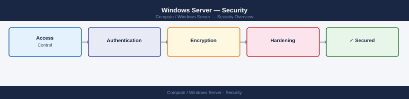

---
tags:
  - security
  - windows
---
# Windows Server — Security

Windows Server hardening — security baselines, local admin controls, Windows Firewall, audit policy, and BitLocker configuration.

*Applies to: Windows Server 2019 / 2022*

<a class="kb-card" href="authentication/">
  <strong>Authentication</strong>
  Active Directory, local accounts, and authentication configuration.
</a>

<a class="kb-card" href="access-control/">
  <strong>Access Control</strong>
  RBAC, local groups, file permissions, and GPO-based access.
</a>

<a class="kb-card" href="encryption/">
  <strong>Encryption</strong>
  BitLocker, TLS, and encrypted communication.
</a>

<a class="kb-card" href="hardening/">
  <strong>Hardening</strong>
  Security baselines, CIS benchmarks, and compliance.
</a>

