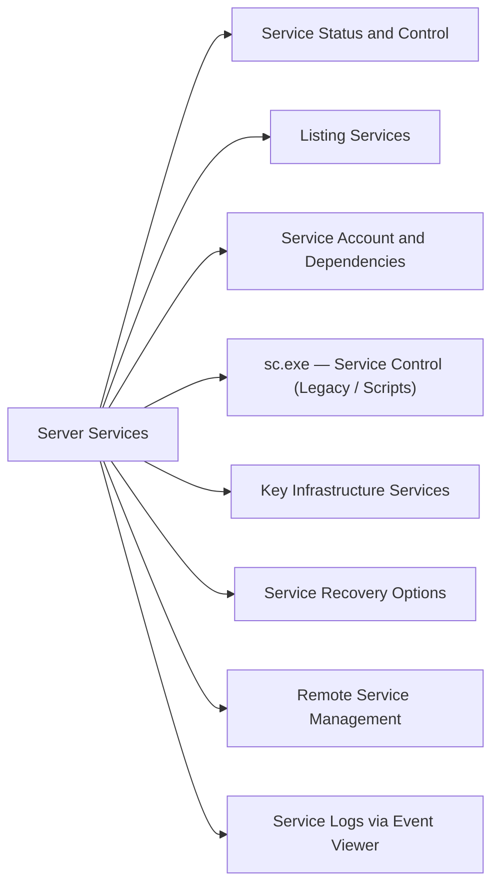

# Windows Server Services

Managing Windows services via PowerShell and sc.exe.



## Service Status and Control

```powershell
# Check service status
Get-Service -Name <ServiceName>
Get-Service -Name <ServiceName> | Select-Object *

# Start / stop / restart
Start-Service -Name <ServiceName>
Stop-Service -Name <ServiceName>
Restart-Service -Name <ServiceName> -Force

# Set startup type
Set-Service -Name <ServiceName> -StartupType Automatic
Set-Service -Name <ServiceName> -StartupType Disabled
Set-Service -Name <ServiceName> -StartupType Manual

# Start and set to automatic in one step
Set-Service -Name <ServiceName> -StartupType Automatic -Status Running
```

## Listing Services

```powershell
# All running services
Get-Service | Where-Object { $_.Status -eq "Running" }

# Automatic-start services that are stopped (should not normally be stopped)
Get-Service | Where-Object { $_.StartType -eq "Automatic" -and $_.Status -ne "Running" } |
    Select-Object Name, DisplayName, Status

# All services with start type
Get-Service | Select-Object Name, DisplayName, Status, StartType | Sort-Object StartType, Name

# Services matching a name pattern
Get-Service -Name "SQL*"
Get-Service | Where-Object { $_.DisplayName -match "IIS" }
```

## Service Account and Dependencies

```powershell
# View service account via WMI
Get-CimInstance Win32_Service -Filter "Name='wuauserv'" |
    Select-Object Name, StartName, State, StartMode

# All services not running as LocalSystem or NetworkService
Get-CimInstance Win32_Service |
    Where-Object { $_.StartName -notin @("LocalSystem","NT AUTHORITY\NetworkService","NT AUTHORITY\LocalService") } |
    Select-Object Name, StartName, State

# Service dependencies
(Get-Service -Name <ServiceName>).DependentServices
(Get-Service -Name <ServiceName>).ServicesDependedOn
```

## sc.exe — Service Control (Legacy / Scripts)

```cmd
:: Query a service
sc query <ServiceName>
sc qc <ServiceName>   :: Config (start type, binary path, account)

:: Start / stop
sc start <ServiceName>
sc stop <ServiceName>

:: Change startup type
sc config <ServiceName> start= auto
sc config <ServiceName> start= disabled
sc config <ServiceName> start= demand

:: Delete a service
sc delete <ServiceName>
```

## Key Infrastructure Services

| Service Name | Display Name | Role |
|---|---|---|
| W32Time | Windows Time | Time sync with AD / NTP |
| Netlogon | Netlogon | AD domain authentication |
| NTDS | Active Directory Domain Services | DC — AD database |
| DNS | DNS Server | DNS resolution |
| WinRM | Windows Remote Management | PowerShell remoting |
| EventLog | Windows Event Log | Event logging |
| wuauserv | Windows Update | Patch management |
| CryptSvc | Cryptographic Services | Certificate store |
| BFE | Base Filtering Engine | Windows Firewall core |
| mpssvc | Windows Defender Firewall | Host firewall |
| WinDefend | Windows Defender Antivirus | AV (if not replaced) |

## Service Recovery Options

```powershell
# Set service recovery actions via sc.exe
# First failure: restart; second failure: restart; subsequent: restart; reset after 86400s
sc failure <ServiceName> reset= 86400 actions= restart/5000/restart/5000/restart/5000

# View current recovery actions
sc qfailure <ServiceName>
```

## Remote Service Management

```powershell
# Check service on a remote server
Get-Service -Name <ServiceName> -ComputerName <servername>

# Restart service on remote server
Invoke-Command -ComputerName <servername> -ScriptBlock { Restart-Service -Name <ServiceName> -Force }

# Check multiple servers at once
$servers = @("srv01","srv02","srv03")
$servers | ForEach-Object {
    $svc = Get-Service -Name <ServiceName> -ComputerName $_ -ErrorAction SilentlyContinue
    [PSCustomObject]@{ Server = $_; Status = $svc.Status; StartType = $svc.StartType }
}
```

## Service Logs via Event Viewer

```powershell
# Service start/stop events (Event ID 7036)
Get-WinEvent -FilterHashtable @{ LogName='System'; Id=7036 } -MaxEvents 20 |
    Select-Object TimeCreated, Message | Format-List

# Unexpected service termination (Event ID 7034)
Get-WinEvent -FilterHashtable @{ LogName='System'; Id=7034 } -MaxEvents 10 |
    Select-Object TimeCreated, Message | Format-List

# Service control manager errors
Get-WinEvent -FilterHashtable @{ LogName='System'; ProviderName='Service Control Manager'; Level=2 } -MaxEvents 20 |
    Select-Object TimeCreated, Message | Format-List
```

## Creating a New Service

```cmd
:: Register a new service
sc create MyService binPath= "C:\Apps\myservice.exe --config C:\Apps\config.json" ^
    start= auto obj= "NT AUTHORITY\NetworkService" DisplayName= "My Application Service"

:: Or with PowerShell (requires admin)
New-Service -Name "MyService" `
    -BinaryPathName "C:\Apps\myservice.exe --config C:\Apps\config.json" `
    -DisplayName "My Application Service" `
    -StartupType Automatic `
    -Description "Application background service"
```
