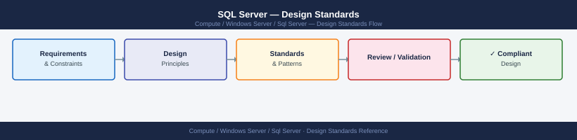

---
tags:
  - architecture
  - windows
---
# SQL Server — Design Standards

<div class="kb-summary">
SQL Server design standards — HA topology (Always On AG, FCI), edition selection, disk layout, memory sizing, tempdb configuration, and naming conventions.

*Applies to: SQL Server 2019 / 2022*
</div>


## High-Availability Topologies

| Pattern | Description | Use case |
|---|---|---|
| Always On AG | Log-based replication; automatic failover; readable secondaries | Primary HA for production workloads |
| Failover Cluster Instance (FCI) | Shared storage; single database instance; cluster failover | Legacy HA; SAN-based environments |
| Log Shipping | Manual failover; warm standby; async | DR / reporting copies |
| Database Mirroring | Deprecated in SQL 2016; use AG instead | Legacy only |

## Edition Selection

| Edition | Use case |
|---|---|
| Enterprise | Always On AG, partitioning, online operations, advanced analytics |
| Standard | Limited AG (2 replicas); no online index rebuild on most operations |
| Developer | Full Enterprise features; free; non-production only |
| Express | Free; 10 GB limit; no SQL Agent |

## Disk Layout

Separate volumes for:
- **Data files** (`.mdf`, `.ndf`) — RAID 10 / SSD
- **Transaction log** (`.ldf`) — sequential writes; dedicated SSD spindles
- **tempdb** — local NVMe preferred; one file per CPU core (up to 8)
- **Backups** — separate volume or off-host

## Memory Sizing

```sql
-- Set max server memory (leave 10 GB for OS)
EXEC sp_configure 'max server memory (MB)', 51200;   -- 50 GB for SQL
RECONFIGURE WITH OVERRIDE;
```

## tempdb Best Practices

- Equal-sized files: one per logical CPU core (cap at 8)
- Pre-sized to expected workload
- Trace flag 1118 / 1117 built-in from SQL 2016+

## Naming Conventions

- Databases: `AppName_Env` — `CRM_Prod`, `ERP_Dev`
- Logins/users: `app_<name>_<rw|ro>`, `svc_<servicename>`
- AG names: `AG_<DatabaseName>` — `AG_CRM`

---

## See also

- [Sql Server — How It Works](how-it-works/)
- [Sql Server — Integrations](integrations/)
- [Sql Server — Deploy](../deploy/)
