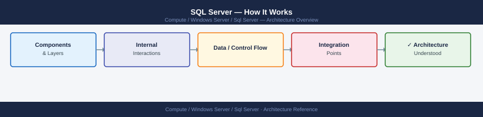
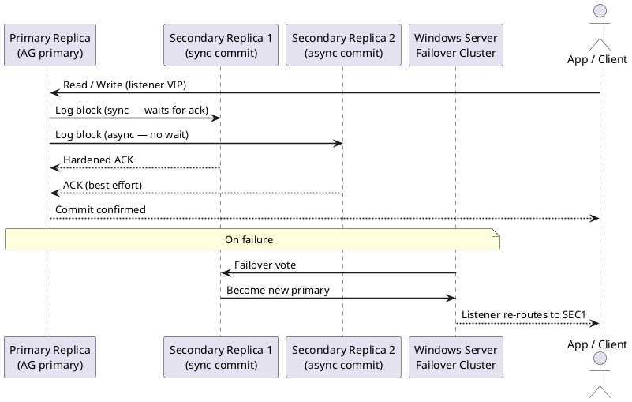

---
tags:
  - architecture
  - windows
description: "SQL Server architecture — database engine, buffer pool, transaction log, WAL-based crash recovery, Always On AG replication, and query processing pipeline."
---
# SQL Server — How It Works

<div class="kb-summary">
SQL Server architecture — database engine, buffer pool, transaction log, WAL-based crash recovery, Always On AG replication, and query processing pipeline.

*Applies to: SQL Server 2019 / 2022*
</div>




## Database Engine Components

| Component | Role |
|---|---|
| Buffer Manager | In-memory page cache (buffer pool); target 80–90% of available RAM |
| Transaction Log | Sequential WAL; all changes logged before data pages written |
| Lock Manager | Row/page/table locking; escalation to table lock at threshold |
| Query Processor | Parser → Algebrizer → Optimizer → Executor |
| SQL OS | Scheduler; worker threads; memory manager |

## Buffer Pool

- Pages (8 KB) loaded from disk into buffer pool on first access
- Dirty pages written by background `LazyWriter`; `CHECKPOINT` flushes all dirty pages
- `max server memory` — set to leave ~10 GB for OS; rest to SQL Server

## Transaction Log and Recovery

SQL Server uses Write-Ahead Logging (WAL):
1. Log record written to transaction log buffer
2. Log buffer flushed to disk on `COMMIT`
3. Data page written to disk asynchronously (lazy)
4. On crash: redo committed txns, undo uncommitted from log

Log files are reused in circular fashion after `CHECKPOINT` advances the log sequence number (LSN).

## Always On Availability Groups

```text
Primary → synchronous/asynchronous log shipping → Secondary (readable replica)
          ↓
     Listener (VIP) — routes app connections to current primary
```

- **Synchronous**: primary waits for secondary ACK — zero data loss; lower throughput
- **Asynchronous**: no wait — DR sites; potential data loss on failover

## Query Processing

```text
T-SQL Query → Parse → Bind (object resolution) → Optimize (execution plan) → Execute
                                                    ↓
                                            Plan Cache (reuse)
```

`sys.dm_exec_cached_plans` — view cached plans; `DBCC FREEPROCCACHE` — clear plan cache.

---

## See also

- [Sql Server — Design Standards](../design-standards/)
- [Sql Server — Integrations](../integrations/)
- [Sql Server — Deploy](../../deploy/)
