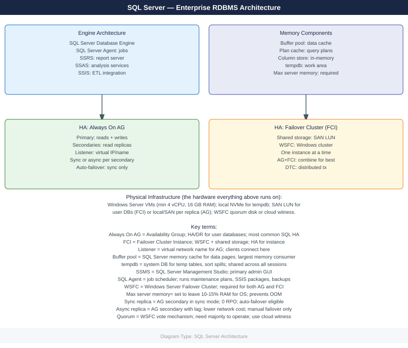

---
tags:
  - architecture
  - windows
description: "SQL Server architecture: Always On AG topology, FCI failover clustering, TempDB placement, memory configuration, and storage I/O path design."
---
# SQL Server — Architecture

SQL Server architecture: Always On AG topology, FCI failover clustering, TempDB placement, memory configuration, and storage I/O path design.

*Applies to: SQL Server 2019 / 2022*

  <a class="kb-card" href="how-it-works/">How It Works</a>
  <a class="kb-card" href="design-standards/">Design Standards</a>
  <a class="kb-card" href="integrations/">Integrations</a>

