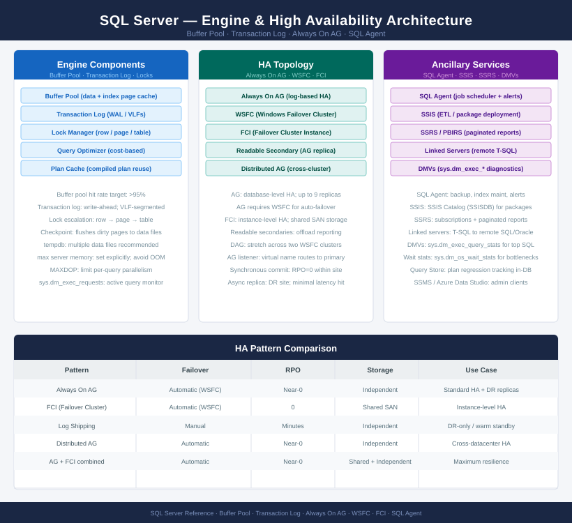

# SQL Server — Architecture

<div class="kb-summary">
Architecture overview, design standards, and integrations.
</div>



```text
┌────────────────────────────────────── SQL Server — Architecture ──────────────────────────────────────┐
│                                                                                                       │
│   SQL Server is a relational database engine with integrated HA, backup, and analytics components     │
│   Always On AG is the standard HA pattern; requires Windows Server Failover Clustering                │
│   SQL Agent handles scheduled jobs; SSIS handles ETL; SSRS handles reporting workloads                │
│                                                                                                       │
│   Sub-sections                                                                                        │
│   How It Works: SQL Server engine components, Buffer Pool, WAL (transaction log), lock manager        │
│   Design Standards: HA topology, edition selection, disk layout, memory sizing, tempdb config         │
│   Integrations: application drivers (ODBC, JDBC, pyodbc), linked servers, SSIS, SSRS, monitoring      │
│                                                                                                       │
│   Key terms:                                                                                          │
│   Buffer Pool    = SQL Server shared memory cache; caches data and index pages for performance        │
│   WAL            = Write-Ahead Logging; transaction log ensures durability and crash recovery         │
│   Always On AG   = Availability Group; log-based HA with automatic failover and readable replicas     │
│   SQL Agent      = SQL Server job scheduler; runs backup, index maintenance, and alert jobs           │
│   WSFC           = Windows Server Failover Cluster; required for Always On AG and FCI                 │
└───────────────────────────────────────────────────────────────────────────────────────────────────────┘
```

<div class="kb-grid kb-grid-3">
  <a class="kb-card" href="how-it-works/">How It Works</a>
  <a class="kb-card" href="design-standards/">Design Standards</a>
  <a class="kb-card" href="integrations/">Integrations</a>
</div>
