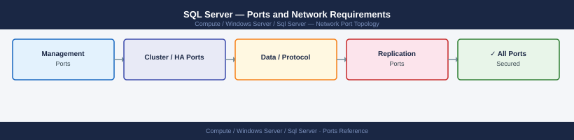

---
tags:
  - sql-server
  - windows-server
  - compute
  - networking
  - firewall
  - ports
  - database
---
# SQL Server — Ports and Network Requirements

<div class="kb-summary">
Firewall port reference for Microsoft SQL Server. Covers the default instance, named instances, Always On Availability Groups, mirroring, SSMS remote access, and SQL Agent mail.

*Applies to: SQL Server 2019 / 2022*
</div>



## Before you begin

- SQL Server default instance listens on TCP 1433 — this is the standard port for all client connections
- Named instances use dynamic ports; SQL Browser (UDP 1434) is required to resolve the dynamic port unless a static port is set per instance
- Always On Availability Groups require TCP 5022 (database mirroring endpoint) to be open between all replicas
- Block 1433 from internet-facing zones; only allow from known application server and management IP ranges

---

## Inbound — Client / Application Connections

| Port | Protocol | Source | Purpose |
|---|---|---|---|
| 1433 | TCP | Application servers, SSMS admin workstations, Veeam, Commvault, SnapCenter | SQL Server default instance — client connections |
| 1434 | UDP | Clients requiring named instance resolution | SQL Browser — returns dynamic port for named instances |

For named instances with a static port configured, only 1433 (or the static port) is needed — SQL Browser is optional.

---

## Inbound — Remote Management (SSMS, PowerShell)

| Port | Protocol | Source | Purpose |
|---|---|---|---|
| 1433 | TCP | Admin workstations (SSMS, sqlcmd) | Direct SQL connection for management |
| 135 | TCP | Admin workstations | DCOM/RPC endpoint mapper (remote WMI/DCOM SQL management tools) |
| 49152–65535 | TCP | Admin workstations | Dynamic RPC (remote server management, SCCM, WMI) |

---

## Always On Availability Groups (AG)

| Port | Protocol | Between | Purpose |
|---|---|---|---|
| 5022 | TCP | SQL Server replicas ↔ SQL Server replicas | Database Mirroring Endpoint — AG synchronisation (log shipping) |
| 1433 | TCP | AG Listener → Clients | Client connections to the AG Listener virtual IP |

If using WSFC (Windows Server Failover Cluster):
- Also open cluster heartbeat ports between cluster nodes: 3343 UDP (WSFC heartbeat), 445 TCP (SMB cluster communication)

---

## SQL Server Replication and Linked Servers

| Port | Protocol | Source | Destination | Purpose |
|---|---|---|---|---|
| 1433 | TCP | Distribution agent (SQL Server) | Subscriber SQL Server | Replication data delivery |
| 1433 | TCP | Publisher SQL Server | Distributor SQL Server | Log reader agent communication |

---

## SQL Agent Mail (Database Mail)

| Port | Protocol | Destination | Purpose |
|---|---|---|---|
| 25 | TCP | SMTP relay | Database Mail — SQL Agent job failure notifications |

---

## SQL Server Integration Services (SSIS)

| Port | Protocol | Source | Purpose |
|---|---|---|---|
| 135 | TCP | SSMS / client | DCOM — SSIS package execution and monitoring |
| 49152–65535 | TCP | SSMS / client | Dynamic RPC (SSIS service) |

---

## Monitoring and Backup

| Port | Protocol | Source | Purpose |
|---|---|---|---|
| 1433 | TCP | Aria Operations, Zabbix SQL adapter, monitoring | Performance metrics via SQL queries |
| 1433 | TCP | Veeam, Commvault, NetBackup, SnapCenter | Application-aware backup (VSS, log backup, AAG backup) |

---

## Firewall Zone Summary

| From | To | Ports | Notes |
|---|---|---|---|
| App servers | SQL Server | 1433 | Primary data access — restrict to known app server IPs |
| Admin workstations (SSMS) | SQL Server | 1433 | Management access — restrict to admin IP range |
| Clients using named instances | SQL Server | 1434 UDP | SQL Browser for instance discovery |
| SQL Server replicas | SQL Server replicas | 5022 | Always On AG / Mirroring — bidirectional |
| Monitoring / backup | SQL Server | 1433 | Read-only access for metrics and backups |
| SQL Agent | SMTP relay | 25 | Database Mail |

---

## Verify

```powershell
# From app server — test SQL port
Test-NetConnection -ComputerName <sql-server> -Port 1433

# From admin workstation — test SSMS connection
sqlcmd -S <sql-server> -Q "SELECT @@VERSION"

# From SQL Server — test AG replica connectivity
Test-NetConnection -ComputerName <replica-sql-server> -Port 5022

# From SQL Server — check AG health
Invoke-Sqlcmd -Query "SELECT replica_server_name, synchronization_health_desc FROM sys.dm_hadr_availability_replica_states r JOIN sys.availability_replicas ar ON r.replica_id = ar.replica_id"

# Verify SQL Browser is running (if using named instances)
Get-Service SQLBrowser
```

---

## See also

- [SQL Server — Architecture](how-it-works/)
- [SQL Server — Operations](../operations/)
- [Windows Server — Ports](../../architecture/ports.md)
- [Active Directory — Ports](../../active-directory/architecture/ports.md)
