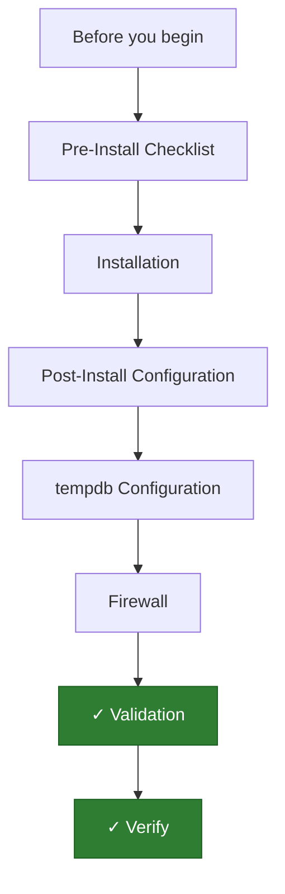

---
tags:
  - deployment
  - windows
search:
  boost: 1.5
---
# SQL Server — Initial Deployment

<div class="kb-summary">
SQL Server initial deployment — installation checklist, post-install configuration (max memory, tempdb, SQL Agent), firewall, and validation queries.

*Applies to: Windows Server 2019 / 2022*
</div>



```d2
direction: right

plan: "Plan" {shape: oval}
preinstall_checklist: "Pre-Install Checklist" {shape: rectangle}
installation: "Installation" {shape: rectangle}
postinstall_configuration: "Post-Install Configuration" {shape: rectangle}
tempdb_configuration: "tempdb Configuration" {shape: rectangle}
firewall: "Firewall" {shape: rectangle}
validation: "Validation" {shape: rectangle}
validate: "Validate" {shape: oval}

plan -> preinstall_checklist
preinstall_checklist -> installation
installation -> postinstall_configuration
postinstall_configuration -> tempdb_configuration
tempdb_configuration -> firewall
firewall -> validation
validation -> validate
```

## Before you begin

- **Access:** Local Administrator or Domain Admin on target hosts
- **Environment:** DNS, NTP, and network connectivity verified before starting
- **Change management:** change request approved; maintenance window scheduled
- **Rollback:** snapshot or backup taken immediately before deployment begins
- **Time estimate:** 30–90 minutes — do not start if less than 2 hours are available

---

## Pre-Install Checklist

- Windows Server 2019 or 2022; all Windows Updates applied
- Dedicated service account (`svc_sqlserver` domain account)
- Separate volumes for data, log, tempdb, and backup
- .NET Framework 4.7+ installed
- SQL Server installer ISO mounted

## Installation

Run setup with:
- **Feature selection**: Database Engine, SQL Server Agent, Management Tools
- **Instance**: Default (`MSSQLSERVER`) or named
- **Directories**: Point data/log/backup to dedicated volumes
- **Service accounts**: Use the domain service account
- **Authentication mode**: Windows Authentication (preferred) or Mixed Mode

## Post-Install Configuration

```sql
-- Set max server memory (leave 10 GB for OS; adjust to actual RAM)
EXEC sp_configure 'show advanced options', 1; RECONFIGURE;
EXEC sp_configure 'max server memory (MB)', 51200; RECONFIGURE WITH OVERRIDE;

-- Enable SQL Agent
EXEC msdb.dbo.sp_set_sqlagent_properties @auto_start = 1;

-- Set cost threshold for parallelism
EXEC sp_configure 'cost threshold for parallelism', 50; RECONFIGURE;

-- Set max degree of parallelism (MAXDOP)
EXEC sp_configure 'max degree of parallelism', 4; RECONFIGURE;  -- adjust to core count
```

## tempdb Configuration

```sql
-- One file per core (up to 8), equal size
-- Add files via SSMS: Server → Databases → tempdb → Properties → Files
-- Or T-SQL:
ALTER DATABASE tempdb
  ADD FILE (NAME = tempdev2, FILENAME = 'D:\tempdb\tempdev2.ndf', SIZE = 512MB);
```

## Firewall

```powershell
New-NetFirewallRule -DisplayName "SQL Server" `
  -Direction Inbound -Protocol TCP -LocalPort 1433 -Action Allow `
  -RemoteAddress 10.0.1.0/24
```

## Validation

```sql
SELECT @@VERSION;
SELECT name, physical_name FROM sys.master_files ORDER BY database_id;
SELECT name, value_in_use FROM sys.configurations WHERE name IN ('max server memory (MB)', 'max degree of parallelism');
```

---

## Verify

- SQL Server service shows `Running` in Services console or `Get-Service MSSQLSERVER`
- `SELECT @@VERSION` returns the expected SQL Server version and edition
- `SELECT name FROM sys.databases` lists the expected databases including system DBs
- SQL Server Agent is running and no failed agent jobs in SSMS → SQL Server Agent → Jobs

---

## See also

- [Sql Server — Procedures](../operations/procedures/)
- [Sql Server — Common Issues](../troubleshooting/common-issues/)
- [Sql Server — How It Works](../architecture/how-it-works/)
