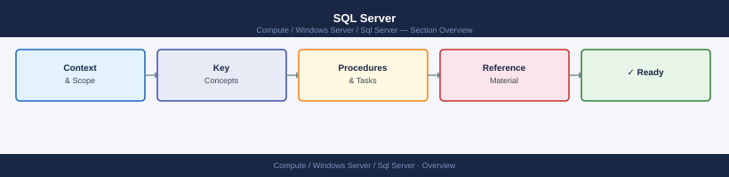

---
tags:
  - windows
---
# SQL Server

Microsoft SQL Server for Windows Server — Always On AG, failover clustering, backup/restore.

*Applies to: SQL Server 2019 / 2022*

  <a class="kb-card" href="architecture/">Architecture</a>
  <a class="kb-card" href="deploy/">Deploy</a>
  <a class="kb-card" href="operations/">Operations</a>
  <a class="kb-card" href="security/">Security</a>
  <a class="kb-card" href="troubleshooting/">Troubleshooting</a>

