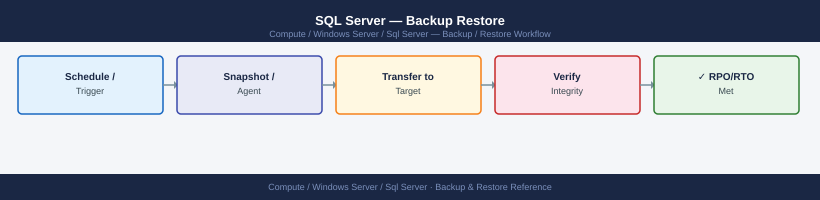

---
tags:
  - operations
  - windows
description: "SQL Server backup: BACKUP DATABASE TO DISK, full/diff/log chain, Ola Hallengren scripts, RESTORE WITH NORECOVERY, and point-in-time recovery procedure."
---
# SQL Server — Backup Restore

<div class="kb-summary">
SQL Server backup: `BACKUP DATABASE TO DISK`, full/diff/log chain, Ola Hallengren scripts, `RESTORE WITH NORECOVERY`, and point-in-time recovery procedure.

*Applies to: Windows Server 2019 / 2022*
</div>


## Before you begin

- **Access:** Local Administrator or Domain Admin on target hosts
- **Timing:** safe to run during business hours unless a step is marked ⚠ (causes interruption)
- **Dependencies:** no active upgrades or migrations on the same infrastructure
- **Logging:** capture command output — paste into the change record on completion

---

## Database — Backup Validation

```bash
# pgBackRest — check latest backup info
pgbackrest --stanza=<stanza-name> info

# List backup files
pgbackrest --stanza=<stanza-name> info --output=json | jq '.[] | .backup[-1]'

# Check WAL archiving is current
psql -U postgres -c "SELECT last_archived_wal, last_archived_time, last_failed_wal FROM pg_stat_archiver;"
```


```text title="Expected output"
stanza: prod-db-01
    status: ok
    cipher: none

    db (current)
        wal archive min/max (14-1): 000000010000000000000001/000000010000000000001A4F

        full backup: 20240115-084532F
            timestamp start/stop: 2024-01-15 08:45:32 / 2024-01-15 08:47:18
            wal included: 000000010000000000000001 to 000000010000000000000042
            database size: 2.3GB, database backup size: 2.3GB
            repo size: 1.8GB, repo backup size: 1.8GB

{
  "name": "prod-db-01",
  "backup": [
    {
      "backup-reference": "20240115-084532F",
      "type": "full",
      "timestamp-start": 1705315532,
      "timestamp-stop": 1705315638
    }
  ]
}

 last_archived_wal | last_archived_time       | last_failed_wal
-------------------+--------------------------+-----------------
 000000010000000000001A4F | 2024-01-15 09:22:14+00 |
(1 row)
```

!!! warning "Common errors"
    **`ERROR: stanza 'prod-db-01' not found`** — Verify the stanza name matches your pgBackRest configuration file (usually /etc/pgbackrest/pgbackrest.conf).
    **`psql: error: connection to server at "localhost" (127.0.0.1), port 5432 failed`** — Ensure PostgreSQL is running and the postgres user has passwordless local connections configured in pg_hba.conf.
```bash
# PostgreSQL — verify backup with pgBackRest
pgbackrest --stanza=<stanza-name> check

# MySQL — verify xtrabackup integrity
xtrabackup --prepare --target-dir=/backup/mysql/latest/

# SQL Server — verify backup file checksum
RESTORE VERIFYONLY FROM DISK = '/backup/mssql/mydb_full.bak' WITH CHECKSUM;
```

```text title="Expected output"
pgbackrest: INFO: check command begin 2.52.1
pgbackrest: INFO: archive-push WAL archiving is OK
pgbackrest: INFO: backup path exists and has permissions to execute
pgbackrest: INFO: check command end: completed successfully

xtrabackup: recognized server arguments:
xtrabackup: using the following InnoDB configuration:
xtrabackup: using the following Percona XtraBackup configuration:
xtrabackup: Generating a list of tablespaces
xtrabackup: Copying /backup/mysql/latest/ibdata1 to /backup/mysql/latest/ibdata1.copy
xtrabackup: Applying log files
xtrabackup: All done! [OK]

Msg 0, Level 11, State 1, Server SQLSERVER01\MSSQLSERVER, Line 1
RESTORE VERIFYONLY passed.
```

!!! warning "Common errors"
    **`pgbackrest: ERROR: archive-push command failed: backup path does not exist`** — Create the backup directory with `mkdir -p /var/lib/pgbackrest/backup/<stanza-name>` and ensure the postgres user owns it.
    **`xtrabackup: error: cannot open file /backup/mysql/latest/ibdata1`** — Verify the backup path exists and xtrabackup process has read permissions with `ls -la /backup/mysql/latest/`.
    **`Msg 3013, Level 16, State 1 — RESTORE VERIFYONLY failed`** — Check that the backup file path is correct and the SQL Server service account has read permissions on the .bak file.
```bash
# Restore to test instance
pgbackrest --stanza=<stanza-name> --pg1-path=/var/lib/pgsql/test-restore restore
# Start test instance and verify
pg_ctl -D /var/lib/pgsql/test-restore start
psql -p 5433 -U postgres -c "SELECT count(*) FROM pg_stat_user_tables;"
```

```text title="Expected output"
INFO: restore command begin 2.52: --stanza=prod-db --pg1-path=/var/lib/pgsql/test-restore restore
INFO: check archive for backup info
INFO: restore backup set 20240115-093847F
INFO: remove invalid files before restore
INFO: restore file list (2847 files, 18.4 GB)
INFO: restore backup complete
waiting for server to start.... done
server started
 count 
-------
    42
(1 row)
```

!!! warning "Common errors"
    **`ERROR: archive directory missing: /var/lib/pgbackrest/archive/prod-db`** — Verify pgbackrest archive path is configured correctly in pgbackrest.conf and the directory exists with proper permissions.
    **`FATAL: could not open file "/var/lib/pgsql/test-restore/global/pg_control": No such file or directory`** — Ensure the restore completed successfully and the destination path /var/lib/pgsql/test-restore has sufficient disk space and proper ownership.
    **`psql: error: could not translate host name "localhost" to address: Name or service not known`** — Verify PostgreSQL is listening on port 5433 by checking pg_isready -p 5433 or confirming the port in postgresql.conf.
```bash
# Copy backup to test directory
xtrabackup --prepare --target-dir=/restore/mysql-test/
rsync -a /restore/mysql-test/ /var/lib/mysql-test/
chown -R mysql: /var/lib/mysql-test/
mysqld_safe --datadir=/var/lib/mysql-test --socket=/tmp/mysql-test.sock &
mysql -S /tmp/mysql-test.sock -e "SHOW DATABASES;"
```
```sql
RESTORE DATABASE [TestRestore] FROM DISK = '/backup/mssql/prod_full.bak'
WITH MOVE 'proddb' TO '/var/opt/mssql/data/TestRestore.mdf',
     MOVE 'proddb_log' TO '/var/opt/mssql/data/TestRestore_log.ldf',
     REPLACE, STATS = 10;
-- Verify table counts match expected
USE TestRestore;
SELECT COUNT(*) FROM important_table;
```

---

## Verify

- Confirm the operation completed without errors in the log or management UI
- Verify the expected state change is visible (service running, object created, config applied)
- Document the outcome in the change record

---

## See also

- [Sql Server — Procedures](../procedures/)
- [Sql Server — Health Checks](../health-checks/)
- [Sql Server — Common Issues](../../troubleshooting/common-issues/)
