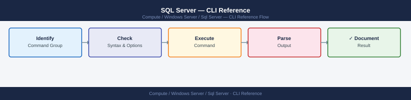

---
tags:
  - operations
  - windows
---
# SQL Server — CLI Reference

<div class="kb-summary">
SQL Server CLI reference — sqlcmd, PowerShell SqlServer module, BCP, SQLCMD scripting, and key DMV queries for operations.

*Applies to: Windows Server 2019 / 2022*
</div>


## Before you begin

- **Access:** Local Administrator or Domain Admin on target hosts
- **Timing:** safe to run during business hours unless a step is marked ⚠ (causes interruption)
- **Dependencies:** no active upgrades or migrations on the same infrastructure
- **Logging:** capture command output — paste into the change record on completion

---

## sqlcmd

```cmd
:: Connect and run a query
sqlcmd -S <host> -U <user> -P <pass> -Q "SELECT @@VERSION"

:: Interactive session
sqlcmd -S localhost -E   :: -E = Windows auth

:: Execute a script file
sqlcmd -S localhost -E -i script.sql -o output.txt

:: Scripting mode (suppress headers)
sqlcmd -S localhost -E -h -1 -W -Q "SELECT name FROM sys.databases"
```

## PowerShell SqlServer Module

```powershell
# Install
Install-Module -Name SqlServer -Force

# Run a query
Invoke-Sqlcmd -ServerInstance "localhost" -Database "master" -Query "SELECT @@VERSION"

# Backup a database
Backup-SqlDatabase -ServerInstance "localhost" -Database "MyDB" `
  -BackupFile "D:\Backup\MyDB_$(Get-Date -Format yyyyMMdd).bak" -CompressionOption On

# Restore
Restore-SqlDatabase -ServerInstance "localhost" -Database "MyDB_Restore" `
  -BackupFile "D:\Backup\MyDB.bak"
```

## BCP (Bulk Copy Program)

```cmd
:: Export table to CSV
bcp MyDB.dbo.Orders out D:\export\orders.csv -c -t, -S localhost -T

:: Import from CSV
bcp MyDB.dbo.Orders in D:\import\orders.csv -c -t, -S localhost -T -b 10000
```

## Key Operational DMV Queries

```sql
-- Current open transactions
SELECT session_id, status, blocking_session_id, wait_type,
       wait_time/1000 AS wait_sec, open_transaction_count,
       left(text, 80) AS query
FROM sys.dm_exec_requests
CROSS APPLY sys.dm_exec_sql_text(sql_handle)
WHERE session_id > 50   -- skip system sessions
ORDER BY wait_time DESC;

-- Blocking chains
SELECT blocking_session_id, session_id, wait_type, wait_time/1000 AS wait_sec
FROM sys.dm_exec_requests
WHERE blocking_session_id > 0;

-- AG replica health
SELECT ag.name, ar.replica_server_name, rs.role_desc, rs.synchronization_health_desc
FROM sys.dm_hadr_availability_replica_states rs
JOIN sys.availability_replicas ar ON rs.replica_id = ar.replica_id
JOIN sys.availability_groups ag ON ar.group_id = ag.group_id;
```

## SQL Agent Job Control

```sql
-- Start a job
EXEC msdb.dbo.sp_start_job @job_name = 'Nightly Backup';

-- View job history
SELECT j.name, h.run_date, h.run_time, h.run_status, h.message
FROM msdb.dbo.sysjobhistory h
JOIN msdb.dbo.sysjobs j ON j.job_id = h.job_id
ORDER BY h.run_date DESC, h.run_time DESC;
```

---

## Verify

- Confirm the operation completed without errors in the log or management UI
- Verify the expected state change is visible (service running, object created, config applied)
- Document the outcome in the change record

---

## See also

- [Sql Server — Procedures](procedures/)
- [Sql Server — Scripts](scripts/)
- [Sql Server — Health Checks](health-checks/)
