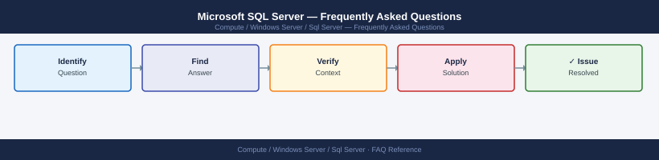

---
tags:
  - sql-server
  - faq
  - operations
---
# Microsoft SQL Server — Frequently Asked Questions

Common questions about Microsoft SQL Server operations, configuration, and troubleshooting. For step-by-step procedures, see the <a href="index.md">Operations</a> section.

## General

**Q: What SQL Server version is recommended for new deployments?**
A: SQL Server 2022 (16.x) for new deployments. Check: `SELECT @@VERSION;`. SQL Server 2016 (13.x) is the minimum for modern features; 2012 is EOL. Always apply latest CU (Cumulative Update).

**Q: How do I check the current Microsoft SQL Server version?**
A: `SELECT @@VERSION;`

## Configuration

**Q: What is the default max memory setting and when should it change?**
A: Default is unlimited — SQL Server will consume all available RAM. Always set `max server memory`: reserve at minimum 4 GB for the OS. Use: `sp_configure 'max server memory (MB)', 12288; RECONFIGURE;`

**Q: How do I enable Always On Availability Groups?**
A: Enable the feature in SQL Server Configuration Manager → SQL Server Services → right-click SQL Server → Properties → Always On tab. Create an AG via SSMS wizard or T-SQL. Requires Windows Server Failover Cluster.

## Operations

**Q: How do I patch SQL Server without downtime in an AG environment?**
A: Patch secondary replicas first. Failover the AG to a patched secondary. Patch the old primary (now secondary). Use `ALTER AVAILABILITY GROUP [AG] FAILOVER` for manual failover. Verify synchronisation before each step.

**Q: What is the correct procedure to add a new database to an Availability Group?**
A: Ensure full recovery model: `ALTER DATABASE mydb SET RECOVERY FULL`. Take a full backup. In SSMS, right-click the AG → Add Database. Use 'Automatic seeding' or restore to secondary manually with `NORECOVERY`.

## Troubleshooting

**Q: SQL Agent job fails with 'The job failed. The owner ... does not have server access'. What does it mean?**
A: The job owner's login is disabled or deleted. Change ownership: `EXEC msdb.dbo.sp_update_job @job_name='JobName', @owner_login_name='sa';`. Use a service account as the job owner rather than a personal account.

**Q: Query performance degraded after a SQL Server upgrade — where do I start?**
A: Check for plan regression: enable Query Store and review forced plans. Run `sp_BlitzCache` (First Responder Kit) to identify top resource consumers. Check compatibility level — lower it if needed for a regression window.

## Backup and Recovery

**Q: How often should I back up SQL Server databases?**
A: Full backup weekly, differential daily, transaction log every 15-30 minutes for PITR. Use Ola Hallengren's backup scripts or SQL Server Agent maintenance plans. Test restores monthly.

**Q: Can I restore a single table from a SQL Server backup without a full restore?**
A: Not natively. Restore the backup to a separate instance using `RESTORE DATABASE ... WITH NORECOVERY`, then extract the table with BCP or `SELECT INTO`. SQL Server 2022 supports contained availability groups for easier DR.

## See Also

- [Microsoft SQL Server Operations](index.md)
- [Microsoft SQL Server Troubleshooting](../../../troubleshooting/index.md)
