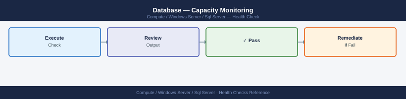

---
tags:
  - operations
  - windows
description: "SQL Server health checks: sys.dm_exec_query_stats, AG replica sync state, job history review, tempdb contention, and disk latency monitoring with DMVs."
---
# SQL Server — Health Checks

<div class="kb-summary">
SQL Server health checks: `sys.dm_exec_query_stats`, AG replica sync state, job history review, tempdb contention, and disk latency monitoring with DMVs.

*Applies to: Windows Server 2019 / 2022*
</div>

## Before you begin

- **Access:** Local Administrator or Domain Admin on target hosts
- **Timing:** safe to run during business hours unless a step is marked ⚠ (causes interruption)
- **Dependencies:** no active upgrades or migrations on the same infrastructure
- **Logging:** capture command output — paste into the change record on completion

---

## Run This Routine

Run every morning to confirm the instance is healthy before business hours.

```powershell
# 1. Service up (Windows)
Get-Service -Name MSSQLSERVER | Select-Object Status, DisplayName

# 2. Connectivity
sqlcmd -S localhost -Q "SELECT 1 AS alive"

# 3. Active sessions and blocking chains
sqlcmd -S localhost -Q "SELECT session_id, blocking_session_id, wait_type, wait_time/1000 AS wait_sec, DB_NAME(database_id) AS db FROM sys.dm_exec_requests WHERE blocking_session_id != 0 OR wait_time > 300000 ORDER BY wait_time DESC;"

# 4. AG replica health (if Always On configured)
sqlcmd -S localhost -Q "SELECT ag.name, ar.replica_server_name, rs.synchronization_health_desc FROM sys.dm_hadr_availability_replica_states rs JOIN sys.availability_replicas ar ON rs.replica_id = ar.replica_id JOIN sys.availability_groups ag ON ar.group_id = ag.group_id;"

# 5. SQL Agent jobs — last 24h failures
sqlcmd -S localhost -Q "SELECT j.name, h.run_date, h.run_time, h.message FROM msdb.dbo.sysjobhistory h JOIN msdb.dbo.sysjobs j ON h.job_id = j.job_id WHERE h.run_status = 0 AND h.run_date >= CONVERT(int, CONVERT(varchar, GETDATE()-1, 112)) ORDER BY h.run_date DESC, h.run_time DESC;"

# 6. Disk space (data/log volumes)
Get-PSDrive -PSProvider FileSystem | Where-Object {$_.Used -gt 0} | Select-Object Name, @{N='Used(GB)';E={[math]::Round($_.Used/1GB,1)}}, @{N='Free(GB)';E={[math]::Round($_.Free/1GB,1)}}
```

**Pass criteria:** service Running, connectivity returns `1`, no sessions blocked >5 min, all AG replicas HEALTHY, no Agent job failures in 24h, volumes <80% full.

---

## Database — Daily Health Check


```bash
# PostgreSQL
systemctl status postgresql
psql -U postgres -c "SELECT version();"
psql -U postgres -c "SELECT pg_is_in_recovery();"  # true = standby

# MySQL / MariaDB
systemctl status mysqld
mysql -u root -e "SHOW STATUS LIKE 'Uptime';"
mysql -u root -e "SHOW STATUS LIKE 'Threads_connected';"

# SQL Server
systemctl status mssql-server   # Linux
# Windows:
Get-Service -Name MSSQLSERVER
```

```sql
-- Instance uptime
SELECT sqlserver_start_time FROM sys.dm_os_sys_info;

-- Active sessions and blocking
SELECT session_id, status, blocking_session_id, wait_type, wait_time/1000 AS wait_sec, text
FROM sys.dm_exec_requests
CROSS APPLY sys.dm_exec_sql_text(sql_handle)
WHERE status != 'background'
ORDER BY wait_time DESC;

-- Database file sizes and free space
SELECT DB_NAME(database_id) AS db_name, name, type_desc,
       size * 8 / 1024 AS size_mb,
       fileproperty(name, 'SpaceUsed') * 8 / 1024 AS used_mb
FROM sys.master_files;

-- AG replica health (Always On)
SELECT ag.name, ar.replica_server_name, rs.synchronization_state_desc, rs.synchronization_health_desc
FROM sys.dm_hadr_availability_replica_states rs
JOIN sys.availability_replicas ar ON rs.replica_id = ar.replica_id
JOIN sys.availability_groups ag ON ar.group_id = ag.group_id;
```
```bash
# PostgreSQL
psql -h <host> -U <user> -d <dbname> -c "SELECT 1 AS alive;"

# MySQL
mysql -h <host> -u <user> -p<pass> -e "SELECT 1 AS alive;"

# SQL Server
sqlcmd -S <host> -U <user> -P <pass> -Q "SELECT 1 AS alive"

# Port reachability
nc -zv <db-host> 5432    # PostgreSQL
nc -zv <db-host> 3306    # MySQL
nc -zv <db-host> 1433    # SQL Server
```


```text title="Expected output"
psql (14.8, server 14.9)
Type "help" for help.

 alive
-------
     1
(1 row)

Welcome to the MySQL monitor.  Commands end with ; or \g.
Your MySQL connection id is 47
Server version: 8.0.35-0ubuntu0.22.04.1 (Ubuntu)

| alive |
|-------|
|     1 |

(1 rows affected)

Connection successful

Ncat: Version 7.93 ( https://nmap.org/ncat )
Ncat: Connected to 192.168.1.50:5432.
Sent 0, Rcvd 0
Connection to 192.168.1.50 3306 port [tcp/mysql] succeeded!
Connection to 192.168.1.50 1433 port [tcp/mssql-s] succeeded!
```

!!! warning "Common errors"
    **`psql: error: could not translate host name "<host>" to address: Name or service not known`** — Replace `<host>` with the actual PostgreSQL server hostname or IP address.
    **`mysql: [Warning] Using a password on the command line interface can be insecure.`** — Use a MySQL configuration file (~/.my.cnf) with restricted permissions instead of passing the password as a command-line argument.
    **`nc: getaddrinfo: Name or service not known`** — Verify the database hostname is correct and resolvable; check DNS or use the IP address directly.
## Database — Capacity Monitoring



```sql
-- Database sizes
SELECT datname AS database,
       pg_size_pretty(pg_database_size(datname)) AS size
FROM pg_database ORDER BY pg_database_size(datname) DESC;

-- Table sizes (top 20)
SELECT schemaname, tablename,
       pg_size_pretty(pg_total_relation_size(schemaname||'.'||tablename)) AS total_size
FROM pg_tables
ORDER BY pg_total_relation_size(schemaname||'.'||tablename) DESC
LIMIT 20;

-- Index sizes
SELECT indexname,
       pg_size_pretty(pg_relation_size(indexname::regclass)) AS index_size
FROM pg_indexes
ORDER BY pg_relation_size(indexname::regclass) DESC LIMIT 20;
```

```bash
# Database data directories
df -h /var/lib/postgresql /var/lib/mysql /var/opt/mssql

# inode usage (log files can exhaust inodes before disk is full)
df -i /var/lib/postgresql

# Identify large files
du -sh /var/lib/postgresql/data/*
du -sh /var/lib/mysql/*

# WAL / binary log space (PostgreSQL)
du -sh /var/lib/postgresql/data/pg_wal/

# MySQL binary logs
du -sh /var/lib/mysql/mysql-bin.*
mysql -u root -e "SHOW BINARY LOGS;"
```

```text title="Expected output"
Filesystem     Size  Used Avail Use% Mounted on
/var/lib/postgresql  500G  387G  113G  78% /var/lib/postgresql
/var/lib/mysql       1.0T  892G  108G  89% /var/lib/mysql
/var/opt/mssql       2.0T  1.8T  200G  90% /var/opt/mssql

Filesystem     Inodes IUsed IFree IUse% Mounted on
/var/lib/postgresql  52M   48M  4.2M   92% /var/lib/postgresql

4.2G	/var/lib/postgresql/data/base
18G	/var/lib/postgresql/data/global
156G	/var/lib/postgresql/data/pg_wal
203G	/var/lib/postgresql/data/pg_tblspc

892M	/var/lib/mysql/ibdata1
156G	/var/lib/mysql/mysql-bin.000147
142G	/var/lib/mysql/mysql-bin.000148
89G	/var/lib/mysql/mysql-bin.000149

+------------------+----------+-----------+
| Log_name         | File_size | Encrypted |
+------------------+----------+-----------+
| mysql-bin.000147 | 156G      | N         |
| mysql-bin.000148 | 142G      | N         |
| mysql-bin.000149 | 89G       | N         |
+------------------+----------+-----------+
```

!!! warning "Common errors"
    **`du: cannot access '/var/lib/postgresql/data/*': No such file or directory`** — Verify PostgreSQL is installed and the data directory path is correct, or adjust the path to match your actual PostgreSQL PGDATA location.
    **`ERROR 1045 (28000): Access denied for user 'root'@'localhost'`** — Use the correct MySQL credentials (e.g., `mysql -u root -p` and enter the password, or use a .my.cnf file with stored credentials).
    **`df: '/var/opt/mssql': No such file or directory`** — Remove `/var/opt/mssql` from the command if SQL Server is not installed, or verify the correct installation path with `find / -name mssql -type d 2>/dev/null`.
```bash
# Weekly snapshots — capture to track growth
psql -U postgres -Atc "SELECT pg_database_size('mydb');" >> /var/log/db-size-mydb.log

# Simple growth rate from log
awk 'NR>1{print ($1-prev)/1024/1024 " MB added since last check"; prev=$1} NR==1{prev=$1}' /var/log/db-size-mydb.log
```
```sql
-- PostgreSQL: reclaim dead tuple space
VACUUM ANALYZE <schema>.<table>;
-- Full reclaim (locks table briefly)
VACUUM FULL <schema>.<table>;

-- PostgreSQL: drop unused indexes
SELECT indexname, idx_scan FROM pg_stat_user_indexes
WHERE idx_scan = 0 ORDER BY pg_relation_size(indexname::regclass) DESC;

-- MySQL: purge old binary logs
PURGE BINARY LOGS BEFORE DATE_SUB(NOW(), INTERVAL 7 DAY);

-- SQL Server: shrink log file (use sparingly — not routine maintenance)
USE mydb;
DBCC SHRINKFILE (mydb_log, 1024);  -- 1024 MB target
```

## Database — Replication Check


```sql
-- On PRIMARY: show connected replicas and lag
SELECT client_addr, application_name, state,
       sent_lsn, write_lsn, flush_lsn, replay_lsn,
       (sent_lsn - replay_lsn) AS replication_lag_bytes,
       sync_state
FROM pg_stat_replication;

-- On STANDBY: confirm it is a replica and check lag
SELECT pg_is_in_recovery() AS is_standby;
SELECT now() - pg_last_xact_replay_timestamp() AS replay_lag;
SELECT pg_last_wal_receive_lsn(), pg_last_wal_replay_lsn();

-- Replication slots — check for inactive slots holding WAL
SELECT slot_name, active, restart_lsn, pg_wal_lsn_diff(pg_current_wal_lsn(), restart_lsn) AS lag_bytes
FROM pg_replication_slots;
```

```bash
# Quick one-liner — show lag and thread status
mysql -u root -e "SHOW SLAVE STATUS\G" | grep -E "Slave_(IO|SQL)_Running|Seconds_Behind|Last_(IO|SQL)_Error"
```
```sql
-- Check GTID position on replica vs primary
SHOW VARIABLES LIKE 'gtid_mode';
SELECT @@GLOBAL.gtid_executed;
SELECT @@GLOBAL.gtid_purged;
-- Compare GTID sets between primary and replica to calculate drift
```
```sql
-- Replica synchronization health
SELECT ag.name AS ag_name,
       ar.replica_server_name,
       rs.role_desc,
       rs.synchronization_state_desc,
       rs.synchronization_health_desc,
       rs.last_commit_time
FROM sys.dm_hadr_availability_replica_states rs
JOIN sys.availability_replicas ar ON rs.replica_id = ar.replica_id
JOIN sys.availability_groups ag ON ar.group_id = ag.group_id;

-- Database-level lag
SELECT drs.database_id, DB_NAME(drs.database_id) AS db_name,
       drs.synchronization_state_desc,
       drs.log_send_queue_size AS send_queue_kb,
       drs.redo_queue_size AS redo_queue_kb,
       drs.last_commit_time
FROM sys.dm_hadr_database_replica_states drs;
```
```bash
# PostgreSQL — compare row counts between primary and replica
psql -h <primary-host> -U postgres -c "SELECT relname, n_live_tup FROM pg_stat_user_tables ORDER BY relname;" > /tmp/primary-counts.txt
psql -h <standby-host> -U postgres -c "SELECT relname, n_live_tup FROM pg_stat_user_tables ORDER BY relname;" > /tmp/standby-counts.txt
diff /tmp/primary-counts.txt /tmp/standby-counts.txt

# MySQL — pt-table-checksum (Percona Toolkit)
pt-table-checksum --host=<primary> --user=root --password=<pass> --databases=<dbname>
# Then on replica:
pt-table-sync --sync-to-master h=<replica>,u=root,p=<pass> --print  # --execute to fix
```
```sql
-- Check error
SHOW SLAVE STATUS\G
-- If duplicate key / skip error (use with caution)
STOP SLAVE;
SET GLOBAL sql_slave_skip_counter = 1;
START SLAVE;
SHOW SLAVE STATUS\G
```
```bash
# If replay lag is huge and WAL is no longer available on primary,
# rebuild the replica from a fresh base backup
pg_basebackup -h <primary-host> -U replication -D /var/lib/postgresql/data-new -P -R
# -R writes recovery.conf / standby.signal automatically
```


```text title="Expected output"
pg_basebackup: initiating base backup, waiting for checkpoint to complete
pg_basebackup: checkpoint completed
24601/24601 kB (100%), 1/1 tablespace
transaction log start point: 0/3000028 on timeline 1
pg_basebackup: write-ahead log start point: 0/3000028 on timeline 1
pg_basebackup: checksum: 8a4f2c91d7e3b5f6c9a1d2e3f4a5b6c7
pg_basebackup: base backup completed
```

!!! warning "Common errors"
    **`pg_basebackup: could not connect to server: FATAL: no pg_hba.conf entry for replication connection from "10.45.12.8" user "replication"`** — Add a replication entry to pg_hba.conf on the primary (e.g., `host replication replication 10.45.12.8/32 md5`) and reload PostgreSQL.
    **`pg_basebackup: directory "/var/lib/postgresql/data-new" exists but is not empty`** — Remove or rename the target directory before running pg_basebackup, or use an empty path.
    **`pg_basebackup: could not identify system: got 0 rows`** — Verify the replication user exists and has REPLICATION privilege on the primary with `ALTER USER replication WITH REPLICATION;`.
---

## Verify

- Confirm the operation completed without errors in the log or management UI
- Verify the expected state change is visible (service running, object created, config applied)
- Document the outcome in the change record

---

## See also

- [Sql Server — Procedures](../procedures/)
- [Sql Server — CLI Reference](../cli-reference/)
- [Sql Server — Common Issues](../../troubleshooting/common-issues/)
