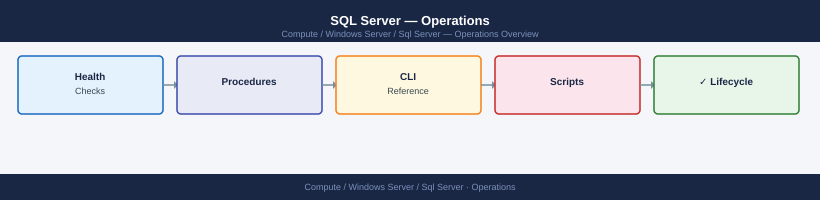

---
tags:
  - operations
  - windows
---
# SQL Server — Operations

Health checks, procedures, CLI, backup/restore, upgrades, and scripts.

*Applies to: Windows Server 2019 / 2022*

  <a class="kb-card" href="health-checks/">Health Checks</a>
  <a class="kb-card" href="procedures/">Procedures</a>
  <a class="kb-card" href="cli-reference/">Cli Reference</a>
  <a class="kb-card" href="backup-restore/">Backup Restore</a>
  <a class="kb-card" href="install-upgrade/">Install Upgrade</a>
  <a class="kb-card" href="scripts/">Scripts</a>

