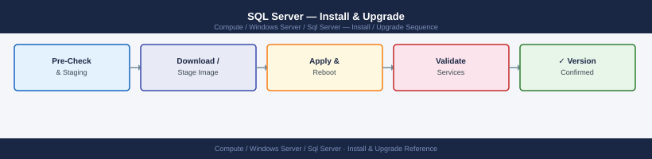

---
tags:
  - operations
  - windows
---
# SQL Server — Install & Upgrade

<div class="kb-summary">
SQL Server upgrade procedures — in-place upgrade, side-by-side upgrade, compatibility level, upgrade advisor, and post-upgrade validation.

*Applies to: Windows Server 2019 / 2022*
</div>



```d2
direction: right

hub: "SQL Server\nOperations" {shape: hexagon}
upgrade_path: "Upgrade Path" {shape: rectangle}
preupgrade_steps: "Pre-Upgrade Steps" {shape: rectangle}
inplace_upgrade: "In-Place Upgrade" {shape: rectangle}
postupgrade_steps: "Post-Upgrade Steps" {shape: rectangle}
compatibility_level_strategy: "Compatibility Level Strategy" {shape: rectangle}
verify: "Verify" {shape: rectangle}

hub -> upgrade_path
hub -> preupgrade_steps
hub -> inplace_upgrade
hub -> postupgrade_steps
hub -> compatibility_level_strategy
hub -> verify
```

## Before you begin

- **Access:** Local Administrator or Domain Admin on target hosts
- **Timing:** safe to run during business hours unless a step is marked ⚠ (causes interruption)
- **Dependencies:** no active upgrades or migrations on the same infrastructure
- **Logging:** capture command output — paste into the change record on completion

---

## Upgrade Path

SQL Server supports in-place upgrade from two prior major versions:
- `SQL 2016 → 2019`, `SQL 2017 → 2019`, `SQL 2019 → 2022`
- Cannot skip more than one major version

## Pre-Upgrade Steps

```sql
-- 1. Check current version and compatibility level
SELECT @@VERSION;
SELECT name, compatibility_level FROM sys.databases;

-- 2. Run Upgrade Advisor / Database Experimentation Assistant (DEA)
-- Download from Microsoft; analyse compatibility issues

-- 3. Check deprecated features in use
SELECT * FROM sys.dm_os_performance_counters
WHERE counter_name = 'Deprecated features';

-- 4. Backup all databases
BACKUP DATABASE [master] TO DISK = 'D:\Backup\master.bak' WITH COMPRESSION;
BACKUP DATABASE [msdb]   TO DISK = 'D:\Backup\msdb.bak'   WITH COMPRESSION;
BACKUP DATABASE [MyDB]   TO DISK = 'D:\Backup\MyDB.bak'   WITH COMPRESSION;
```

## In-Place Upgrade

1. Mount SQL Server installation media
2. Run `setup.exe` → **Maintenance** → **Edition Upgrade** or directly **Installation** → **Upgrade**
3. Select features to upgrade; point to existing instance
4. SQL Setup upgrades system databases and restarts service

## Post-Upgrade Steps

```sql
-- 1. Update compatibility level to new version (after testing)
ALTER DATABASE MyDB SET COMPATIBILITY_LEVEL = 160;   -- SQL 2022

-- 2. Update statistics
EXEC sp_updatestats;

-- 3. Rebuild system indexes
DBCC UPDATEUSAGE(0);

-- 4. Verify SQL Agent jobs running
SELECT name, enabled, date_modified FROM msdb.dbo.sysjobs ORDER BY name;

-- 5. Verify AG health (if applicable)
SELECT ag.name, rs.role_desc, rs.synchronization_health_desc
FROM sys.dm_hadr_availability_replica_states rs
JOIN sys.availability_replicas ar ON rs.replica_id = ar.replica_id
JOIN sys.availability_groups ag ON ar.group_id = ag.group_id;
```

## Compatibility Level Strategy

Keep databases on previous compatibility level immediately after upgrade. Test application, then raise level. This allows rollback of query plan regression without downgrading SQL Server.

---

## Verify

- Confirm the operation completed without errors in the log or management UI
- Verify the expected state change is visible (service running, object created, config applied)
- Document the outcome in the change record

---

## See also

- [Sql Server — Procedures](procedures/)
- [Sql Server — Health Checks](health-checks/)
- [Sql Server — Deploy](../deploy/)
