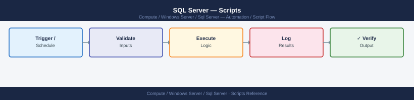

---
tags:
  - operations
  - windows
---
# SQL Server — Scripts

<div class="kb-summary">
SQL Server automation scripts — PowerShell backup rotation, index maintenance, AG health check, blocking chain alert, and database size report.

*Applies to: Windows Server 2019 / 2022*
</div>


## Before you begin

- **Access:** Local Administrator or Domain Admin on target hosts
- **Timing:** safe to run during business hours unless a step is marked ⚠ (causes interruption)
- **Dependencies:** no active upgrades or migrations on the same infrastructure
- **Logging:** capture command output — paste into the change record on completion

---

## Nightly Backup Script (PowerShell)

```powershell
# /opt/scripts/sql-backup.ps1
$Server = "localhost"
$BackupRoot = "D:\Backup\$(Get-Date -Format yyyy-MM-dd)"
New-Item -ItemType Directory -Force -Path $BackupRoot | Out-Null

$Databases = Invoke-Sqlcmd -ServerInstance $Server -Query `
  "SELECT name FROM sys.databases WHERE state_desc = 'ONLINE' AND name NOT IN ('tempdb')"

foreach ($db in $Databases) {
    $BackupFile = "$BackupRoot\$($db.name).bak"
    Backup-SqlDatabase -ServerInstance $Server -Database $db.name `
      -BackupFile $BackupFile -CompressionOption On -CheckSum
    Write-Output "Backed up: $($db.name) → $BackupFile"
}

# Rotate: delete backups older than 14 days
Get-ChildItem "D:\Backup\" -Recurse -Directory |
  Where-Object { $_.LastWriteTime -lt (Get-Date).AddDays(-14) } |
  Remove-Item -Recurse -Force
```

## Index Maintenance (Ola Hallengren)

Use Ola Hallengren's `IndexOptimize` stored procedure — industry standard.

```sql
-- Rebuild/reorganise based on fragmentation thresholds
EXEC dbo.IndexOptimize
  @Databases = 'USER_DATABASES',
  @FragmentationLow = NULL,
  @FragmentationMedium = 'INDEX_REORGANIZE',
  @FragmentationHigh = 'INDEX_REBUILD_ONLINE,INDEX_REBUILD_OFFLINE',
  @FragmentationLevel1 = 5,
  @FragmentationLevel2 = 30,
  @UpdateStatistics = 'ALL',
  @OnlyModifiedStatistics = 'Y';
```

## Blocking Chain Alert

```sql
-- Run from SQL Agent job; alerts if blocking > 5 minutes
IF EXISTS (
  SELECT 1 FROM sys.dm_exec_requests
  WHERE blocking_session_id > 0
    AND wait_time > 300000   -- 5 minutes in ms
)
BEGIN
  EXEC msdb.dbo.sp_send_dbmail
    @profile_name = 'DBA Alert',
    @recipients = 'dba@example.com',
    @subject = 'SQL Server: Blocking chain detected',
    @body = 'Blocking chain > 5 minutes detected on ' + @@SERVERNAME;
END
```

## AG Health Check

```sql
SELECT ag.name AS ag_name,
       ar.replica_server_name,
       rs.role_desc,
       rs.synchronization_state_desc,
       rs.synchronization_health_desc,
       drs.log_send_queue_size AS send_queue_kb,
       drs.redo_queue_size AS redo_queue_kb
FROM sys.dm_hadr_availability_replica_states rs
JOIN sys.availability_replicas ar ON rs.replica_id = ar.replica_id
JOIN sys.availability_groups ag ON ar.group_id = ag.group_id
LEFT JOIN sys.dm_hadr_database_replica_states drs ON drs.replica_id = rs.replica_id;
```

## Database Size Report

```sql
SELECT DB_NAME(database_id) AS db_name,
       type_desc,
       name AS file_name,
       size * 8 / 1024 AS size_mb,
       fileproperty(name, 'SpaceUsed') * 8 / 1024 AS used_mb,
       (size - fileproperty(name, 'SpaceUsed')) * 8 / 1024 AS free_mb
FROM sys.master_files
ORDER BY database_id, type;
```

---

## Verify

- Confirm the operation completed without errors in the log or management UI
- Verify the expected state change is visible (service running, object created, config applied)
- Document the outcome in the change record

---

## See also

- [Sql Server — Procedures](../procedures/)
- [Sql Server — CLI Reference](../cli-reference/)
- [Sql Server — Health Checks](../health-checks/)
