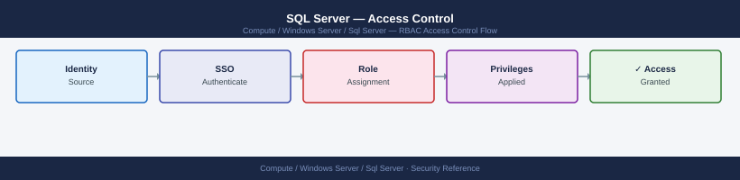

---
tags:
  - security
  - windows
---
# SQL Server — Access Control

<div class="kb-summary">
SQL Server access control — logins vs users, server/database roles, GRANT/DENY/REVOKE, schema ownership, and auditing current permissions.

*Applies to: Windows Server 2019 / 2022*
</div>


## Before you begin

- **Access:** Local Administrator or Domain Admin on target hosts
- **Change management:** security changes require CAB approval in most environments
- **Rollback plan:** document current state before any security control change
- **Testing:** validate in a non-production environment first where possible

---

## Login vs User

- **Login**: server-level principal — authenticates to SQL Server instance
- **User**: database-level principal — mapped to a login; has permissions within a database

```sql
-- Create a login
CREATE LOGIN appuser WITH PASSWORD = 'StrongPass1!';

-- Create a database user mapped to that login
USE app_prod;
CREATE USER appuser FOR LOGIN appuser;
```

## Server-Level Roles

| Role | Permissions |
|---|---|
| `sysadmin` | Full control; equivalent to root — restrict tightly |
| `dbcreator` | Create, alter, drop databases |
| `securityadmin` | Manage logins and permissions |
| `serveradmin` | Server config only |
| `bulkadmin` | BULK INSERT operations |

```sql
ALTER SERVER ROLE dbcreator ADD MEMBER dba_user;
```

## Database-Level Roles

| Role | Permissions |
|---|---|
| `db_owner` | Full control over database |
| `db_datareader` | SELECT on all tables |
| `db_datawriter` | INSERT, UPDATE, DELETE on all tables |
| `db_ddladmin` | CREATE/ALTER/DROP objects; no data access |
| `db_securityadmin` | Manage roles and permissions |

```sql
USE app_prod;
ALTER ROLE db_datareader ADD MEMBER appuser;
ALTER ROLE db_datawriter ADD MEMBER appuser;
```

## Fine-Grained GRANT / DENY

```sql
-- Grant execute on a specific stored procedure
GRANT EXECUTE ON dbo.usp_ProcessOrder TO appuser;

-- Deny direct table access (force through stored procedures)
DENY SELECT ON dbo.CreditCards TO appuser;
```

## Auditing Permissions

```sql
-- Server-level role memberships
SELECT r.name AS role, m.name AS member
FROM sys.server_role_members rm
JOIN sys.server_principals r ON r.principal_id = rm.role_principal_id
JOIN sys.server_principals m ON m.principal_id = rm.member_principal_id;

-- Database permissions
SELECT pr.name AS principal, pe.class_desc, pe.permission_name, pe.state_desc
FROM sys.database_permissions pe
JOIN sys.database_principals pr ON pr.principal_id = pe.grantee_principal_id
ORDER BY principal, permission_name;
```

---

## See also

- [Sql Server — Authentication](../authentication/)
- [Sql Server — Hardening](../hardening/)
- [Sql Server — Encryption](../encryption/)
