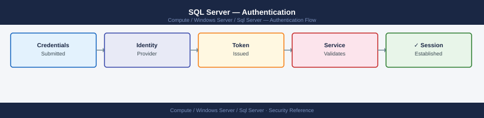

---
tags:
  - security
  - windows
---
# SQL Server — Authentication

<div class="kb-summary">
SQL Server authentication — Windows vs Mixed Mode, service account configuration, AD group logins, Managed Service Accounts, and password policy enforcement.

*Applies to: Windows Server 2019 / 2022*
</div>



## Before you begin

- **Access:** Local Administrator or Domain Admin on target hosts
- **Change management:** security changes require CAB approval in most environments
- **Rollback plan:** document current state before any security control change
- **Testing:** validate in a non-production environment first where possible

---

## Authentication Modes

| Mode | Description | Recommended |
|---|---|---|
| Windows Authentication | Kerberos/NTLM via AD — no SQL password | Yes — for internal apps |
| Mixed Mode | Windows + SQL logins with passwords | Yes — for apps requiring SQL auth |
| SQL Auth only | No Windows auth | No — avoid |

```sql
-- Check current auth mode
SELECT SERVERPROPERTY('IsIntegratedSecurityOnly') AS windows_only;
-- 1 = Windows only; 0 = Mixed Mode
```

## Windows Authentication Logins

```sql
-- Individual AD user
CREATE LOGIN [DOMAIN\username] FROM WINDOWS;

-- AD security group (all members inherit access)
CREATE LOGIN [DOMAIN\SQL_DBA_Group] FROM WINDOWS;
ALTER SERVER ROLE sysadmin ADD MEMBER [DOMAIN\SQL_DBA_Group];
```

## SQL Authentication

```sql
-- Create SQL login with password policy
CREATE LOGIN appuser WITH PASSWORD = 'StrongPass1!',
  CHECK_POLICY = ON,      -- enforce Windows password policy
  CHECK_EXPIRATION = ON;  -- enforce password expiration
```

## Service Account Configuration

- Use a **Managed Service Account (MSA)** or **Group MSA (gMSA)** — password managed by AD
- Avoid local service or `NETWORK SERVICE` for production instances

```powershell
# Create gMSA
New-ADServiceAccount -Name "svc-sql-prod" -DNSHostName sql01.example.com
Install-ADServiceAccount -Identity "svc-sql-prod"
# Then configure SQL Server service to run as DOMAIN\svc-sql-prod$
```

## Password Policy

SQL logins created with `CHECK_POLICY = ON` inherit the Windows account lockout and complexity policy from the domain/local policy.

```sql
-- View SQL logins and their policy status
SELECT name, is_policy_checked, is_expiration_checked, is_disabled
FROM sys.sql_logins;

-- Unlock a locked SQL login
ALTER LOGIN appuser WITH PASSWORD = 'NewPass1!' UNLOCK;
```

## Auditing Authentication Events

```sql
-- Failed logins in SQL error log
EXEC sp_readerrorlog 0, 1, 'Login failed';

-- C2 audit / SQL Server Audit for detailed authentication logging
```

---

## See also

- [Sql Server — Access Control](access-control/)
- [Sql Server — Hardening](hardening/)
- [Sql Server — Encryption](encryption/)
