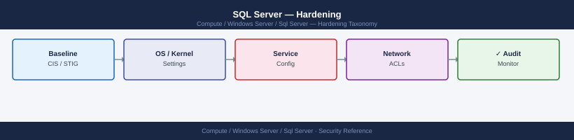

---
tags:
  - security
  - windows
---
# SQL Server — Hardening

<div class="kb-summary">
SQL Server hardening — surface area reduction, disabling xp_cmdshell, SQL Browser, CLR, linked server restrictions, auditing, and CIS benchmark key controls.

*Applies to: Windows Server 2019 / 2022*
</div>



## Before you begin

- **Access:** Local Administrator or Domain Admin on target hosts
- **Change management:** security changes require CAB approval in most environments
- **Rollback plan:** document current state before any security control change
- **Testing:** validate in a non-production environment first where possible

---

## Surface Area Reduction

```sql
-- Disable features not in use
EXEC sp_configure 'show advanced options', 1; RECONFIGURE;
EXEC sp_configure 'xp_cmdshell', 0; RECONFIGURE;          -- OS command execution
EXEC sp_configure 'Ole Automation Procedures', 0; RECONFIGURE;
EXEC sp_configure 'clr enabled', 0; RECONFIGURE;           -- if CLR not used
EXEC sp_configure 'Database Mail XPs', 0; RECONFIGURE;     -- if mail not used
EXEC sp_configure 'remote admin connections', 0; RECONFIGURE;
```

## Disable SQL Server Browser

SQL Server Browser resolves named instances to ports. Disable if using default instance with static port 1433.

```powershell
Set-Service -Name SQLBrowser -StartupType Disabled
Stop-Service -Name SQLBrowser
```

## Remove Dangerous Logins

```sql
-- Check for enabled guest account
SELECT name, is_disabled FROM sys.server_principals WHERE name = 'guest';

-- Disable the guest login
ALTER LOGIN guest DISABLE;

-- Check for blank passwords
SELECT name FROM sys.sql_logins WHERE PWDCOMPARE('', password_hash) = 1;
```

## Restrict sysadmin Membership

```sql
-- Audit sysadmin members
SELECT m.name AS member FROM sys.server_role_members rm
JOIN sys.server_principals r ON r.principal_id = rm.role_principal_id
JOIN sys.server_principals m ON m.principal_id = rm.member_principal_id
WHERE r.name = 'sysadmin';

-- Remove unwanted sysadmin
ALTER SERVER ROLE sysadmin DROP MEMBER username;
```

## Enable SQL Server Audit

```sql
-- Server-level audit: log all login events
CREATE SERVER AUDIT DBA_Audit
  TO FILE (FILEPATH = 'C:\SQLAudit\', MAXSIZE = 100MB, MAX_ROLLOVER_FILES = 10)
  WITH (ON_FAILURE = CONTINUE);

CREATE SERVER AUDIT SPECIFICATION DBA_Audit_Spec
  FOR SERVER AUDIT DBA_Audit
  ADD (FAILED_LOGIN_GROUP),
  ADD (SUCCESSFUL_LOGIN_GROUP)
  WITH (STATE = ON);

ALTER SERVER AUDIT DBA_Audit WITH (STATE = ON);
```

## CIS Benchmark Key Controls

| Control | Verification |
|---|---|
| `xp_cmdshell = 0` | `SELECT value_in_use FROM sys.configurations WHERE name = 'xp_cmdshell'` → 0 |
| No sa login active | `SELECT is_disabled FROM sys.sql_logins WHERE name = 'sa'` → 1 |
| TDE on sensitive DBs | `SELECT encryption_state FROM sys.dm_database_encryption_keys` → 3 |
| TLS forced | SQL Server Config Manager → Force Encryption = Yes |
| Audit enabled | `SELECT audit_id FROM sys.server_audits WHERE is_state_enabled = 1` |

---

## See also

- [Sql Server — Authentication](authentication/)
- [Sql Server — Access Control](access-control/)
- [Sql Server — Encryption](encryption/)
