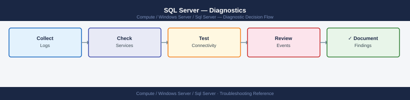
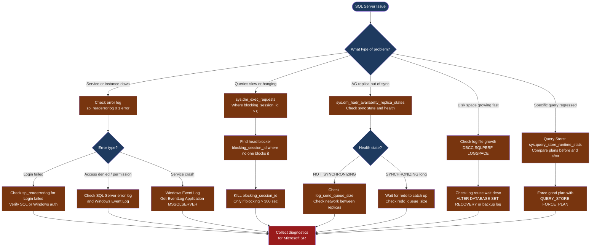

---
tags:
  - troubleshooting
  - windows
search:
  boost: 1.5
---
# SQL Server — Diagnostics

<div class="kb-summary">
SQL Server diagnostic commands: read sp_readerrorlog, query sys.dm_exec_requests for blocking, check Availability Group health with sys.dm_hadr_*, diagnose tempdb contention, inspect Query Store for plan regressions, and collect a PSSDiag / SQL Server diagnostic bundle for Microsoft support.

*Applies to: SQL Server 2019 / 2022 on Windows Server 2019 / 2022*
</div>





```d2
direction: down

symptom: Identify Symptom {shape: diamond}
step_1_check_the_error_log: "Step 1 — Check the error log" {shape: rectangle}
step_2_check_active_requests_and_blo: "Step 2 — Check active requests and blocking" {shape: rectangle}
step_3_check_availability_group_heal: "Step 3 — Check Availability Group health" {shape: rectangle}
step_4_check_tempdb_contention: "Step 4 — Check tempdb contention" {shape: rectangle}
step_5_check_log_file_growth_and_tru: "Step 5 — Check log file growth and truncation" {shape: rectangle}
step_6_query_store_for_plan_regressi: "Step 6 — Query Store for plan regressions" {shape: rectangle}
resolution: Resolve or Escalate {shape: oval}

symptom -> step_1_check_the_error_log: investigate
symptom -> step_2_check_active_requests_and_blo: investigate
symptom -> step_3_check_availability_group_heal: investigate
symptom -> step_4_check_tempdb_contention: investigate
symptom -> step_5_check_log_file_growth_and_tru: investigate
symptom -> step_6_query_store_for_plan_regressi: investigate
step_1_check_the_error_log -> resolution
step_2_check_active_requests_and_blo -> resolution
step_3_check_availability_group_heal -> resolution
step_4_check_tempdb_contention -> resolution
step_5_check_log_file_growth_and_tru -> resolution
step_6_query_store_for_plan_regressi -> resolution
```

## Before you begin

- **Access:** `sysadmin` fixed server role or `VIEW SERVER STATE` permission for DMV queries; Windows admin for event log and service management
- **Gather first:** the exact error message (from the application or SSMS), the database name, approximate time the issue started, and whether any maintenance (index rebuild, backup, AG failover) ran recently
- **Scope:** confirm whether the issue affects one database, one instance, one AG replica, or the entire SQL Server host
- **Do not KILL blindly:** identify the head blocker before issuing KILL — killing a session in the middle of a long transaction triggers rollback, which can take as long as the original transaction ran

---

## Step 1 — Check the error log

```sql
-- Current error log (all messages)
EXEC sp_readerrorlog;

-- Filter for errors
EXEC sp_readerrorlog 0, 1, 'error';

-- Filter for login failures
EXEC sp_readerrorlog 0, 1, 'Login failed';

-- Filter for a specific database
EXEC sp_readerrorlog 0, 1, 'app_prod';

-- List available error logs (SQL Server keeps 6 by default)
EXEC sp_enumerrorlogs;
-- Then read a previous log: EXEC sp_readerrorlog 1;  (1 = previous log)

-- Find the physical ERRORLOG file location
SELECT SERVERPROPERTY('ErrorLogFileName') AS ErrorLogPath;
```

```powershell
# Windows Application Event Log — SQL Server events
Get-EventLog -LogName Application -Source "MSSQLSERVER" -Newest 50 |
  Format-Table TimeGenerated, EntryType, Message -Wrap

# For SQL Server Agent events
Get-EventLog -LogName Application -Source "SQLAGENT" -Newest 50 |
  Format-Table TimeGenerated, EntryType, Message -Wrap
```

---

## Step 2 — Check active requests and blocking

```sql
-- All non-background active requests with blocking info
SELECT r.session_id,
       r.status,
       r.blocking_session_id,
       r.wait_type,
       r.wait_time / 1000          AS wait_sec,
       r.open_transaction_count,
       DB_NAME(r.database_id)      AS db_name,
       left(t.text, 120)           AS query_text
FROM sys.dm_exec_requests r
CROSS APPLY sys.dm_exec_sql_text(r.sql_handle) t
WHERE r.session_id > 50
ORDER BY r.wait_time DESC;

-- Find the head blocker (session blocking others but not itself blocked)
SELECT session_id, blocking_session_id, wait_type, wait_time / 1000 AS wait_sec
FROM sys.dm_exec_requests
WHERE blocking_session_id > 0;
-- The head blocker is the session that appears in blocking_session_id but is NOT blocked by anyone

-- Full blocking chain (who blocks whom recursively)
WITH BlockChain AS (
  SELECT session_id, blocking_session_id, wait_type, 0 AS depth
  FROM sys.dm_exec_requests WHERE blocking_session_id > 0
  UNION ALL
  SELECT r.session_id, r.blocking_session_id, r.wait_type, bc.depth + 1
  FROM sys.dm_exec_requests r
  JOIN BlockChain bc ON r.session_id = bc.blocking_session_id
  WHERE bc.depth < 10
)
SELECT * FROM BlockChain ORDER BY depth;

-- Kill the head blocking session (after confirming > 5 minutes of blocking)
KILL <head_blocker_session_id>;
```

---

## Step 3 — Check Availability Group health

```sql
-- AG replica state across all replicas
SELECT ag.name            AS ag_name,
       ar.replica_server_name,
       rs.role_desc,
       rs.synchronization_state_desc,
       rs.synchronization_health_desc,
       rs.last_commit_time
FROM sys.dm_hadr_availability_replica_states rs
JOIN sys.availability_replicas ar  ON rs.replica_id = ar.replica_id
JOIN sys.availability_groups   ag  ON ar.group_id    = ag.group_id
ORDER BY ag.name, rs.role_desc;
-- Expected: PRIMARY = SYNCHRONIZED; SECONDARY = SYNCHRONIZED or SYNCHRONIZING

-- Log send queue and redo queue per database per replica
SELECT ag.name, ar.replica_server_name, adb.database_name,
       drs.log_send_queue_size,   -- bytes not yet sent to replica
       drs.redo_queue_size,       -- bytes received but not yet applied on replica
       drs.synchronization_state_desc
FROM sys.dm_hadr_database_replica_states drs
JOIN sys.availability_replicas       ar  ON drs.replica_id = ar.replica_id
JOIN sys.availability_groups         ag  ON ar.group_id = ag.group_id
JOIN sys.availability_databases_cluster adb ON drs.group_database_id = adb.group_database_id
ORDER BY drs.log_send_queue_size DESC;
-- log_send_queue_size > 0 and growing = AG lag; investigate network between replicas

-- Check AG listener state
SELECT dns_name, ip_address, port, state_desc
FROM sys.availability_group_listeners al
JOIN sys.availability_group_listener_ip_addresses ali ON al.listener_id = ali.listener_id;
```

---

## Step 4 — Check tempdb contention

High PAGELATCH waits on pages 2:1:1, 2:1:3, 2:1:5 indicate tempdb allocation page contention — a common problem when many concurrent sessions create temporary objects.

```sql
-- Check for PAGELATCH wait accumulation
SELECT wait_type, waiting_tasks_count, wait_time_ms,
       signal_wait_time_ms,
       wait_time_ms - signal_wait_time_ms AS resource_wait_ms
FROM sys.dm_os_wait_stats
WHERE wait_type LIKE 'PAGELATCH%'
ORDER BY wait_time_ms DESC;
-- High PAGELATCH_EX / PAGELATCH_SH on tempdb allocation pages = contention

-- Check how many tempdb data files exist
SELECT name, physical_name, size * 8 / 1024 AS size_mb
FROM sys.master_files
WHERE database_id = 2;  -- 2 = tempdb
-- Recommended: one tempdb data file per logical processor core, up to 8

-- Check current tempdb space usage
USE tempdb;
SELECT SUM(unallocated_extent_page_count) * 8 / 1024 AS free_mb,
       SUM(version_store_reserved_page_count) * 8 / 1024 AS version_store_mb,
       SUM(user_object_reserved_page_count) * 8 / 1024 AS user_objects_mb
FROM sys.dm_db_file_space_usage;
```

---

## Step 5 — Check log file growth and truncation

```sql
-- Log space usage for all databases
DBCC SQLPERF(LOGSPACE);
-- Log Space Used % > 70% = log is not being truncated regularly

-- Why the log can't be truncated (critical field)
SELECT name, log_reuse_wait_desc
FROM sys.databases
WHERE log_reuse_wait_desc <> 'NOTHING';
-- Common causes:
--   LOG_BACKUP   = no log backup taken; run BACKUP LOG or set SIMPLE recovery
--   REPLICATION  = log reader agent is behind; check SQL Agent and distribution
--   AVAILABILITY_REPLICA = AG secondary is lagging; check redo queue
--   ACTIVE_TRANSACTION = a long-running open transaction; find it with dm_exec_requests

-- Manually back up the log to release space (FULL or BULK_LOGGED recovery model only)
BACKUP LOG <database_name> TO DISK = 'NUL';  -- discards log; use only for emergency space
```

---

## Step 6 — Query Store for plan regressions

```sql
-- Enable Query Store on a database (SQL 2016+)
ALTER DATABASE app_prod SET QUERY_STORE = ON (OPERATION_MODE = READ_WRITE);

-- Top 10 queries by total execution time
SELECT TOP 10
       q.query_id,
       qt.query_sql_text,
       rs.avg_duration / 1000   AS avg_ms,
       rs.count_executions,
       rs.last_execution_time
FROM sys.query_store_query          q
JOIN sys.query_store_query_text     qt ON qt.query_text_id = q.query_text_id
JOIN sys.query_store_plan           p  ON p.query_id       = q.query_id
JOIN sys.query_store_runtime_stats  rs ON rs.plan_id       = p.plan_id
ORDER BY rs.avg_duration DESC;

-- Find regressed queries (queries that got slower recently)
-- In SSMS: database → Query Store → Regressed Queries

-- Force a known-good plan for a query
EXEC sp_query_store_force_plan @query_id = <id>, @plan_id = <good_plan_id>;

-- Unforce a plan (let SQL Server choose again)
EXEC sp_query_store_unforce_plan @query_id = <id>, @plan_id = <plan_id>;
```

---

## Step 7 — Collect diagnostics for Microsoft support

```powershell
# Use SQL Server Diagnostic Script (free community toolset by Glen Berry)
# Or collect manually:

# System info
systeminfo > C:\Temp\sysinfo-$(Get-Date -Format yyyyMMdd).txt

# Windows event logs (Application + System, last 24 hours)
Get-EventLog -LogName Application -Newest 500 |
  Export-Csv C:\Temp\app-eventlog-$(Get-Date -Format yyyyMMdd).csv

# SQL Server ERRORLOG files
Copy-Item "$(sqlcmd -Q 'SELECT SERVERPROPERTY(''ErrorLogFileName'')' -h -1 -W | Out-String | Trim())" `
  C:\Temp\ -Force
# Simpler: find via SQL
# SELECT SERVERPROPERTY('ErrorLogFileName')
# Then copy from the returned path
```

```sql
-- SQL Server version and patch level
SELECT @@VERSION;

-- Wait stats snapshot (for Microsoft support)
SELECT TOP 20 wait_type, waiting_tasks_count, wait_time_ms
FROM sys.dm_os_wait_stats
WHERE wait_type NOT IN (
  'SLEEP_TASK','BROKER_TO_FLUSH','HADR_WORK_QUEUE','CLR_AUTO_EVENT','DISPATCHER_QUEUE_SEMAPHORE',
  'SQLTRACE_BUFFER_FLUSH','CHECKPOINT_QUEUE','REQUEST_FOR_DEADLOCK_SEARCH','LOGMGR_QUEUE',
  'ONDEMAND_TASK_QUEUE','XE_TIMER_EVENT','XE_DISPATCHER_WAIT','FT_IFTS_SCHEDULER_IDLE_WAIT',
  'BROKER_EVENTHANDLER','WAITFOR','DBMIRROR_EVENTS_QUEUE','SQLTRACE_INCREMENTAL_FLUSH_SLEEP',
  'RESOURCE_QUEUE','SERVER_IDLE_CHECK','SLEEP_DBSTARTUP','SLEEP_DBRECOVER','SLEEP_MASTERDBREADY',
  'SLEEP_MASTERMDREADY','SLEEP_MASTERUPGRADED','SLEEP_MSDBSTARTUP','SLEEP_SYSTEMTASK',
  'SLEEP_TEMPDBSTARTUP','SNI_HTTP_ACCEPT','SP_SERVER_DIAGNOSTICS_SLEEP')
ORDER BY wait_time_ms DESC;
```

---

## Log locations

| Source | Path / Command | What to look for |
|---|---|---|
| SQL Server ERRORLOG | `EXEC sp_readerrorlog;` / physical path from `SERVERPROPERTY('ErrorLogFileName')` | Errors, login failures, AG state changes |
| Windows Event Log | `Get-EventLog Application -Source MSSQLSERVER` | Service crashes, OOM |
| SQL Agent log | `EXEC msdb.dbo.sp_help_jobhistory` | Failed scheduled jobs |
| Availability Group | `sys.dm_hadr_availability_replica_states` | Sync state, health |
| Wait statistics | `sys.dm_os_wait_stats` | Top waits (blocking, tempdb, I/O) |
| Query Store | `sys.query_store_runtime_stats` | Regressed plans, slow queries |

---

## See also

- [SQL Server — Common Issues](common-issues/)
- [SQL Server — Escalation](escalation/)
- [SQL Server — Health Checks](../operations/health-checks/)

## Verify resolution

- `sys.dm_exec_requests` shows no sessions with `blocking_session_id > 0` that have been waiting more than 30 seconds
- `sys.dm_hadr_availability_replica_states` shows all replicas in `SYNCHRONIZED` state; `log_send_queue_size = 0`
- `DBCC SQLPERF(LOGSPACE)` shows log space used below 50% for affected databases
- The original slow query runs within expected time; `Query Store` shows the forced plan is active
- No new ERROR entries in `sp_readerrorlog` in the last 15 minutes
