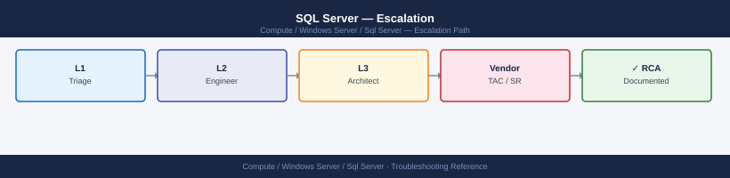
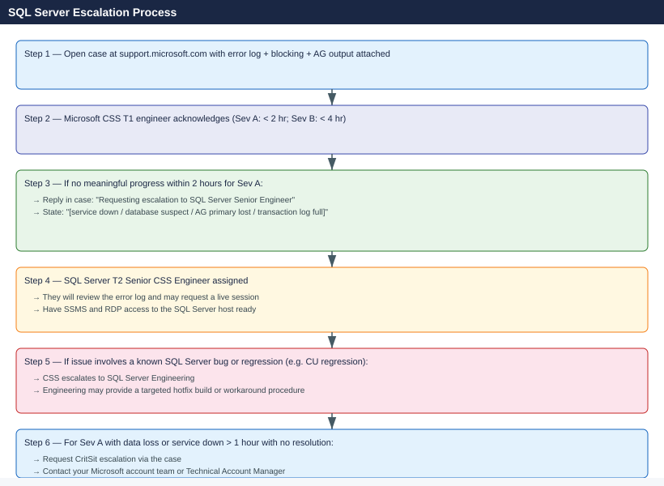

---
tags:
  - troubleshooting
  - windows
search:
  boost: 1.5
---
# SQL Server — Escalation

<div class="kb-summary">
How to escalate SQL Server issues to Microsoft support: what data to collect before calling, step-by-step case creation on support.microsoft.com, AG failover decision criteria, and the escalation path when progress stalls.

*Applies to: SQL Server 2019 / 2022 on Windows Server*
</div>



---

```d2
direction: down

symptom: Identify Symptom {shape: diamond}
preescalation_selfcheck: "Pre-Escalation Self-Check" {shape: rectangle}
stepbystep_data_collection: "Step-by-Step Data Collection" {shape: rectangle}
ag_manual_failover_procedure: "AG Manual Failover Procedure" {shape: rectangle}
how_to_open_the_case_on_supportmicro: "How to Open the Case on support.microsoft.com" {shape: rectangle}
escalation_path: "Escalation Path" {shape: rectangle}
what_not_to_do: "What NOT to Do" {shape: rectangle}
resolution: Resolve or Escalate {shape: oval}

symptom -> preescalation_selfcheck: investigate
symptom -> stepbystep_data_collection: investigate
symptom -> ag_manual_failover_procedure: investigate
symptom -> how_to_open_the_case_on_supportmicro: investigate
symptom -> escalation_path: investigate
symptom -> what_not_to_do: investigate
preescalation_selfcheck -> resolution
stepbystep_data_collection -> resolution
ag_manual_failover_procedure -> resolution
how_to_open_the_case_on_supportmicro -> resolution
escalation_path -> resolution
what_not_to_do -> resolution
```

## Before you begin

- **Access required:** `sysadmin` or `VIEW SERVER STATE` permission on the SQL Server instance; Local Administrator on the host; Microsoft support account at support.microsoft.com with a Microsoft Unified or Premier Support contract
- **Do NOT run `DBCC CHECKDB` with `REPAIR_ALLOW_DATA_LOSS`** without Microsoft CSS direction — this repair mode destroys data to remove corruption and cannot be undone
- **Do NOT restart SQL Server** when a database is in SUSPECT state without CSS guidance — a restart may overwrite the crash dump and the redo/undo log information CSS needs to understand the corruption
- **Do NOT run `FORCE_FAILOVER_ALLOW_DATA_LOSS`** without explicit DBA and CSS approval — this failover permanently discards uncommitted transactions at the secondary

---

## Pre-Escalation Self-Check

Run these before opening the case.

| Check | Command | Expected result |
|---|---|---|
| SQL service status | `Get-Service MSSQLSERVER` or `MSSQL$<instance>` | Running |
| SQL Server version | `SELECT @@VERSION` | Note full version + build |
| Database states | `SELECT name, state_desc FROM sys.databases WHERE state <> 0` | Empty result (all online) |
| AG health | `SELECT * FROM sys.dm_hadr_availability_replica_states` | All replicas CONNECTED, SYNCHRONIZED |
| Blocking chains | `SELECT blocking_session_id FROM sys.dm_exec_requests WHERE blocking_session_id > 0` | Empty result (no blocking) |
| Disk space | `EXEC xp_fixeddrives` | Sufficient free space on data + log drives |
| Log space usage | `DBCC SQLPERF(LOGSPACE)` | Log used % < 80% for all databases |
| Error log recent | `EXEC sp_readerrorlog 0, 1, 'Error'` | No recent ERROR entries |

---

## Step-by-Step Data Collection

### 1. Get the SQL Server version and database states

```sql
-- SQL Server version (include in case description)
SELECT @@VERSION;
SELECT @@SERVERNAME, SERVERPROPERTY('ProductVersion'), SERVERPROPERTY('Edition');

-- All non-ONLINE database states
SELECT name, state_desc, log_reuse_wait_desc
FROM sys.databases
WHERE state <> 0 OR log_reuse_wait_desc <> 'NOTHING';
```

### 2. Capture the SQL Server error log

```sql
-- Error log — last 500 entries
EXEC sp_readerrorlog 0, 1, NULL, NULL;

-- Error log filtered to errors and warnings only
EXEC sp_readerrorlog 0, 1, 'Error';
EXEC sp_readerrorlog 0, 1, 'Warning';

-- Save output: in SSMS, right-click the result → Save Results As → CSV
```

```powershell
# PowerShell: copy the SQL error log file directly
$sqlErrorLogPath = (Get-ItemProperty "HKLM:\SOFTWARE\Microsoft\Microsoft SQL Server\MSSQL16.MSSQLSERVER\MSSQLServer\Parameters").ErrorDumpDir
Copy-Item "$sqlErrorLogPath\ERRORLOG" "C:\temp\ERRORLOG-$(Get-Date -Format 'yyyyMMddHHmm').txt"
```

### 3. Capture blocking chains and active requests

```sql
-- Active requests with blocking
SELECT r.session_id, r.blocking_session_id, r.status, r.wait_type,
       r.wait_time / 1000 AS wait_seconds,
       r.cpu_time, r.reads, r.writes,
       DB_NAME(r.database_id) AS database_name,
       LEFT(st.text, 500) AS query_text
FROM sys.dm_exec_requests r
CROSS APPLY sys.dm_exec_sql_text(r.sql_handle) st
WHERE r.session_id > 50
ORDER BY r.blocking_session_id DESC, r.session_id;

-- Active transactions with lock details
SELECT s.session_id, s.login_name, s.host_name, s.program_name,
       tst.open_transaction_count, tst.is_user_transaction,
       es.status AS session_status
FROM sys.dm_tran_session_transactions tst
JOIN sys.dm_exec_sessions s ON s.session_id = tst.session_id
JOIN sys.dm_exec_requests es ON es.session_id = tst.session_id;
```

### 4. Capture AG health (if Availability Groups are in use)

```sql
-- Replica states and synchronization health
SELECT ag.name AS ag_name,
       ar.replica_server_name,
       rs.role_desc,
       rs.synchronization_health_desc,
       rs.connected_state_desc,
       drs.log_send_queue_size,
       drs.redo_queue_size,
       drs.synchronization_state_desc
FROM sys.dm_hadr_availability_replica_states rs
JOIN sys.availability_replicas ar ON rs.replica_id = ar.replica_id
JOIN sys.availability_groups ag ON ar.group_id = ag.group_id
LEFT JOIN sys.dm_hadr_database_replica_states drs ON drs.replica_id = rs.replica_id;

-- Failover readiness
SELECT database_name, synchronization_state_desc, synchronization_health_desc,
       log_send_queue_size, redo_queue_size, last_hardened_time
FROM sys.dm_hadr_database_replica_states;
```

### 5. Capture disk and log space

```sql
-- Disk space per drive
EXEC xp_fixeddrives;

-- Log space usage (watch for databases at > 80%)
DBCC SQLPERF(LOGSPACE);

-- Database file sizes
SELECT DB_NAME(database_id) AS db_name, name AS file_name,
       type_desc, size * 8.0 / 1024 AS size_mb,
       growth, is_percent_growth
FROM sys.master_files
ORDER BY database_id, type;
```

### 6. Collect Windows event logs

```powershell
# Export Application event log (SQL Server errors appear here)
wevtutil epl Application C:\temp\Application-$(hostname)-$(Get-Date -Format 'yyyyMMdd').evtx

# Export System event log (disk errors, memory errors)
wevtutil epl System C:\temp\System-$(hostname)-$(Get-Date -Format 'yyyyMMdd').evtx
```

### 7. Write the timeline

```text
SQL Server version: SQL Server 2022 (16.0.4125.3) Enterprise Edition
Server: sql-prod-01.corp.local (Windows Server 2022)
AG: prod-ag (Primary: sql-prod-01; Secondary: sql-prod-02)
Databases: 12 databases in AG; total data: 2.1 TB
Issue first observed: 2026-06-14 11:00 UTC
Last confirmed healthy: 2026-06-14 10:00 UTC
Changes in 24h before the issue:
  - 10:00: SQL Server cumulative update CU14 applied; instance restarted
  - 10:45: Application team reports INSERT errors on db "orders"
  - 11:00: sys.databases shows "orders" database in state RECOVERY_PENDING
  - 11:05: sp_readerrorlog: "Error: 3041 — BACKUP failed to complete" and "I/O error"
Steps already taken:
  - sys.databases: "orders" shows state RECOVERY_PENDING (not SUSPECT yet)
  - Disk check: data drive at 87% full; log drive at 94% full
  - No blocking chains active currently
  - Did NOT restart SQL Server or run DBCC CHECKDB repair
Blast radius: "orders" database unavailable; order processing halted; 50 app servers affected
```

---

## AG Manual Failover Procedure

**Standard failover (no data loss — use when primary is reachable):**

```sql
-- On the target secondary — promotes it to primary
-- Only when primary is still reachable and synchronized
ALTER AVAILABILITY GROUP [AG_Name] FAILOVER;
```

**Forced failover (potential data loss — last resort when primary is completely unreachable):**

```sql
-- On the target secondary — use ONLY when:
-- 1. Primary is completely lost and cannot be recovered
-- 2. You have explicit business approval to accept data loss
-- 3. CSS or DBA has reviewed and approved this step
ALTER AVAILABILITY GROUP [AG_Name] FORCE_FAILOVER_ALLOW_DATA_LOSS;
```

---

## How to Open the Case on support.microsoft.com

1. Go to **support.microsoft.com** and sign in with your Microsoft account associated with your support contract.

2. Click **Create a support request**.

3. Under **Product**, select **SQL Server**.

4. Under **Severity**, select:
   - **Severity A — Critical**: SQL Server service is completely down; database in SUSPECT state; AG primary lost with no automatic failover; transaction log full with writes failing; no workaround; production halted
   - **Severity B — High**: AG synchronisation degraded; repeated deadlocks with application impact; performance regression after an upgrade; a workaround exists but is incomplete
   - **Severity C — Moderate**: Non-critical database or feature issue; workaround available; limited user impact
   - **Severity D — Low**: How-to question, pre-upgrade review, query optimisation advice, non-urgent issue

5. In the **Summary** field: symptom + scope. Example: `SQL Server 2022 — orders database in RECOVERY_PENDING after CU14 upgrade, I/O errors in error log, order processing halted`.

6. In the **Description** field, paste:
   - SQL Server version from Step 1
   - Database state from Step 1
   - Key error messages from the error log (Step 2)
   - AG health summary from Step 4 (if applicable)
   - Disk and log space from Step 5
   - The timeline from Step 7

7. Under **Attachments**, upload:
   - The SQL Server ERRORLOG file from Step 2
   - The blocking/request query output from Step 3
   - The AG state query output from Step 4
   - Windows Application and System event logs from Step 6

8. Click **Submit**. You receive a case number immediately.

9. **Severity A only:** call Microsoft CSS after submission. The phone support number is in your Microsoft Unified Support or Premier Support portal. State "Severity A — SQL Server — database down, case number XXXXXXXX" when connected.

---

## Escalation Path



---

## What NOT to Do

| Do NOT do this | Why | What to do instead |
|---|---|---|
| Run `DBCC CHECKDB` with `REPAIR_ALLOW_DATA_LOSS` without CSS | This repair mode permanently destroys data to remove corruption; once run, lost data cannot be recovered | Run `DBCC CHECKDB` in read-only mode first; only run repair after CSS reviews the output and approves |
| Restart SQL Server when a database is in SUSPECT state | Restart may overwrite the crash dump and the redo/undo log data CSS needs to diagnose the corruption | Preserve the current state; contact CSS before any restart; they may request the crash dump first |
| Run `FORCE_FAILOVER_ALLOW_DATA_LOSS` without DBA and CSS approval | Permanently discards uncommitted transactions at the point of failover; data loss cannot be reversed | Only run forced failover when: primary is confirmed completely lost, CSS has approved, and you have business sign-off for data loss |
| Clear the SQL Server error log (`sp_cycle_errorlog`) before capturing | Truncates the log; the evidence from before the issue disappears | Copy the ERRORLOG file first; CSS needs the pre-failure log entries |
| Shrink data or log files during a space-critical incident | Shrinking causes fragmentation and may lock pages needed for recovery | Contact CSS; they will provide the correct space-freeing procedure that preserves data integrity |
| Detach databases to resolve a SUSPECT state | Detach may fail mid-way and leave the database in an inconsistent detached state | Leave the database attached and contact CSS; they will direct the recovery procedure |

---

## Useful Commands for Case Updates

```sql
-- Paste these into every case update

-- Version confirmation
SELECT @@VERSION;

-- Database states (any non-ONLINE databases)
SELECT name, state_desc, log_reuse_wait_desc FROM sys.databases WHERE state <> 0;

-- Active blocking
SELECT session_id, blocking_session_id, wait_type, wait_time / 1000 AS wait_sec
FROM sys.dm_exec_requests WHERE blocking_session_id > 0;

-- AG replica health
SELECT ar.replica_server_name, rs.role_desc, rs.synchronization_health_desc
FROM sys.dm_hadr_availability_replica_states rs
JOIN sys.availability_replicas ar ON rs.replica_id = ar.replica_id;

-- Log space (watch for databases > 80%)
DBCC SQLPERF(LOGSPACE);

-- Recent error log entries
EXEC sp_readerrorlog 0, 1, 'Error';
```

---

## Support SLA Reference

| Severity | Definition | Initial Response SLA |
|---|---|---|
| Sev A — Critical | Service down; SUSPECT database; AG primary lost; log full; writes failing | < 2 hours callback (Unified/Premier) |
| Sev B — High | AG sync degraded; repeated deadlocks; performance regression; workaround exists | < 4 hours (business hours) |
| Sev C — Moderate | Non-critical issue; specific feature failing; workaround available | < 8 hours (business hours) |
| Sev D — Low | How-to, planning, query optimisation, non-urgent review | Next business day |

---

## See also

- [SQL Server — Diagnostics](../diagnostics/)
- [SQL Server — Common Issues](../common-issues/)

---

## Verify resolution

- Run `SELECT name, state_desc FROM sys.databases` and confirm all databases show `ONLINE`
- Run `SELECT * FROM sys.dm_hadr_availability_replica_states` and confirm all AG replicas show `SYNCHRONIZED` and `CONNECTED`
- Run `DBCC SQLPERF(LOGSPACE)` and confirm log used % is within safe range (< 80%) for all databases
- Run `EXEC sp_readerrorlog 0, 1, 'Error'` and confirm no new errors in the last 10 minutes
- Run `SELECT blocking_session_id FROM sys.dm_exec_requests WHERE blocking_session_id > 0` and confirm no blocking chains
- Test the previously failing application operation end-to-end and confirm it completes successfully
- Monitor `sys.dm_exec_requests` for 15 minutes to confirm no blocking chains re-form
