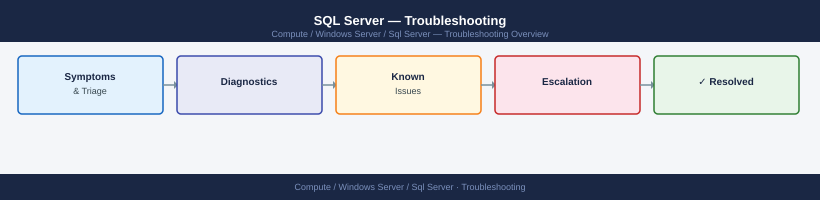

---
tags:
  - troubleshooting
  - windows
search:
  boost: 1.5
---
# SQL Server — Troubleshooting

SQL Server troubleshooting hub: AG health, job failures, deadlocks, tempdb contention, and escalation path to Microsoft Premier Support.

*Applies to: Windows Server 2019 / 2022*

  <a class="kb-card" href="common-issues/">Common Issues</a>
  <a class="kb-card" href="diagnostics/">Diagnostics</a>
  <a class="kb-card" href="escalation/">Escalation</a>

