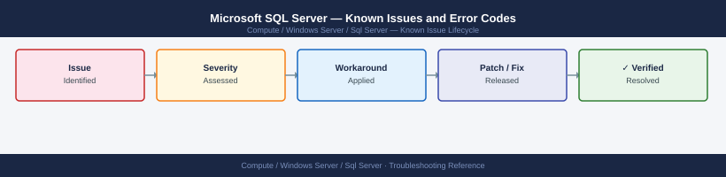

---
tags:
  - troubleshooting
  - sql-server
  - windows-server
  - known-issues
---
# Microsoft SQL Server — Known Issues and Error Codes

Catalog of known SQL Server bugs, error codes, and workarounds covering connectivity, AG failover, blocking, and backup.

*Applies to: SQL Server 2019 / 2022*

## Before you begin

- SQL Server errors appear in SQL Server Management Studio (SSMS) → Management → SQL Server Logs.
- Error log: `SELECT * FROM sys.fn_xe_file_target_read_file(...)` or view in SSMS.
- Most connectivity errors are port (1433) or authentication (Windows vs SQL auth mode) issues.

## Connectivity

| Error / Symptom | Affected Versions | Cause | Workaround / Fix | Fixed In |
|---|---|---|---|---|
| Error 10061 `No connection could be made` | SQL 2019/2022 | SQL Server not listening or TCP 1433 blocked | Enable TCP in SQL Server Configuration Manager; allow 1433 in Windows Firewall | N/A |
| `Login failed for user NT AUTHORITY\ANONYMOUS LOGON` | SQL 2019/2022 | Kerberos double-hop issue; SPN not registered | Register SPN: `setspn -A MSSQLSvc/<host>:1433 <domain>\<svc-account>` | N/A |
| `Cannot open database requested by login` | All | Database offline or user not mapped to database | Bring database online; check user-database mapping in SSMS | N/A |

## Availability Groups

| Error / Symptom | Affected Versions | Cause | Workaround / Fix | Fixed In |
|---|---|---|---|---|
| AG secondary shows `Not Synchronizing` | SQL 2019/2022 | Endpoint port 5022 blocked between AG replicas | Verify TCP 5022 between all replica nodes; check AG endpoint: `SELECT * FROM sys.database_mirroring_endpoints` | N/A |
| Automatic failover not triggering | SQL 2019/2022 | Failover mode not set to `Automatic` or health detection threshold too high | Set AG failover mode: `ALTER AVAILABILITY GROUP ... MODIFY REPLICA ... WITH (FAILOVER_MODE = AUTOMATIC)` | N/A |
| `AG listener not reachable` after failover | SQL 2019/2022 | Windows Failover Cluster VIP not responding | Check Windows Failover Cluster Manager → Networks; verify listener VIP moved to new primary | N/A |

## Performance

| Error / Symptom | Affected Versions | Cause | Workaround / Fix | Fixed In |
|---|---|---|---|---|
| High blocking — `SPID waiting on LCK_M_X` | All | Long-running transaction holding lock | Identify blocker: `SELECT * FROM sys.dm_exec_requests WHERE blocking_session_id != 0` | N/A |
| TempDB contention (`PAGELATCH_EX`) | SQL 2019/2022 | TempDB data files too few for concurrent sessions | Add TempDB files: 1 per logical CPU core (up to 8) via `ALTER DATABASE tempdb ADD FILE` | N/A |

## See also

- [SQL Server — Common Issues](common-issues/)
- [Windows Server — Known Issues](../../troubleshooting/known-issues.md)
- [Active Directory — Known Issues](../../active-directory/troubleshooting/known-issues.md)
