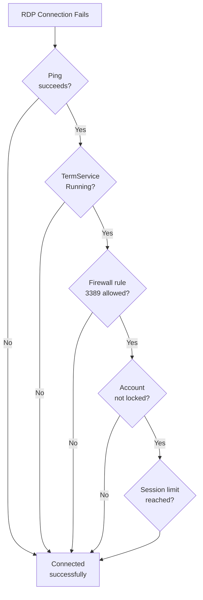

# Windows Server — Common Issues


<div class="kb-summary">
Quick reference for common problems and resolutions. Structured approach to diagnosing common Windows Server issues.
</div>

Quick reference for common problems and resolutions.

Structured approach to diagnosing common Windows Server issues.

## RDP Connectivity Triage


┌─────────────────────────── Windows Server — Troubleshooting Common Issues ────────────────────────────┐
│                                                                                                       │
│  Step-by-step resolution for services, boot failures, high CPU/RAM, and network connectivity.         │
│                                                                                                       │
│   ┌──────────────────────────────────────────────┐  ┌─────────────────────────────────────────────┐   │
│   │           Service & Boot Failures            │  │              Performance Issues             │   │
│   │          sc query → sc start <svc>           │  │          Task Manager → Details tab         │   │
│   │      Event 7034/7000: crash/start fail       │  │        CPU: top process + call stack        │   │
│   │        Dependency check: sc qc <svc>         │  │          RAM: pool monitor; poolmon         │   │
│   │       BSOD: check minidump + !analyze        │  │        Disk: diskperf; latency > 20ms       │   │
│   │       Boot: bcdedit; recovery console        │  │         Handle/thread leak: procexp         │   │
│   └──────────────────────────────────────────────┘  └─────────────────────────────────────────────┘   │
│                                                                                                       │
│  Service and boot failures resolved via sc tools and event logs; perf via Perfmon/procexp.            │
│                                                                                                       │
│                          ▼                                                 ▼                          │
│                                                                                                       │
│   ┌──────────────────────────────────────────────┐  ┌─────────────────────────────────────────────┐   │
│   │             Network & DNS Issues             │  │          AD & Authentication Issues         │   │
│   │         ipconfig /flushdns + /renew          │  │         klist purge; re-request TGT         │   │
│   │         nslookup to test DNS records         │  │           nltest /sc_verify:domain          │   │
│   │         netsh int ip reset + Winsock         │  │            repadmin /syncall /Ade           │   │
│   │        Test-NetConnection port check         │  │         w32tm /resync for clock skew        │   │
│   │         netstat -ano: port conflicts         │  │         gpupdate /force; gpresult /h        │   │
│   └──────────────────────────────────────────────┘  └─────────────────────────────────────────────┘   │
│                                                                                                       │
│  Physical Infrastructure (the hardware everything above runs on):                                     │
│  Physical or virtual server · NIC ports · iDRAC/iLO OOB · domain controller network path              │
│                                                                                                       │
│  Key terms:                                                                                           │
│                                                                                                       │
│  sc             = Service Control CLI; query, start, stop, configure Windows services                 │
│  Event 7034     = service terminated unexpectedly; maps to specific service crash                     │
│  bcdedit        = Boot Configuration Data editor; modify boot entries and flags                       │
│  !analyze       = WinDbg command; auto-analyses crash dump for root cause                             │
│  poolmon        = kernel pool monitor; detects pool tag memory leaks                                  │
│  diskperf       = enables disk performance counters; required for Perfmon disk stats                  │
│  klist          = Kerberos ticket list; purge clears cached tickets for re-auth                       │
│  nltest         = network logon test; /sc_verify checks secure channel to DC                          │
│  w32tm          = Windows Time service tool; /resync forces NTP re-synchronisation                    │
│  repadmin       = AD replication admin; /syncall forces replication from all partners                 │
│  gpupdate       = Group Policy update; /force reapplies all policies immediately                      │
│  Test-NetConnection= PS cmdlet testing TCP port connectivity and route tracing                        │
│  procexp        = SysInternals Process Explorer; shows handles, threads, DLLs per process             │
│                                                                                                       │
└───────────────────────────────────────────────────────────────────────────────────────────────────────┘
```powershell

## High Memory

```powershell
# Memory summary
$os = Get-CimInstance Win32_OperatingSystem
"Free: $([math]::Round($os.FreePhysicalMemory/1MB,1)) GB of $([math]::Round($os.TotalVisibleMemorySize/1MB,1)) GB"

# Top memory consumers
Get-Process | Sort-Object WorkingSet -Descending | Select-Object -First 10 Name, Id,
    @{N="WS_MB"; E={ [math]::Round($_.WorkingSet/1MB,1) }},
    @{N="Priv_MB"; E={ [math]::Round($_.PrivateMemorySize64/1MB,1) }}

# Memory pressure — paging activity
Get-Counter '\Memory\Pages/sec', '\Memory\Available MBytes' -SampleInterval 5 -MaxSamples 5

# Non-paged pool exhaustion event
Get-WinEvent -FilterHashtable @{ LogName='System'; Id=2019 } -MaxEvents 3 -ErrorAction SilentlyContinue
```

## Disk Full or High Latency

```powershell
# Which volume is full?
Get-PSDrive -PSProvider FileSystem | Select-Object Name,
    @{N="FreeGB";  E={ [math]::Round($_.Free/1GB,1) }},
    @{N="TotalGB"; E={ [math]::Round(($_.Used+$_.Free)/1GB,1) }},
    @{N="UsedPct"; E={ [math]::Round($_.Used/($_.Used+$_.Free)*100,1) }}

# Largest directories on C:\
Get-ChildItem C:\ -Directory | ForEach-Object {
    [PSCustomObject]@{
        Name    = $_.Name
        SizeGB  = [math]::Round((Get-ChildItem $_.FullName -Recurse -ErrorAction SilentlyContinue |
            Measure-Object Length -Sum).Sum / 1GB, 2)
    }
} | Sort-Object SizeGB -Descending

# Disk latency — Avg sec/Transfer > 20ms = problem
Get-Counter '\PhysicalDisk(*)\Avg. Disk sec/Transfer' -SampleInterval 2 -MaxSamples 5
```

## Network Connectivity Issues

```powershell
# Is the adapter up?
Get-NetAdapter | Select-Object Name, Status, LinkSpeed

# IP and routing
Get-NetIPAddress -AddressFamily IPv4 | Select-Object InterfaceAlias, IPAddress, PrefixLength
Get-NetRoute -AddressFamily IPv4 | Sort-Object RouteMetric | Select-Object -First 10

# Test DNS
Resolve-DnsName corp.local
Test-NetConnection -ComputerName 10.0.0.1 -Port 443

# Firewall — check if port is blocked
Get-NetFirewallRule -Direction Inbound -Enabled True -Action Block |
    Select-Object DisplayName, Profile, LocalPort | Format-Table -AutoSize
```

## Service Not Starting

```powershell
# Get the error
Get-Service -Name <ServiceName> | Select-Object *
Get-WinEvent -FilterHashtable @{ LogName='System'; Id=7000,7001,7009,7011,7034 } -MaxEvents 20 |
    Where-Object { $_.Message -match "<ServiceName>" } |
    Select-Object TimeCreated, Id, Message | Format-List

# Check service account permissions
Get-CimInstance Win32_Service -Filter "Name='<ServiceName>'" | Select-Object Name, StartName, State
```

## RDP / Remote Access Issues

```powershell
# Is RDP listening?
Get-NetTCPConnection -LocalPort 3389 | Select-Object State, OwningProcess

# Is firewall allowing RDP?
Get-NetFirewallRule -DisplayName "*Remote Desktop*" | Select-Object DisplayName, Enabled, Direction, Action

# Is TermService running?
Get-Service TermService | Select-Object Status, StartType

# Check RDP login failures (Event ID 4625)
Get-WinEvent -FilterHashtable @{ LogName='Security'; Id=4625 } -MaxEvents 20 |
    Select-Object TimeCreated, Message | Format-List
```
