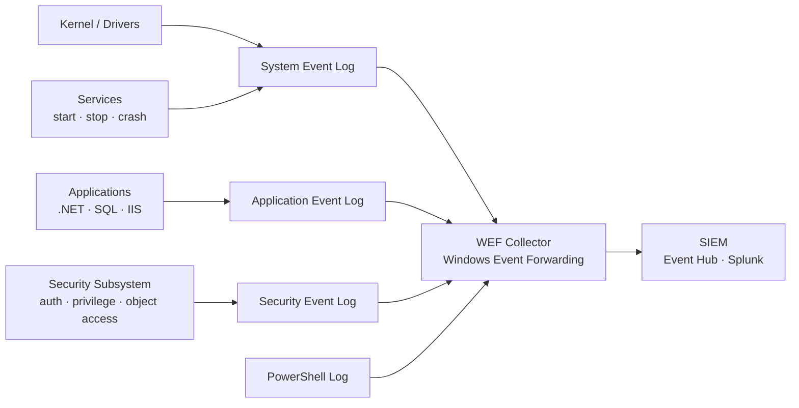

# Windows Server — Diagnostics


<div class="kb-summary">
Diagnostics reference covering Windows Event Log Pipeline, Key Security Event IDs, Searching by Event ID, Exporting Logs, Event Log Forwarding (WEF) and 3 more sections.
</div>

Diagnostic procedures and log analysis.

## Windows Event Log Pipeline


┌──────────────────────────────────── Windows Server — Diagnostics ─────────────────────────────────────┐
│                                                                                                       │
│  Diagnostics: event log analysis, performance data collection, network traces, memory dumps.          │
│                                                                                                       │
│   ┌──────────────────────────────────────────────┐  ┌─────────────────────────────────────────────┐   │
│   │              Event Log Analysis              │  │         Performance Data Collection         │   │
│   │         wevtutil qe System /count:50         │  │         Perfmon: data collector sets        │   │
│   │        Get-WinEvent filter hash table        │  │           typeperf: counter to CSV          │   │
│   │        Subscriptions: WEF centralise         │  │          PAL: Perf Analysis of Logs         │   │
│   │         Custom views: by error level         │  │         Resource Monitor: real-time         │   │
│   │           Export: evtx for offline           │  │        Process Monitor: file+reg+net        │   │
│   └──────────────────────────────────────────────┘  └─────────────────────────────────────────────┘   │
│                                                                                                       │
│  Event logs show what happened; Perfmon and procmon show how the system behaved.                      │
│                                                                                                       │
│                          ▼                                                 ▼                          │
│                                                                                                       │
│   ┌──────────────────────────────────────────────┐  ┌─────────────────────────────────────────────┐   │
│   │             Network Diagnostics              │  │          Memory & Crash Diagnostics         │   │
│   │          netsh trace start capture           │  │         Task Manager: commit charge         │   │
│   │           Wireshark: .etl to .pcap           │  │         Poolmon: tag leak detection         │   │
│   │         netstat -anob: PID per port          │  │          WinDbg: !analyze -v crash          │   │
│   │          tracert + pathping latency          │  │           procdump -ma <PID> dump           │   │
│   │          PortQry: remote port scan           │  │          MDSN for WER online search         │   │
│   └──────────────────────────────────────────────┘  └─────────────────────────────────────────────┘   │
│                                                                                                       │
│  Physical Infrastructure (the hardware everything above runs on):                                     │
│  Physical or virtual server · NIC for packet capture · dump storage disk · OOB console                │
│                                                                                                       │
│  Key terms:                                                                                           │
│                                                                                                       │
│  wevtutil       = Windows Event Utility; CLI query, export, and clear event logs                      │
│  Get-WinEvent   = PowerShell cmdlet; powerful filter-hash queries across event logs                   │
│  WEF            = Windows Event Forwarding; aggregates events to a central collector                  │
│  Perfmon        = Performance Monitor; records counters to BLG/CSV/SQL data sets                      │
│  typeperf       = CLI perfmon; writes counter data to CSV for offline analysis                        │
│  PAL            = Performance Analysis of Logs; analyses BLG files against thresholds                 │
│  Resource Monitor= real-time view of CPU/RAM/disk/network per process                                 │
│  procmon        = SysInternals Process Monitor; captures file, registry, network events               │
│  netsh trace    = built-in packet capture; outputs ETL for Message Analyser / Wireshark               │
│  poolmon        = kernel pool monitor; detects memory tag leaks in driver pool                        │
│  WinDbg         = Windows Debugger; analyses crash dumps; !analyze -v auto-diagnoses                  │
│  procdump       = SysInternals; captures process memory dump for hang/crash analysis                  │
│  PortQry        = Microsoft port connectivity scanner; tests TCP/UDP port accessibility               │
│                                                                                                       │
└───────────────────────────────────────────────────────────────────────────────────────────────────────┘
```
┌──────────────────────────────────── Windows Server — Diagnostics ─────────────────────────────────────┐
│                                                                                                       │
│  Diagnostics: event log analysis, performance data collection, network traces, memory dumps.          │
│                                                                                                       │
│   ┌──────────────────────────────────────────────┐  ┌─────────────────────────────────────────────┐   │
│   │              Event Log Analysis              │  │         Performance Data Collection         │   │
│   │         wevtutil qe System /count:50         │  │         Perfmon: data collector sets        │   │
│   │        Get-WinEvent filter hash table        │  │           typeperf: counter to CSV          │   │
│   │        Subscriptions: WEF centralise         │  │          PAL: Perf Analysis of Logs         │   │
│   │         Custom views: by error level         │  │         Resource Monitor: real-time         │   │
│   │           Export: evtx for offline           │  │        Process Monitor: file+reg+net        │   │
│   └──────────────────────────────────────────────┘  └─────────────────────────────────────────────┘   │
│                                                                                                       │
│  Event logs show what happened; Perfmon and procmon show how the system behaved.                      │
│                                                                                                       │
│                          ▼                                                 ▼                          │
│                                                                                                       │
│   ┌──────────────────────────────────────────────┐  ┌─────────────────────────────────────────────┐   │
│   │             Network Diagnostics              │  │          Memory & Crash Diagnostics         │   │
│   │          netsh trace start capture           │  │         Task Manager: commit charge         │   │
│   │           Wireshark: .etl to .pcap           │  │         Poolmon: tag leak detection         │   │
│   │         netstat -anob: PID per port          │  │          WinDbg: !analyze -v crash          │   │
│   │          tracert + pathping latency          │  │           procdump -ma <PID> dump           │   │
│   │          PortQry: remote port scan           │  │          MDSN for WER online search         │   │
│   └──────────────────────────────────────────────┘  └─────────────────────────────────────────────┘   │
│                                                                                                       │
│  Physical Infrastructure (the hardware everything above runs on):                                     │
│  Physical or virtual server · NIC for packet capture · dump storage disk · OOB console                │
│                                                                                                       │
│  Key terms:                                                                                           │
│                                                                                                       │
│  wevtutil       = Windows Event Utility; CLI query, export, and clear event logs                      │
│  Get-WinEvent   = PowerShell cmdlet; powerful filter-hash queries across event logs                   │
│  WEF            = Windows Event Forwarding; aggregates events to a central collector                  │
│  Perfmon        = Performance Monitor; records counters to BLG/CSV/SQL data sets                      │
│  typeperf       = CLI perfmon; writes counter data to CSV for offline analysis                        │
│  PAL            = Performance Analysis of Logs; analyses BLG files against thresholds                 │
│  Resource Monitor= real-time view of CPU/RAM/disk/network per process                                 │
│  procmon        = SysInternals Process Monitor; captures file, registry, network events               │
│  netsh trace    = built-in packet capture; outputs ETL for Message Analyser / Wireshark               │
│  poolmon        = kernel pool monitor; detects memory tag leaks in driver pool                        │
│  WinDbg         = Windows Debugger; analyses crash dumps; !analyze -v auto-diagnoses                  │
│  procdump       = SysInternals; captures process memory dump for hang/crash analysis                  │
│  PortQry        = Microsoft port connectivity scanner; tests TCP/UDP port accessibility               │
│                                                                                                       │
└───────────────────────────────────────────────────────────────────────────────────────────────────────┘
```

## Exporting Logs

```powershell
# Export Security log to EVTX file
wevtutil epl Security C:\Logs\Security-$(Get-Date -Format 'yyyyMMdd').evtx

# Export filtered events to XML
Get-WinEvent -FilterHashtable @{ LogName='System'; Level=2 } -MaxEvents 500 |
    Export-Clixml C:\Logs\SystemErrors.xml

# Export to CSV for analysis
Get-WinEvent -FilterHashtable @{ LogName='System'; Level=2; StartTime=(Get-Date).AddDays(-7) } |
    Select-Object TimeCreated, Id, LevelDisplayName, Message |
    Export-Csv C:\Logs\SystemErrors.csv -NoTypeInformation
```

## Event Log Forwarding (WEF)

Windows Event Forwarding collects events centrally from multiple servers.

```powershell
# On collector — enable WecSvc
wecutil qc /q

# Create subscription (from XML file)
wecutil cs C:\Subscriptions\security-events.xml

# List subscriptions
wecutil es

# Check subscription status
wecutil gr <SubscriptionName>
```

On source servers, configure via GPO:
- `Computer Configuration → Windows Settings → Security Settings → System Services → Windows Remote Management → Automatic`
- `Computer Configuration → Administrative Templates → Windows Components → Event Forwarding → Configure target Subscription Manager`

## Log Size and Retention

```powershell
# Check current log sizes and limits
Get-WinEvent -ListLog System, Application, Security |
    Select-Object LogName, MaximumSizeInBytes,
        @{N="CurrentSizeMB"; E={ [math]::Round($_.FileSize/1MB,1) }},
        LogMode

# Set max size (e.g., Security log to 1 GB)
wevtutil sl Security /ms:1073741824

# Clear a log (after archiving)
wevtutil cl Application
```

## Sysmon (Extended Logging)

If Sysmon is deployed:

```powershell
# Process creation events (Event ID 1)
Get-WinEvent -LogName 'Microsoft-Windows-Sysmon/Operational' |
    Where-Object { $_.Id -eq 1 } |
    Select-Object -First 20 TimeCreated, Message | Format-List

# Network connections (Event ID 3)
Get-WinEvent -LogName 'Microsoft-Windows-Sysmon/Operational' |
    Where-Object { $_.Id -eq 3 } |
    Select-Object -First 20 TimeCreated, Message | Format-List
```

---

## Performance Analysis

Performance monitoring, baseline capture, and bottleneck identification.

### Quick Performance Snapshot

```powershell
# CPU usage (5-sample average)
$cpu = Get-Counter '\Processor(_Total)\% Processor Time' -SampleInterval 2 -MaxSamples 5
[math]::Round(($cpu.CounterSamples.CookedValue | Measure-Object -Average).Average, 1)

# Memory
$os = Get-CimInstance Win32_OperatingSystem
[PSCustomObject]@{
    TotalGB   = [math]::Round($os.TotalVisibleMemorySize/1MB, 1)
    FreeGB    = [math]::Round($os.FreePhysicalMemory/1MB, 1)
    UsedPct   = [math]::Round(($os.TotalVisibleMemorySize - $os.FreePhysicalMemory)/$os.TotalVisibleMemorySize*100, 1)
}

# Top processes by CPU
Get-Process | Sort-Object CPU -Descending | Select-Object -First 10 Name, Id,
    @{N="CPU%"; E={ [math]::Round($_.CPU, 1) }}, WorkingSet

# Top processes by memory
Get-Process | Sort-Object WorkingSet -Descending | Select-Object -First 10 Name, Id,
    @{N="MemMB"; E={ [math]::Round($_.WorkingSet/1MB, 1) }}
```

### Performance Thresholds

| Counter | Warning | Critical |
|---|---|---|
| CPU % Processor Time | > 70% sustained | > 90% sustained |
| Memory Available MB | < 20% of total | < 10% of total |
| Pages/sec | > 100/sec | > 1,000/sec |
| Disk Avg. sec/Transfer | > 15 ms | > 25 ms |
| Disk % Disk Time | > 80% | > 95% |
| Network % Bandwidth | > 70% | > 90% |

### Data Collector Sets (PerfMon)

```powershell
# Create a data collector set from command line
logman create counter "PerfBaseline" ^
    -c "\Processor(_Total)\% Processor Time" ^
       "\Memory\Available MBytes" ^
       "\PhysicalDisk(*)\Avg. Disk sec/Transfer" ^
       "\Network Interface(*)\Bytes Total/sec" ^
    -si 00:00:05 ^
    -f bincirc ^
    -max 500 ^
    -o C:\PerfLogs\baseline

logman start PerfBaseline
logman stop PerfBaseline
```

### Collecting Diagnostics for Vendor/TAC

```powershell
# System info
msinfo32 /report C:\Logs\msinfo32-$(hostname)-$(Get-Date -Format yyyyMMdd).txt

# Event logs export
wevtutil epl System C:\Logs\System.evtx
wevtutil epl Application C:\Logs\Application.evtx
wevtutil epl Security C:\Logs\Security.evtx

# Network trace (2-minute capture)
netsh trace start capture=yes tracefile=C:\Logs\nettrace.etl
Start-Sleep 120
netsh trace stop
```
