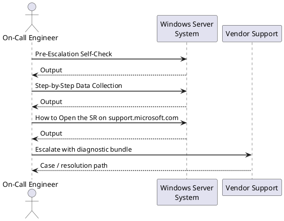
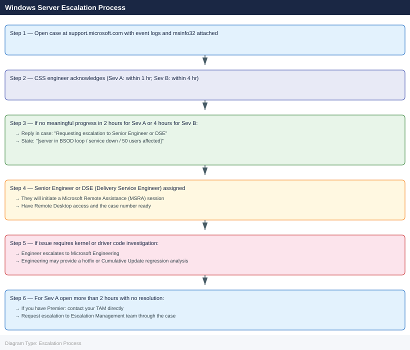

---
tags:
  - troubleshooting
  - windows
search:
  boost: 1.5
---
# Windows Server — Escalation

<div class="kb-summary">
How to escalate Windows Server issues to Microsoft support: what data to collect, how to run the diagnostic package, step-by-step case creation on the Microsoft portal, and the escalation path when progress stalls.

*Applies to: Windows Server 2019 / 2022*
</div>

---



## Before you begin

- **Access required:** Local Administrator or Domain Admin on the affected server; Microsoft 365 admin account or Premier contract access on support.microsoft.com
- **Do this first:** collect diagnostics before rebooting. A reboot clears the Windows Event Log volatile entries and resets the crash dump state
- **Do NOT run `chkdsk /f`** on a live mounted volume — it requires a reboot and schedules the check, which may mask or alter the filesystem state the support engineer needs to examine
- **Crash dump:** if the server has BSOD'd, DO NOT reboot before checking `%SystemRoot%\Minidump\` — the dump files are written before the reboot and are critical for kernel crash analysis

---

## Pre-Escalation Self-Check

Run these before opening the case.

| Check | Where to look | Expected result |
|---|---|---|
| Windows version | `winver` or `systeminfo` | Note full build (e.g. 10.0.20348.2400) |
| System uptime | `systeminfo \| findstr "Boot Time"` | Consistent with known reboots |
| Recent critical events | Event Viewer → Windows Logs → System → filter Level = Critical | Review all Critical events in last 24h |
| Application event errors | Event Viewer → Windows Logs → Application → Level Error | Note Event ID and Source |
| BSOD dumps | `dir %SystemRoot%\Minidump\` | Note most recent .dmp files |
| Full crash dump | `dir %SystemRoot%\memory.dmp` | Present if configured and BSOD occurred |
| Disk space | `Get-PSDrive C \| Select-Object Used,Free` (PowerShell) | > 15% free |
| Windows Update errors | `%SystemRoot%\Logs\CBS\CBS.log` → search "FAIL" | No recent update failures |
| Services status | `Get-Service \| Where-Object Status -ne Running` (PowerShell) | All expected services running |

---

## Step-by-Step Data Collection

Run on the affected server as Administrator.

### 1. Get the Windows version and installed hotfixes

```powershell
# Windows version and build number — include in case description
[System.Environment]::OSVersion.VersionString
(Get-ComputerInfo).WindowsBuildLabEx

# Full system info (generates the text output)
systeminfo

# Last 10 installed hotfixes (for correlation with issue start)
Get-HotFix | Sort-Object InstalledOn -Descending | Select-Object -First 10
```

### 2. Export Windows Event Logs

```powershell
# Export the System log to a file — covers BSODs, driver faults, disk errors
wevtutil epl System C:\Temp\System-$(Get-Date -Format 'yyyyMMdd').evtx

# Export the Application log
wevtutil epl Application C:\Temp\Application-$(Get-Date -Format 'yyyyMMdd').evtx

# If IIS / DNS / AD is involved, export the relevant Admin log too
# Example for DNS:
wevtutil epl "DNS Server" C:\Temp\DNS-$(Get-Date -Format 'yyyyMMdd').evtx

# Get the last 50 System log errors as plain text (for pasting into the case description)
Get-EventLog -LogName System -EntryType Error,FailureAudit -Newest 50 |
  Format-List TimeGenerated, EntryType, Source, EventID, Message |
  Out-File C:\Temp\system-errors-$(Get-Date -Format 'yyyyMMdd').txt
```

### 3. Collect crash dump (if BSOD occurred)

```cmd
rem Check for mini dumps (small; always check first)
dir %SystemRoot%\Minidump\

rem Check for full memory dump
dir %SystemRoot%\memory.dmp

rem Verify crash dump is configured for future crashes
reg query "HKLM\System\CurrentControlSet\Control\CrashControl" /v CrashDumpEnabled
rem Value 7 = automatic; Value 2 = kernel; Value 1 = full
```

If a dump file exists, note the path. For full dumps (memory.dmp), Microsoft will provide upload instructions — files can be several GB.

### 4. Run msinfo32 (system snapshot)

```cmd
rem Export full system information to a file — required for all Microsoft cases
msinfo32 /nfo C:\Temp\sysinfo-%COMPUTERNAME%.nfo

rem This takes 30–60 seconds. The .nfo file includes:
rem - Hardware resources (IRQ, I/O, DMA)
rem - Components (disk drives, display, network)
rem - Software environment (drivers, services, startup items)
```

### 5. Capture performance data (for CPU/memory/disk issues)

```powershell
# Start a 5-minute Performance Monitor capture
$logfile = "C:\Temp\perfmon-$(Get-Date -Format 'yyyyMMdd-HHmm').blg"
logman create counter "escalation-capture" -f bincirc -max 100 `
  -c "\Processor(_Total)\% Processor Time" `
     "\Memory\Available MBytes" `
     "\LogicalDisk(_Total)\% Disk Time" `
     "\LogicalDisk(_Total)\Avg. Disk Queue Length" `
     "\Network Interface(*)\Bytes Total/sec" `
  -o $logfile -si 5
logman start "escalation-capture"
Start-Sleep 300   # 5 minutes
logman stop "escalation-capture"
logman delete "escalation-capture"
```

### 6. Write the timeline

```text
Windows version: Windows Server 2022 Datacenter (Build 20348.2400)
Server: prod-srv-01.corp.local
Issue first observed: 2026-06-14 14:30 UTC
Last known good state: 2026-06-14 10:00 UTC
Changes in 24h before the issue:
  - 10:00: Windows Update applied (KB5034765)
  - 14:25: Server logged BSOD DRIVER_IRQL_NOT_LESS_OR_EQUAL; auto-restarted
  - 14:30: BSOD recurred after restart
Steps already taken:
  - Checked Minidump\: 2 dump files present for today's crashes
  - Event Viewer shows Event ID 41 (unexpected restart) + Event ID 1001 (BugCheck)
  - Did NOT clear logs or apply additional patches
Blast radius: Application service unavailable; 50 users affected
```

---

## How to Open the SR on support.microsoft.com

1. Go to **support.microsoft.com** and sign in with your Microsoft 365 admin account or Premier contract credentials.

2. Click **Get support** or navigate to **Microsoft 365 admin center** → **Support** → **New service request** (if you have a Microsoft 365 subscription). For standalone Windows Server Premier, go to **support.microsoft.com/premier**.

3. Under **Product**, select **Windows Server** and choose your version (2019 or 2022).

4. Under **Issue type**, select **Technical**.

5. Under **Severity**, select:
   - **Severity A — Critical**: Server completely down; BSOD occurring continuously; data loss; no workaround; production is halted
   - **Severity B — High**: Server degraded; key service down; significant user impact; workaround exists but impractical
   - **Severity C — General**: Non-critical issue; workaround available; limited user impact
   - **Severity D — Minimal**: How-to question, pre-check, or planning inquiry

6. In the **Title** field: OS + symptom + scope. Example: `Windows Server 2022 prod-srv-01 — recurring BSOD DRIVER_IRQL since KB5034765, 50 users offline`.

7. In the **Description** field, paste:
   - Windows version and build from Step 1
   - The last 10 installed hotfixes
   - Event ID and Source from the System/Application log
   - The crash dump file path from Step 3
   - The timeline from Step 6

8. Under **Attachments**, upload:
   - The exported .evtx log files from Step 2
   - The msinfo32 .nfo file from Step 4
   - The performance log if captured

9. Click **Submit**. You will receive a case number by email immediately.

10. **Severity A only:** call Microsoft support after submission. Find your regional number on the case confirmation page or at support.microsoft.com → Contact Us. State "Severity A — Windows Server BSOD loop, production down" at the start of the call.

---

## Escalation Path



---

## What NOT to Do

| Do NOT do this | Why | What to do instead |
|---|---|---|
| Run `chkdsk /f` on a live volume | Requires a reboot; schedules check that alters filesystem before support reviews it | Get Microsoft to review the Event Log first; they will advise if chkdsk is needed |
| Clear Windows Event Logs | Destroys the diagnostic data Microsoft needs; Event Viewer → Clear will permanently lose entries | Export the logs first (Step 2 above), then clear if needed |
| Apply Windows Updates mid-incident | Adds variables; a bad patch or regression may be the root cause | Freeze all updates until Microsoft confirms the update is safe |
| Reboot before capturing crash dumps | Does NOT lose Minidump files (persisted), but may complicate full dump recovery | Check `%SystemRoot%\Minidump\` before each reboot |
| Run `sfc /scannow` and `DISM /restorehealth` proactively | May repair files Microsoft was using for diagnosis | Only run if Microsoft specifically instructs you to |
| Re-install the service or application mid-case | Changes the configuration Microsoft is analysing | Document and hold all changes until the case is closed |

---

## Useful Commands for Case Updates

```powershell
# Current server state — paste into every case update
Get-ComputerInfo | Select-Object WindowsBuildLabEx, OsInstallDate, CsUptime
Get-EventLog -LogName System -EntryType Error,FailureAudit -Newest 20 |
  Select-Object TimeGenerated, EntryType, Source, EventID, Message | Format-List

# Crash dump summary (copy output to paste into case)
Get-ChildItem -Path "$env:SystemRoot\Minidump\" -ErrorAction SilentlyContinue |
  Sort-Object LastWriteTime -Descending | Select-Object Name, Length, LastWriteTime

# Service status (check for stopped services)
Get-Service | Where-Object Status -ne Running | Select-Object Name, DisplayName, Status

# Disk space
Get-PSDrive -PSProvider FileSystem | Select-Object Name, Used, Free

# Running processes with CPU
Get-Process | Sort-Object CPU -Descending | Select-Object -First 20 Name, CPU, WorkingSet
```

---

## Common Issue Reference

| Issue | First tool | What to capture |
|---|---|---|
| BSOD / crash | WinDbg / Minidump | `%SystemRoot%\Minidump\*.dmp` — newest file |
| High CPU | Task Manager / WPR | 30-second WPR trace at peak; `Get-Process` snapshot |
| Memory leak | PerfMon / Task Manager | Private Bytes per process over 30 minutes |
| Slow logon | DCDiag / `gpresult /h` | DC connectivity; GPO application time in `gpresult` |
| Windows Update failure | `CBS.log` | `%SystemRoot%\Logs\CBS\CBS.log` — search "FAIL" |
| DNS resolution failure | `Resolve-DnsName`, `nslookup` | DNS suffix search order; forwarder reachability |

---

## See also

- [Windows Server — Diagnostics](../diagnostics/)
- [Windows Server — Common Issues](../common-issues/)

---

## Verify resolution

- The BSOD or service failure no longer recurs after a full reboot cycle
- Event Viewer → System shows no new Critical or Error events related to the original issue for 30 minutes
- Run `Get-Service | Where-Object Status -ne Running` and confirm all expected services are running
- Confirm `%SystemRoot%\Minidump\` shows no new crash dumps since the fix was applied
- For performance issues: run the PerfMon capture again and confirm counters return to baseline
- Monitor for one full production cycle before closing the case
