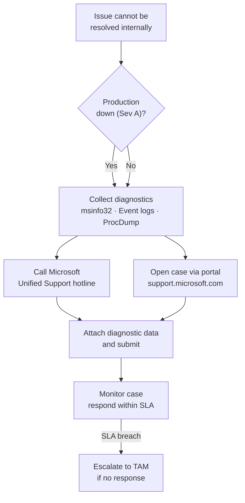

# Windows Server — Escalation

What to collect before opening a support case and how to engage vendor support.

## Escalation Flow


┌───────────────────────────── Windows Server — Troubleshooting Escalation ─────────────────────────────┐
│                                                                                                       │
│  Escalation path: internal L2/L3 → Microsoft Premier/TAC → CSS with diagnostic bundle.                │
│                                                                                                       │
│   ┌──────────────────────────────────────────────┐  ┌─────────────────────────────────────────────┐   │
│   │           Internal Escalation Path           │  │         Microsoft Support Escalation        │   │
│   │        L1 → L2: event logs + timeline        │  │         Open MS Support case online         │   │
│   │        L2 → L3: attach dump + procmon        │  │          Premier: SfMC / DSE assign         │   │
│   │        L3 → Vendor: full diag bundle         │  │         CSS: case + severity rating         │   │
│   │         Incident commander for Sev-1         │  │        Share: SDP (Support Diag Pkg)        │   │
│   │          Bridge call + screen share          │  │          Remote: MSRA or DART tool          │   │
│   └──────────────────────────────────────────────┘  └─────────────────────────────────────────────┘   │
│                                                                                                       │
│  Internal triage first; escalate to Microsoft with a complete diagnostic data package.                │
│                                                                                                       │
│                          ▼                                                 ▼                          │
│                                                                                                       │
│   ┌──────────────────────────────────────────────┐  ┌─────────────────────────────────────────────┐   │
│   │          Diagnostic Bundle Contents          │  │             Escalation Criteria             │   │
│   │        Event logs: evtx all channels         │  │          Sev-A: production down now         │   │
│   │        memory.dmp (full kernel dump)         │  │          Sev-B: degraded production         │   │
│   │        Perfmon BLG: 72h before issue         │  │          Sev-C: non-critical impact         │   │
│   │         netsh trace ETL during issue         │  │           Sev-D: general question           │   │
│   │          msinfo32 /nfo sysinfo file          │  │            CSAT after case closed           │   │
│   └──────────────────────────────────────────────┘  └─────────────────────────────────────────────┘   │
│                                                                                                       │
│  Physical Infrastructure (the hardware everything above runs on):                                     │
│  Physical or virtual server · OOB console · network path to Microsoft CSS upload endpoint             │
│                                                                                                       │
│  Key terms:                                                                                           │
│                                                                                                       │
│  SDP            = Support Diagnostic Package; Microsoft data collection script bundle                 │
│  CSS            = Customer Support Services; Microsoft front-line support organisation                │
│  Premier        = Microsoft Premier Support; dedicated TAM and faster SLA                             │
│  DSE            = Delivery Service Engineer; Microsoft Premier on-site or remote engineer             │
│  SfMC           = Support for Microsoft Cloud; specialist cloud support tier                          │
│  Severity A/B/C/D= Microsoft case severity; A = production down, D = informational                    │
│  MSRA           = Microsoft Remote Assistance; remote session for support engineer                    │
│  DART           = Diagnostics and Recovery Toolset; bootable WinPE recovery kit                       │
│  msinfo32       = System Information utility; exports full hardware/software snapshot                 │
│  memory.dmp     = full kernel crash dump; written on BSOD to SystemRoot                               │
│  procmon        = SysInternals Process Monitor; captures all I/O for escalation bundle                │
│  BLG            = binary performance log; Perfmon native format for counter data                      │
│  CSAT           = Customer Satisfaction survey; sent after Microsoft case closure                     │
│                                                                                                       │
└───────────────────────────────────────────────────────────────────────────────────────────────────────┘
```

## Support Tiers

| Tier | Access | SLA |
|---|---|---|
| Standard (pay-per-incident) | Web + phone per incident | Business hours |
| Developer | For development scenarios | Business hours |
| Professional Direct | Proactive services + faster response | 1 business hour for Sev A |
| Unified (formerly Premier) | Designated Support Engineer + advisory | < 1 hour for Sev A |

## Windows Server Lifecycle

| Version | Mainstream EOL | Extended Support EOL | ESU Available |
|---|---|---|---|
| Windows Server 2025 | October 2029 | October 2034 | N/A |
| Windows Server 2022 | October 2026 | October 2031 | N/A |
| Windows Server 2019 | January 2024 | January 2029 | N/A |
| Windows Server 2016 | January 2022 | January 2027 | N/A |
| Windows Server 2012 R2 | October 2018 | October 2023 | Via Azure Arc or ESU MAK |

Track EOL dates in CMDB — alert 12 months before Extended Support ends.

## Extended Security Updates (ESU)

For servers running Windows Server 2012/2012 R2 past EOL:

```powershell
# Option 1: Enroll via Azure Arc (no additional cost)
# Install Azure Arc agent, server auto-enrolls for ESU

# Option 2: Purchase ESU MAK key and activate
slmgr /ipk <ESU-MAK-KEY>
slmgr /ato

# Verify ESU activation
slmgr /dlv   # Should show "Extended Security Update" license
```

## Common Issue Reference

| Issue | Diagnostic Tool | Notes |
|---|---|---|
| BSOD / crash | WinDbg + crash dump | Collect from `%SystemRoot%\Minidump\` |
| High CPU | PerfMon, WPR | Capture 30-second trace at peak |
| Memory leak | Task Manager + PerfMon | Monitor "Private Bytes" per process over time |
| Slow logon | DCDiag, `gpresult /h` | Check DC connectivity and GPO application time |
| Windows Update failure | `%SystemRoot%\Logs\CBS\CBS.log` | Look for "FAIL" entries |
| DNS resolution | `Resolve-DnsName`, `nslookup` | Check DNS suffix search order |
