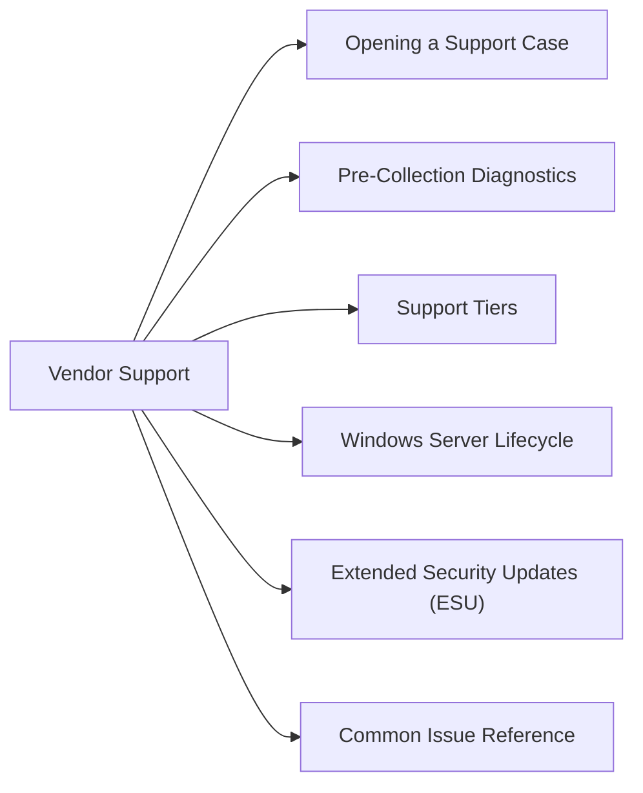

# Windows Server Vendor Support



## Opening a Support Case

Microsoft support portal: [support.microsoft.com](https://support.microsoft.com)

For enterprise customers with Unified/Premier support: [admin.microsoft.com](https://admin.microsoft.com) → Support → New Service Request

1. Select product: Windows Server
2. Select version and problem type
3. Provide: hostname, OS version, event log exports, and diagnostic data (see below)
4. For Sev A (production down): phone support is faster — call number on Unified support portal

## Pre-Collection Diagnostics

Always collect before opening a case — dramatically reduces time to resolution:

```powershell
# System information snapshot
msinfo32 /report C:\Temp\msinfo.txt

# System file integrity check
sfc /scannow

# Component store health
DISM /Online /Cleanup-Image /ScanHealth
DISM /Online /Cleanup-Image /CheckHealth

# Export relevant event logs
wevtutil epl System C:\Temp\System.evtx
wevtutil epl Application C:\Temp\Application.evtx
wevtutil epl Security C:\Temp\Security.evtx /q:"*[System[(Level<=3)]]"   # Warning+ only

# Network diagnostics
netsh trace start capture=yes tracefile=C:\Temp\NetTrace.etl
# ... reproduce issue ...
netsh trace stop

# Windows Performance Recorder for performance issues
wpr -start GeneralProfile -filemode
# ... reproduce issue (30 seconds) ...
wpr -stop C:\Temp\trace.etl
```

## Support Tiers

| Tier | Access | SLA |
|---|---|---|
| Standard (pay-per-incident) | Web + phone per incident | Business hours |
| Developer | For development scenarios | Business hours |
| Professional Direct | Proactive services + faster response | 1 business hour for Sev A |
| Unified (formerly Premier) | Designated Support Engineer + advisory | < 1 hour for Sev A |

## Windows Server Lifecycle

| Version | Mainstream EOL | Extended Support EOL | ESU Available |
|---|---|---|---|
| Windows Server 2025 | October 2029 | October 2034 | N/A |
| Windows Server 2022 | October 2026 | October 2031 | N/A |
| Windows Server 2019 | January 2024 | January 2029 | N/A |
| Windows Server 2016 | January 2022 | January 2027 | N/A |
| Windows Server 2012 R2 | October 2018 | October 2023 | Via Azure Arc or ESU MAK |

Track EOL dates in CMDB — alert 12 months before Extended Support ends.

## Extended Security Updates (ESU)

For servers running Windows Server 2012/2012 R2 past EOL:

```powershell
# Option 1: Enroll via Azure Arc (no additional cost)
# Install Azure Arc agent, server auto-enrolls for ESU

# Option 2: Purchase ESU MAK key and activate
slmgr /ipk <ESU-MAK-KEY>
slmgr /ato

# Verify ESU activation
slmgr /dlv   # Should show "Extended Security Update" license
```

## Common Issue Reference

| Issue | Diagnostic Tool | Notes |
|---|---|---|
| BSOD / crash | WinDbg + crash dump | Collect from `%SystemRoot%\Minidump\` |
| High CPU | PerfMon, WPR | Capture 30-second trace at peak |
| Memory leak | Task Manager + PerfMon | Monitor "Private Bytes" per process over time |
| Slow logon | DCDiag, `gpresult /h` | Check DC connectivity and GPO application time |
| Windows Update failure | `%SystemRoot%\Logs\CBS\CBS.log` | Look for "FAIL" entries |
| DNS resolution | `Resolve-DnsName`, `nslookup` | Check DNS suffix search order |
