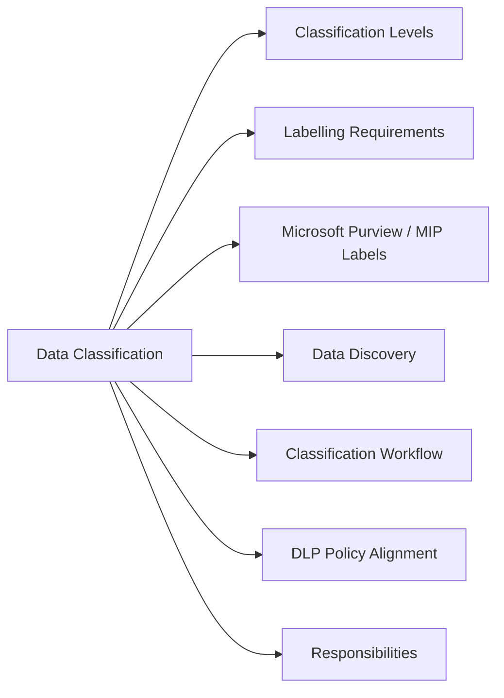

# Data Classification

Data classification defines how sensitive information must be labelled, handled, stored, and shared.



## Classification Levels

| Level | Description | Examples | Controls |
|---|---|---|---|
| Public | Approved for public distribution | Marketing materials, public docs | No restrictions |
| Internal | Internal use only — not for public | Internal policies, project plans | Employee access only |
| Confidential | Sensitive business or personal data | Financial data, HR records, customer data | Need-to-know; encrypted at rest |
| Restricted | Highest sensitivity; regulatory or legal implications | PII, PHI, PCI card data, credentials, legal privilege | Strict access; encrypted; audit-logged |

## Labelling Requirements

| Level | Email | Documents | Storage |
|---|---|---|---|
| Public | Optional | Optional | No special requirement |
| Internal | Header/footer label | Classification tag | Standard access control |
| Confidential | Label + encryption for external recipients | MIP/Purview sensitivity label | Encrypted volume or folder |
| Restricted | Encrypted send only | MIP Protect; watermark | Dedicated encrypted store; DLP policy |

## Microsoft Purview / MIP Labels

```powershell
Install-Module ExchangeOnlineManagement
Connect-IPPSSession

# List sensitivity labels
Get-Label | Select-Object DisplayName, Priority, IsDefault, Guid

# Check label policy assignments
Get-LabelPolicy | Select-Object Name, Labels, Users, Workloads
```

## Data Discovery

```bash
# Find files matching PII patterns (example — SSN format)
grep -rE "\b[0-9]{3}-[0-9]{2}-[0-9]{4}\b" /data/

# Use Microsoft Purview, Varonis, or Spirion for enterprise-scale discovery
```

## Classification Workflow

1. **Identify** — what type of data? Who created it? What system stores it?
2. **Classify** — apply the correct level based on content and context
3. **Label** — apply MIP/Purview label or physical label to storage/document
4. **Apply controls** — access restrictions, encryption, DLP rules per level
5. **Review** — revisit classification when data changes hands or usage changes

## DLP Policy Alignment

| Classification | DLP Action |
|---|---|
| Restricted — PCI | Block external email of card numbers; alert security |
| Restricted — PII | Encrypt external email; log access |
| Confidential | Warn on external sharing; allow with justification |
| Internal | Allow internally; block public share links |

## Responsibilities

| Role | Responsibility |
|---|---|
| Data Owner | Classify data; approve access requests |
| Data Custodian (IT) | Implement controls; maintain storage; enforce labels |
| Data User | Handle data per classification; report misclassification |
| Security / DLP team | Define policy; monitor violations; audit |
