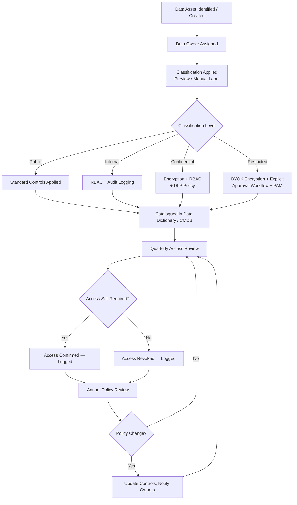

# Data Governance

Data governance is the framework of policies, roles, processes, and controls that ensure data is consistently managed, protected, and compliant with regulatory requirements across the enterprise. Effective governance transforms data from a liability into a controlled, auditable asset.

---

## Data Ownership Model

Every dataset must have an assigned owner, steward, and custodian. These are not interchangeable — each carries distinct accountability.

| Role | Who Holds It | Responsibilities |
|---|---|---|
| **Data Owner** | Business unit leader (VP, Director, Department Head) | Approves access, defines classification, accepts risk, signs off on retention decisions |
| **Data Steward** | Subject-matter expert (team lead, analyst) | Enforces data quality, manages data dictionary entries, reviews access requests |
| **Data Custodian** | IT / Infrastructure team | Implements controls, manages storage, applies encryption, runs backup/restore |
| **Data User** | End-user, application service account | Consumes data within granted permissions; reports anomalies |

Ownership assignments must be documented in the Configuration Management Database (CMDB) and reviewed quarterly.

---

## Data Classification Integration

Governance policy enforcement is triggered by classification tier. Each classification level carries mandatory controls.

| Classification | Examples | Encryption Required | Access Control | Audit Logging | Retention |
|---|---|---|---|---|---|
| Public | Marketing content, public docs | No | Read-only for all | Minimal | As needed |
| Internal | Internal procedures, team docs | In transit | Authenticated employees | Standard | 3 years |
| Confidential | Customer PII, contracts, IP | At rest + in transit | Role-based (RBAC) | Full access + change log | 7 years |
| Restricted | ePHI, financial records, credentials | At rest + in transit + BYOK | Explicit approval required | Privileged access log | 10+ years / legal basis |

Data classification is applied at creation via:
- Microsoft Purview auto-labeling policies (content inspection + regex patterns)
- SharePoint/OneDrive sensitivity labels
- Database column-level classification tags (SQL Server Data Discovery)
- File server classification rules via File Server Resource Manager (FSRM)

---

## Governance Process Flowchart


┌────────────────────────────────── Data Protection — Data Governance ──────────────────────────────────┐
│                                                                                                       │
│   ┌───────────────────────────────────────────────────────────────────────────────────────────────┐   │
│   │      Data governance: define who owns data, who can access it, and how its use is audited     │   │
│   │       Roles: owner (accountable) → steward (operational) → custodian (IT stores/secures)      │   │
│   │      Aligned to regulations: GDPR (EU PII), HIPAA (PHI), SOX (financial), PCI DSS (cards)     │   │
│   └───────────────────────────────────────────────────────────────────────────────────────────────┘   │
│                                                                                                       │
│                  ▼                                ▼                                ▼                  │
│                                                                                                       │
│   ┌─────────────────────────────┐  ┌─────────────────────────────┐  ┌─────────────────────────────┐   │
│   │        Data Ownership       │  │       Access Controls       │  │          Compliance         │   │
│   │      ─────────────────      │  │      ─────────────────      │  │      ─────────────────      │   │
│   │        Owner: BU lead       │  │      RBAC + least priv      │  │        GDPR — EU PII        │   │
│   │      Steward: BU member     │  │     Quarterly access rev    │  │         HIPAA — PHI         │   │
│   │      Custodian: IT/ops      │  │      JIT / PIM for priv     │  │       SOX — financial       │   │
│   │      Processor: vendor      │  │     Audit log all access    │  │       PCI DSS — cards       │   │
│   │        DPA agreements       │  │     Breach notification     │  │      Annual DPA review      │   │
│   └─────────────────────────────┘  └─────────────────────────────┘  └─────────────────────────────┘   │
│                                                                                                       │
│    Key terms:                                                                                         │
│                                                                                                       │
│    Data owner    = Business accountable for a dataset; approves access and classification             │
│    Data steward  = Day-to-day oversight of data quality and policy compliance in a domain             │
│    Data custodian= IT team responsible for storing, securing, and backing up the data                 │
│    DPA           = Data Processing Agreement; contract with vendors who process personal data         │
│    GDPR          = EU regulation; rights over personal data; 72h breach notification                  │
│    JIT           = Just-In-Time access; privileged access granted for a time-limited session          │
│    PIM           = Privileged Identity Management; Azure AD tool for JIT role activation              │
│    Access review = Periodic check that all current permissions are still appropriate and needed       │
│                                                                                                       │
└───────────────────────────────────────────────────────────────────────────────────────────────────────┘

### Privileged Access Management (PAM)

Restricted data access for privileged accounts must be brokered through a PAM solution (CyberArk, BeyondTrust):
- Session recording enabled for all privileged access to data stores
- Just-in-time (JIT) access provisioning — no standing Restricted access for admin accounts
- Credentials vaulted and rotated automatically

---

## GDPR and Compliance Alignment

| Requirement | GDPR Article | Implementation |
|---|---|---|
| Lawful basis for processing | Art. 6 | Data Owner documents basis in Data Register |
| Data minimisation | Art. 5(1)(c) | DLP + access controls limit scope of processing |
| Right of access (DSAR) | Art. 15 | Purview Content Search + documented DSAR process (30-day SLA) |
| Right to erasure | Art. 17 | Deletion workflow: data custodian executes secure erase; legal hold check required first |
| Data breach notification | Art. 33 | 72-hour notification to supervisory authority; incident response procedure |
| Records of processing activities (ROPA) | Art. 30 | Maintained in CMDB / GRC tool; reviewed annually |
| Data Protection Impact Assessment (DPIA) | Art. 35 | Required for new systems processing Restricted data |
| Data transfers outside EU/UK | Art. 44-49 | Standard Contractual Clauses (SCCs) / adequacy decisions documented per transfer |

---

## Data Lineage Tracking

Data lineage maps the origin, movement, transformation, and consumption of data assets. It is essential for impact analysis, compliance audits, and incident response.

Tools:
- **Microsoft Purview Data Map** — auto-scans Azure, SQL, SharePoint, and on-prem SQL Server to build lineage graphs
- **Apache Atlas** — for Hadoop/data lake environments
- **Informatica IDMC** — for complex ETL pipeline lineage
- **Manual ROPA entries** — for systems not covered by automated scanning

Minimum lineage record per dataset:

| Field | Example |
|---|---|
| Dataset name | CustomerOrders_2026 |
| Source system | ERP (SAP S/4HANA) |
| Processing steps | Extract → Transform (PII mask) → Load to DWH |
| Consumers | Finance BI team, Sales reports, Audit |
| Classification | Confidential |
| Data Owner | Head of Finance |
| Last reviewed | 2026-05-01 |

---

## Quarterly Access Review Process

Access reviews must be completed within 10 business days of quarter start.

1. **Generate access report** — export group memberships and share/application permissions from AD and target systems.

```powershell
# Export AD group members for review
Get-ADGroupMember -Identity "DL-FinanceData-ReadOnly" -Recursive |
    Select-Object Name, SamAccountName, ObjectClass |
    Export-Csv "C:\Reviews\Q2-2026-FinanceData-Access.csv" -NoTypeInformation
```

2. **Distribute to Data Owners** — send CSV report to relevant Data Owner via secure channel with 5-business-day response deadline.
3. **Owner certification** — Owner marks each entry as Certify / Revoke / Escalate.
4. **Revoke denied access** — Custodian removes accounts from groups within 2 business days of Owner sign-off.
5. **Document results** — Store completed review report in GRC system with Owner signature.
6. **Escalation** — If Owner does not respond within 5 days, escalate to their manager. After 10 days, access is suspended pending review.

---

## Audit Log Requirements

| Log Source | Events to Capture | Retention | Storage Location |
|---|---|---|---|
| Active Directory | Logon/logoff, account changes, group changes, GPO changes | 1 year online, 6 years archive | SIEM (Splunk / Sentinel) |
| File servers | Create, modify, delete, read on Confidential/Restricted paths | 1 year online, 6 years archive | SIEM |
| Exchange / M365 | Mailbox access, DLP policy hits, external shares | 90 days in M365, 1 year in SIEM | Purview Audit + SIEM |
| SQL Server | Login, schema changes, SELECT on sensitive tables, DBCC | 1 year online, 7 years archive | SIEM |
| PAM (CyberArk) | Privileged session recordings, credential checkouts | 3 years | CyberArk vault + cold storage |
| Azure AD / Entra ID | Sign-in, Conditional Access events, role assignments | 30 days in portal, 1 year in SIEM | Log Analytics / SIEM |

### Enable SQL Server Audit (T-SQL)

```sql
-- Create server audit to file
CREATE SERVER AUDIT [FinanceDB_Audit]
TO FILE (FILEPATH = N'D:\SQLAudit\', MAXSIZE = 1024 MB, MAX_ROLLOVER_FILES = 10)
WITH (ON_FAILURE = CONTINUE);

-- Enable the audit
ALTER SERVER AUDIT [FinanceDB_Audit] WITH (STATE = ON);

-- Create database audit specification for sensitive tables
USE FinanceDB;
CREATE DATABASE AUDIT SPECIFICATION [FinanceDB_DataAccess]
FOR SERVER AUDIT [FinanceDB_Audit]
ADD (SELECT, INSERT, UPDATE, DELETE ON dbo.CustomerPayments BY PUBLIC),
ADD (SELECT, INSERT, UPDATE, DELETE ON dbo.PayrollData BY PUBLIC)
WITH (STATE = ON);
```

---

## Governance Tooling

| Tool | Function | Deployment Model |
|---|---|---|
| Microsoft Purview | Classification, DLP, DSAR search, audit, data map | SaaS (M365 tenant) |
| Varonis Data Security Platform | Behavioral analytics on file access, stale permission detection, UEBA | On-prem agent + cloud console |
| CyberArk PAM | Privileged credential vaulting, session recording, JIT access | On-prem / hybrid |
| Splunk / Microsoft Sentinel | SIEM — centralised log collection, correlation, alerting | On-prem / SaaS |
| ServiceNow GRC | Policy register, risk register, access review workflows | SaaS |
| CMDB (ServiceNow / iTop) | Data asset register, ownership, classification metadata | SaaS / on-prem |

---

## Policy Violation Response Procedure

| Severity | Example | Initial Response | Escalation |
|---|---|---|---|
| Low | Access to data not required for role, no evidence of misuse | Access revoked, user notified, record in GRC | None unless repeated |
| Medium | DLP policy hit (sensitive data in email, blocked) | User manager notified, mandatory DLP awareness training, 30-day monitoring | CISO if repeated within 90 days |
| High | Unauthorised access to Restricted data, data exfiltration attempt | Immediate access suspension, incident ticket, forensic investigation initiated | CISO + Legal + DPO; 72-hour GDPR clock may start |
| Critical | Confirmed data breach, ransomware access to classified data | Invoke Incident Response Plan, isolate affected systems | CISO + Legal + Executive + Regulatory notification |

---

## Governance Metrics Dashboard

Measure and report these at the monthly governance review:

| Metric | Target | Frequency |
|---|---|---|
| Data assets with assigned Owner | 100% | Monthly |
| Data assets with applied classification | ≥ 95% | Monthly |
| Quarterly access reviews completed on time | 100% | Quarterly |
| Stale accounts with data access (>90 days inactive) | 0 | Monthly |
| DLP policy hits (volume + trend) | Decreasing trend | Monthly |
| Privileged access without PAM session recording | 0 | Weekly |
| DSAR requests completed within 30 days | 100% | Monthly |
| Open high/critical policy violations | 0 unresolved > 14 days | Weekly |
| Audit log gaps (sources not forwarding to SIEM) | 0 | Daily |
