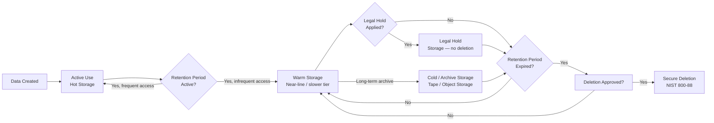

# Data Retention Policy

This policy defines mandatory retention periods, storage tier assignments, and deletion procedures for all data types across the enterprise. Retention decisions are driven by business need, legal obligation, and regulatory requirement — not storage cost alone.

---

## Data Lifecycle Overview



---

## Retention Schedule by Data Type

| Data Type | Retention Period | Legal / Regulatory Basis | Storage Tier at Expiry | Deletion Method |
|---|---|---|---|---|
| Production system data (live) | Duration of business need | Business requirement | N/A — migrated or deleted on decommission | NIST 800-88 Clear/Purge |
| VM backup — Tier 1 (critical systems) | 30 days daily + 12 monthly + 5 yearly GFS | Business continuity / RTO/RPO SLA | Archive before yearly expiry | Veeam / NBU automated purge |
| VM backup — Tier 2 (standard systems) | 14 days daily + 4 weekly + 3 monthly GFS | Business continuity | Archive | Automated purge |
| VM backup — Tier 3 (dev/test) | 7 days daily | Internal standard | No archive | Automated purge |
| Application logs (app-level) | 1 year | Internal SLA / troubleshooting | Warm → Archive after 90 days | Log rotation + secure delete |
| System logs (OS, syslog) | 1 year | Security baseline | Warm → Archive after 90 days | Log rotation |
| Security / SIEM logs | 2 years online, 5 years archive | ISO 27001, SOC 2, PCI DSS | SIEM → cold storage | Automated policy |
| Windows Event Logs | 1 year | Security baseline / SOC 2 | SIEM forwarded | WEF + SIEM retention |
| Firewall / network logs | 1 year | PCI DSS Req. 10.7 / ISO 27001 | SIEM → cold | SIEM policy |
| Email (internal / external) | 3 years standard; 7 years if financial content | GDPR Art. 5, Companies Act | M365 retention policy → archive | Purview auto-deletion |
| Financial records (invoices, contracts) | 7 years | UK Companies Act 2006 / HMRC | Active → archive after year 1 | Secure shred / crypto-erase |
| HR records (employee) | Duration of employment + 6 years | Employment Rights Act 1996 | HR system → archive | Secure delete |
| HR records (recruitment — unsuccessful) | 6 months after decision | GDPR / data minimisation | HR system | Automated purge |
| Customer PII | Duration of relationship + 6 years | GDPR Art. 5(1)(e), limitation periods | CRM → archive | Crypto-erase / anonymisation |
| Audit records (access logs, change logs) | 6 years | ISO 27001 / SOC 2 / legal discoverability | SIEM → cold storage | Secure delete at expiry |
| CCTV / physical security footage | 31 days standard (up to 90 days in sensitive areas) | GDPR / ICO guidance | On-prem NVR | Automated overwrite |
| Incident response records | 5 years | ISO 22301 / internal audit | GRC system | Admin-approved delete |

---

## Tiered Storage Implementation

### Tier Definitions

| Tier | Technology Examples | Access Latency | Cost | Use Case |
|---|---|---|---|---|
| Hot | NVMe SAN (PowerMax), All-Flash array (Pure, VMAX AFA) | < 1 ms | Highest | Active production data, frequent restore points |
| Warm | SAS HDD NAS (Isilon/PowerScale), object storage (S3 Standard-IA) | 10–50 ms | Medium | Recent backups (7–30 days), infrequent access logs |
| Cold | Object storage (S3 Glacier, Azure Archive), tape (LTO-8/9) | Minutes–hours | Low | Long-term backup retention, archived audit logs |
| Archive | Offline tape (Iron Mountain vaulted), WORM object storage | Hours–days | Lowest | Regulatory archive, legal hold data, yearly GFS |

### Veeam — Scale-Out Backup Repository with Tiering

```yaml
# Veeam Scale-Out Backup Repository Tiering Policy (reference — configured via GUI/PowerShell)
# PowerShell equivalent:

# Set capacity tier (cold object storage — e.g., S3)
$s3cred = Get-VBRCredentials -Name "S3-Archive-Creds"
Add-VBRObjectStorageRepository `
    -Name "S3-ColdTier" `
    -Type "AmazonS3Compatible" `
    -ServicePoint "s3.corp-storage.local" `
    -Credentials $s3cred `
    -BucketName "veeam-archive-tier"

# Attach capacity tier to SOBR and set tiering policy
$sobr = Get-VBRScaleOutBackupRepository -Name "SOBR-Primary"
Set-VBRScaleOutBackupRepository -ScaleOutBackupRepository $sobr `
    -EnableCapacityTier $true `
    -CapacityTierRepository (Get-VBRObjectStorageRepository -Name "S3-ColdTier") `
    -MoveOffloadedBackupsAfterDays 14 `
    -OverridePolicy $false

# Veeam GFS retention policy on a backup job
Set-VBRJobScheduleOptions -Job (Get-VBRJob -Name "BKP-SQL-PROD-01") `
    -EnableRetentionPolicy $true `
    -RetentionType Days `
    -RetainDays 30

# GFS (grandfather-father-son) configured separately per job advanced settings
```

### Veeam GFS Retention (GUI-equivalent settings reference)

| GFS Level | Keep | Trigger |
|---|---|---|
| Weekly (father) | 4 restore points | Last successful backup of the week |
| Monthly (grandfather) | 12 restore points | Last successful backup of the month |
| Yearly (great-grandfather) | 5 restore points | Last successful backup of January |

### Commvault — Storage Policy Retention Rules

```text
CommCell Console → Storage Policy → Right-click Copy → Properties → Retention:

Primary Copy (Hot):
  Basic Retention:       30 days
  Extended Retention:    Weekly — keep for 4 weeks
                         Monthly — keep for 12 months
                         Yearly — keep for 5 years

Auxiliary Copy (Cold — tape or object):
  Basic Retention:       1 year
  Extended Retention:    Yearly — keep for 7 years (financial/regulated clients)
```

---

## Log Retention Implementation

### SIEM — Splunk Index Retention

```ini
# /opt/splunk/etc/system/local/indexes.conf

[security_logs]
homePath   = $SPLUNK_DB/security_logs/db
coldPath   = $SPLUNK_DB/security_logs/colddb
thawedPath = $SPLUNK_DB/security_logs/thaweddb
frozenTimePeriodInSecs = 63072000   # 2 years = 730 days online
coldToFrozenDir = /mnt/archive/splunk/security_logs  # cold storage path
maxDataSize = auto_high_volume

[audit_logs]
homePath   = $SPLUNK_DB/audit_logs/db
coldPath   = $SPLUNK_DB/audit_logs/colddb
thawedPath = $SPLUNK_DB/audit_logs/thaweddb
frozenTimePeriodInSecs = 157680000  # 5 years archive
coldToFrozenDir = /mnt/archive/splunk/audit_logs
```

### Windows Event Log Forwarding and Retention

```powershell
# Set Windows Event Log max size and retention policy on source systems via GPO
# GPO Path: Computer Configuration > Policies > Windows Settings > Security Settings > Event Log

# Or via PowerShell on individual hosts:
Limit-EventLog -LogName Security -MaximumSize 1GB -OverflowAction OverwriteOlder
Limit-EventLog -LogName System   -MaximumSize 512MB -OverflowAction OverwriteOlder
Limit-EventLog -LogName Application -MaximumSize 512MB -OverflowAction OverwriteOlder

# Enable Windows Event Forwarding subscription (run on collector)
wecutil cs "C:\WEF\SecurityEventsSubscription.xml"
wecutil rs SecurityEvents
```

Windows Event Logs forwarded to SIEM are retained per SIEM policy (1 year online, archive thereafter). Local logs are a buffer only — do not rely on local retention for compliance.

### Linux Syslog Retention (rsyslog + logrotate)

```bash
# /etc/logrotate.d/syslog
/var/log/syslog {
    daily
    rotate 365
    compress
    delaycompress
    missingok
    notifempty
    postrotate
        /usr/lib/rsyslog/rsyslog-rotate
    endscript
}
```

Remote forwarding to SIEM is required; local rotation is a buffer for connectivity loss.

---

## Legal Hold Process

Legal hold suspends normal retention and deletion for data relevant to litigation, investigation, or regulatory inquiry.

### Legal Hold Procedure

1. **Initiation** — Legal or Compliance team issues a Legal Hold Notice identifying custodians, date range, and data types in scope.
2. **CMDB tag applied** — All affected data assets tagged `legal-hold: true` in the CMDB.
3. **Technical hold applied**:
   - Microsoft Purview: eDiscovery hold placed on mailboxes and SharePoint sites.
   - Veeam: retention lock enabled on relevant restore points via Immutable Backup Repository flag.
   - Commvault: hold flag applied to affected subclients — deletion jobs blocked.
4. **DBA / Sysadmin confirmation** — Custodians confirm hold applied and sign acknowledgement.
5. **Hold register updated** — Entry created in GRC system: matter reference, custodians, data scope, hold date.
6. **Hold release** — Legal team issues release notice. Holds released within 5 business days. Normal retention resumes; data that has passed its retention date is queued for deletion.

```powershell
# Microsoft Purview — place eDiscovery hold on mailbox and SharePoint
Connect-IPPSSession -UserPrincipalName admin@corp.onmicrosoft.com

New-CaseHoldPolicy -Name "Hold-LitigationMatter-2026-001" `
    -Case "Litigation-2026-001" `
    -ExchangeLocation "john.doe@corp.com" `
    -SharePointLocation "https://corp.sharepoint.com/sites/Finance"

New-CaseHoldRule -Name "Hold-Rule-2026-001" `
    -Policy "Hold-LitigationMatter-2026-001" `
    -ContentMatchQuery "subject:ProjectAlpha AND date>=2025-01-01"
```

---

## Secure Data Deletion Procedure

Deletion must follow NIST SP 800-88 Rev. 1 guidelines.

| Media Type | Method | Standard | Notes |
|---|---|---|---|
| Magnetic HDD (spinning) | Overwrite (1-pass) then degauss | NIST 800-88 Clear + Purge | Use DBAN or blancco for overwrite |
| SSD / NVMe (ATA Secure Erase) | ATA Secure Erase command | NIST 800-88 Purge | `hdparm --security-erase` or vendor tool |
| SAN LUN (PowerMax / Pure) | Crypto-erase (if self-encrypting drive) or LUN zero-out | NIST 800-88 Purge | Use array vendor tool (PowerMax CLI, purity erase) |
| Tape (LTO) | Degauss + physical destruction | NIST 800-88 Destroy | Third-party destruction with certificate |
| Cloud object storage (S3, Azure Blob) | API delete + bucket crypto-key deletion (if BYOK) | CSP policy + key destruction | Confirm with CSP data destruction certificate |
| Paper / printed records | Cross-cut shredding (DIN 66399 P-4 minimum) | GDPR Art. 5 | Witnessed shredding for Restricted data |

### PowerMax — Crypto-Erase a Volume

```bash
# Identify volume
symdev -sid 001 list -v | grep <volume-name>

# Mark volume for crypto-erase (requires array admin role)
symdev -sid 001 -dev <DeviceID> set secure_erase

# Confirm erase completion
symdev -sid 001 -dev <DeviceID> show | grep -i erase
```

---

## Retention Compliance Monitoring

```powershell
# Weekly check: Veeam jobs with restore points older than policy allows
$jobs = Get-VBRJob -Type Backup
foreach ($job in $jobs) {
    $oldPoints = Get-VBRRestorePoint -Job $job | Where-Object {
        $_.CreationTime -lt (Get-Date).AddDays(-365)
    }
    if ($oldPoints) {
        Write-Warning "Job '$($job.Name)' has $($oldPoints.Count) restore points older than 1 year — review retention policy"
    }
}
```

```bash
# Check for files on archive NFS share older than retention limit
# Example: flag files in audit archive older than 6 years
find /mnt/archive/audit_logs -type f -mtime +2190 -exec ls -lh {} \; > /tmp/expired_audit_files.txt
wc -l /tmp/expired_audit_files.txt
```

---

## Exceptions and Escalation

Retention exceptions require formal approval before they are implemented.

| Scenario | Approver | Documentation Required |
|---|---|---|
| Extended retention beyond policy (business request) | Data Owner + CISO | Written business justification, risk acknowledgement |
| Early deletion before retention period (e.g., data minimisation exercise) | Legal + Data Owner | Legal sign-off confirming no litigation risk, no hold in place |
| Legal hold extension | Legal team | Updated hold notice with revised release date |
| Deletion of data subject to active legal hold | Not permitted | Must escalate to Legal — do not proceed |

All exceptions are logged in the GRC system with approver name, date, and justification. Exceptions are reviewed at the quarterly governance meeting.
