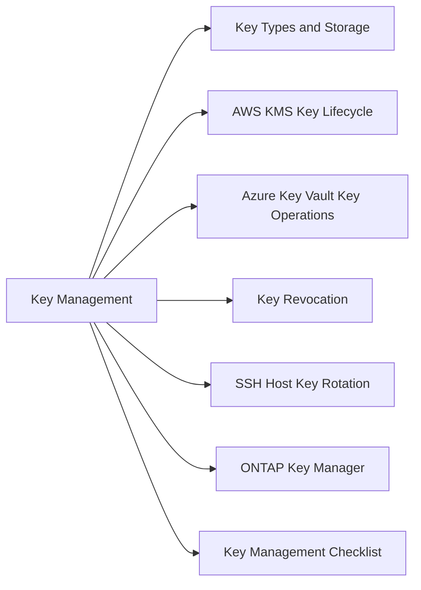

# Key Management

Cryptographic key lifecycle management — generation, storage, distribution, rotation, and revocation.



## Key Types and Storage

| Key Type | Storage | Rotation |
|---|---|---|
| Root CA private key | Air-gapped HSM | On CA renewal (~10 years) |
| Issuing CA private key | HSM (networked) | On CA renewal (~5 years) |
| TLS/server certificates | Venafi / cert store | Annually |
| Symmetric data encryption keys | KMS (AWS/Azure) | Annually or on incident |
| Backup encryption keys | Offline + KMS | Annually |
| Service account API keys | CyberArk / Secrets Manager | 90 days |

## AWS KMS Key Lifecycle

```bash
# Create a key
aws kms create-key --description "prod-data-key" --key-usage ENCRYPT_DECRYPT

# Enable automatic rotation (annual, symmetric only)
aws kms enable-key-rotation --key-id <key-id>

# Check rotation status
aws kms get-key-rotation-status --key-id <key-id>

# Schedule deletion (7–30 day waiting period)
aws kms schedule-key-deletion --key-id <key-id> --pending-window-in-days 30

# Cancel deletion
aws kms cancel-key-deletion --key-id <key-id>
```

## Azure Key Vault Key Operations

```bash
# List keys
az keyvault key list --vault-name <vault-name> \
  --query '[*].{Name:name,Enabled:attributes.enabled,Expires:attributes.expires}' -o table

# Rotate a key (create new version)
az keyvault key rotate --vault-name <vault-name> --name <key-name>

# Backup a key
az keyvault key backup --vault-name <vault-name> --name <key-name> --file key-backup.blob

# Restore a key
az keyvault key restore --vault-name <vault-name> --file key-backup.blob
```

## Key Revocation

1. Identify scope — which systems used the compromised key?
2. Generate replacement key
3. Re-encrypt data encrypted under the compromised key
4. Revoke the old key in KMS/vault
5. Document incident and remediation

## SSH Host Key Rotation

```bash
ssh-keygen -t ed25519 -f /etc/ssh/ssh_host_ed25519_key -N ""
ssh-keygen -t rsa -b 4096 -f /etc/ssh/ssh_host_rsa_key -N ""
systemctl restart sshd
# Update known_hosts on all clients
```

## ONTAP Key Manager

```bash
# Check key manager status
security key-manager show

# Query encryption keys
security key-manager key query

# Check volume encryption state
volume show -fields encryption-state
```

## Key Management Checklist

- [ ] All production keys stored in approved KMS/HSM — no plaintext keys in config files
- [ ] Rotation schedule confirmed for all key types
- [ ] Key backup tested and verifiable
- [ ] Access to key management restricted to named administrators
- [ ] Audit log for key operations forwarded to SIEM
- [ ] Key inventory reviewed quarterly
