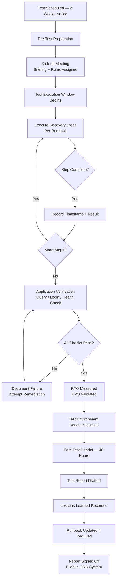

# Recovery Testing

Recovery testing validates that systems, data, and services can be restored to a defined state within acceptable timeframes. Testing is the only mechanism that converts documented procedures into verified capability. Untested recovery plans are risk documents, not recovery plans.

---

## Testing Types

| Test Type | Scope | Frequency | Duration | Disruption | Primary Objective |
|---|---|---|---|---|---|
| **Tabletop Exercise** | Process and decision-making only — no systems restored | Quarterly | 2–4 hours | None | Validate runbooks, identify procedural gaps, train responders |
| **Functional Component Test** | Single system or service restored in isolation (VM, database, file share) | Monthly | 2–8 hours | Low — isolated restore | Prove specific recovery procedures work end-to-end |
| **Parallel / Pilot DR Test** | Subset of systems restored in DR environment in parallel with production | Semi-annual | 1–2 days | Low — production unaffected | Validate DR environment readiness and replication integrity |
| **Full DR Failover Test** | Complete failover of all Tier 1 systems to DR site — production suspended or traffic cut | Annual | 1–5 days | High — planned outage window | Full validation of RTO/RPO, network, and application stack |
| **Ransomware Recovery Test** | Air-gapped restore from immutable backup to isolated environment, full application verify | Annual (or post-incident) | 2–3 days | None (isolated) | Prove recovery from worst-case attack scenario |

---

## Annual Testing Calendar

| Month | Test | Scope | Lead |
|---|---|---|---|
| January | Tabletop — ransomware scenario | IT + Security + Management | CISO / DR Lead |
| February | Functional test — Domain Controller restore | AD + DNS | Infra Engineer |
| March | Functional test — SQL Server database restore | SQL cluster | DBA |
| April | Tabletop — site failure scenario | IT + Facilities + Management | DR Lead |
| May | Functional test — file server restore (Veeam DataLabs) | File services | Backup Admin |
| June | Parallel DR test — Tier 1 systems | All Tier 1 VMs | DR Team |
| July | Functional test — Exchange / M365 mailbox restore | Messaging | Messaging team |
| August | Functional test — accidental deletion recovery | File + DB | Backup Admin |
| September | Tabletop — accidental data corruption | IT + App Owners | DR Lead |
| October | Functional test — IntelliSnap application recovery | Oracle / SQL | DBA + Backup Admin |
| November | **Full DR failover test** | All Tier 1 + selected Tier 2 | DR Team + All IT leads |
| December | Post-year review and planning | All | CISO + IT Management |

---

## Test Scenario Library

### Scenario 1: VM Failure (Single System)
- **Trigger**: Hypervisor host failure causes VM corruption
- **Backup source**: Most recent Veeam or Commvault backup (< 24 hours)
- **Target**: Restore VM to same or alternate ESXi host
- **Success criteria**: VM powers on, services running, data loss < 1 hour (RPO), restore complete < 2 hours (RTO)
- **Validation steps**: Ping, service check, application login, last record timestamp

### Scenario 2: Site Failure
- **Trigger**: Primary data centre becomes unavailable (power, fire, flood)
- **Backup source**: Replicated VMs at DR site (Veeam replication) or tape/object backup
- **Target**: DR site — all Tier 1 systems
- **Success criteria**: All Tier 1 services available at DR site within RTO (typically 4–8 hours), RPO validated against replication schedule
- **Validation steps**: DNS failover confirmed, application stack tested, user connectivity from WAN

### Scenario 3: Ransomware Recovery
- **Trigger**: Ransomware encrypts production storage including recent backups
- **Backup source**: Air-gapped / immutable repository (Veeam Hardened Repository or WORM tape), minimum 14-day rollback
- **Target**: Isolated clean environment (no network connectivity to production)
- **Success criteria**: Systems restored from pre-infection backup, data integrity verified, no re-infection vector present
- **Validation steps**: Anti-malware scan of restored VMs, data integrity check, confirmation infection vector addressed before reconnection

### Scenario 4: Data Corruption (Silent / Logical)
- **Trigger**: Application bug or bad transaction corrupts database records
- **Backup source**: Specific restore point from before corruption event (may require point-in-time transaction log recovery)
- **Target**: Isolated database instance
- **Success criteria**: Correct data restored, DBCC CHECKDB passes, row counts validated against known-good snapshot
- **Validation steps**: Compare restored data with audit log of affected records, DBA sign-off

### Scenario 5: Accidental Deletion
- **Trigger**: Administrator or user accidentally deletes files or a VM
- **Backup source**: Most recent backup before deletion; or AD Recycle Bin / SharePoint version history
- **Success criteria**: All deleted items restored within 1 hour (files) or 2 hours (VM), no additional data loss
- **Validation steps**: File count / checksum match, user confirmation of restored content

---

## Test Execution Procedure



### Pre-Test Phase (T-14 to T-1 days)

- [ ] Define test scope, scenario, and success criteria
- [ ] Identify test environment (isolated VLAN, isolated DR site segment)
- [ ] Confirm backup restore points are available and within RPO window
- [ ] Notify stakeholders: IT management, application owners, change management
- [ ] Raise change request and obtain CAB approval
- [ ] Assign roles: Test Lead, Backup Admin, Application Validator, Timekeeper
- [ ] Confirm runbook version to be used (latest, reviewed within 90 days)
- [ ] Prepare test result log sheet (timestamps, step number, outcome, notes)
- [ ] Verify test environment network isolation is in place

### During-Test Phase

- [ ] Record exact start time
- [ ] Follow runbook sequentially — no improvisation without logging deviation
- [ ] Timekeeper records milestone timestamps (restore start, VM power-on, service available, app verified)
- [ ] All deviations from runbook recorded with reason and outcome
- [ ] Application owner validates business data is correct (not just that the system boots)
- [ ] Capture screenshots or session recordings where required for audit trail

### Post-Test Phase (T+1 to T+5 days)

- [ ] Decommission test environment — remove VMs, revoke test credentials
- [ ] Complete test result log
- [ ] Calculate actual RTO and RPO, compare to targets
- [ ] Hold debrief within 48 hours — mandatory attendees: Test Lead, application owner, backup admin
- [ ] Draft test report within 5 business days
- [ ] Log lessons learned in GRC system
- [ ] Update runbook if gaps identified
- [ ] Schedule re-test if critical failure occurred

---

## Success Criteria and Metrics

| Metric | Description | Target |
|---|---|---|
| RTO achieved | Actual restore time vs. documented RTO target | 100% of Tier 1 tests within RTO |
| RPO achieved | Age of data at point of restore vs. RPO target | 100% of tests within RPO |
| Data integrity | DBCC CHECKDB / file hash / row-count validation pass rate | 100% pass |
| Runbook accuracy | Steps followed without deviation (unplanned improvisation) | < 2 unplanned deviations per test |
| Test completion rate | Tests completed on schedule vs. annual plan | ≥ 95% on schedule |
| Time to detect failure during test | How quickly test team identifies a failed step | < 15 minutes |
| Post-test runbook update rate | Tests that identified runbook gaps and led to update | Track and trend |
| Re-test rate | Tests requiring a re-test due to critical failure | Target: 0; > 2/year triggers process review |

---

## Test Report Template

```
RECOVERY TEST REPORT

Test Reference:    RT-2026-006
Test Date:         YYYY-MM-DD
Test Type:         [Tabletop / Functional / Parallel DR / Full DR]
Scenario:          [e.g., VM failure — SQL-PROD-01]
Test Lead:         <name>
Participants:      <names and roles>

SCOPE
  Systems in scope:    ____
  Backup source:       ____  (tool, repository, restore point date/time)
  Test environment:    ____  (isolated VLAN / DR site segment)

TIMELINE
  Test start:          HH:MM
  First restore point mounted:  HH:MM
  VM / service available:       HH:MM
  Application validated:        HH:MM
  Test environment cleaned up:  HH:MM
  Test end:            HH:MM

RESULTS
  RTO target:          ____    Actual RTO:   ____    PASS / FAIL
  RPO target:          ____    Actual RPO:   ____    PASS / FAIL
  Data integrity:      PASS / FAIL    (method: ____)
  All runbook steps completed without deviation: YES / NO

  If NO — deviations:
    Step #   Description   Reason   Outcome

ISSUES ENCOUNTERED
  [Describe any failures, unexpected behaviour, or delays]

LESSONS LEARNED
  [What gaps were identified? What would have prevented issues?]

RUNBOOK CHANGES REQUIRED
  YES / NO — If YES, reference change ticket: ____

OVERALL RESULT:   PASS / CONDITIONAL PASS / FAIL

SIGN-OFF
  Test Lead:        ______________ Date: __________
  IT Manager:       ______________ Date: __________
  Application Owner:______________ Date: __________
```

---

## Veeam DataLabs — Automated Recovery Testing

Veeam DataLabs provides an on-demand isolated environment for recovery testing without impacting production.

```powershell
# Create a DataLabs On-Demand Sandbox from a SureBackup Virtual Lab
$lab = Get-VBRVirtualLab -Name "SureBackup-VLab"
$group = Get-VBRApplicationGroup -Name "AG-CriticalInfra"

# Start an on-demand sandbox session
$sandbox = Start-VBRSandbox -VirtualLab $lab -ApplicationGroup $group

# The sandbox is now running — perform manual testing inside the isolated lab
# e.g., connect via console to test VMs on the isolated network

# When done — stop the sandbox
Stop-VBRSandbox -Sandbox $sandbox
```

DataLabs is ideal for:
- Testing patches before production deployment against a live copy of the environment
- Application-level recovery validation (login, query, data verify)
- Security testing of restored VMs (malware scan before reconnecting to production)

---

## Commvault IntelliSnap — Application-Consistent Recovery Testing

IntelliSnap integrates with array-level snapshots (NetApp SnapVault, PowerMax TimeFinder, Pure FlashArray) for near-instant recovery testing.

```
CommCell Console → Client Computers → <SQL Server> → iDataAgent → Backup Sets
  → Right-click subclient → Snap Recovery (Test Mount)

Options:
  Snap copy:      Select most recent IntelliSnap
  Recovery type:  Test Mount (non-destructive — read-only mount)
  Target path:    D:\SQLTest\Restore\
  Application:    Run DB consistency check after mount: YES
```

For CLI-driven IntelliSnap restores via `qoperation`:

```bash
qoperation execute -af /opt/commvault/testsnap_template.xml
# XML template specifies client, subclient, snap copy, and test mount options
```

---

## Regulatory Requirements for DR Testing

| Standard | Requirement | Frequency | Evidence Required |
|---|---|---|---|
| **ISO 22301:2019** (Business Continuity) | Clause 8.5: Test and exercise BCPs at planned intervals | At least annually (more frequently recommended) | Test plan, test report, management review record |
| **SOC 2 Type II** (Availability Trust Criteria) | CC9.1: Recovery plan tested and results documented | Annually minimum | Test report, evidence of RTO/RPO metrics, auditor review |
| **PCI DSS v4.0** | Req. 12.10.2: Test incident response plan at least annually | Annually | Test report, participant list, lessons learned |
| **ISO 27001:2022** | A.5.30: ICT readiness for business continuity — tested | Annually | Test plan, results, corrective actions |
| **DORA (EU)** (Financial entities) | Art. 26: Threat-led penetration testing + ICT continuity testing | Annually (TLPT every 3 years for significant institutions) | Regulator-facing test report, independent validation |
| **NHS DSPT / CQC** (Healthcare UK) | Data Security Standard 9: Business continuity plans tested | Annually | Evidence uploaded to DSPT portal |

All test reports must be retained for a minimum of 5 years to support regulatory audit requests.

---

## Lessons Learned Process

The value of recovery testing is only fully realised when lessons are systematically captured and acted upon.

1. **Debrief within 48 hours** — while memory is fresh. Use a structured format: What went well? What went wrong? What was missing from the runbook?
2. **Root cause, not blame** — frame findings as process gaps, not individual failures.
3. **Log in GRC** — every lesson is a ticket. Assign owner, priority, and due date.
4. **Categorise findings**:
   - Runbook gap — update the runbook
   - Tool / infrastructure gap — raise infrastructure change
   - Training gap — schedule training or awareness session
   - Dependency gap — update dependency map in CMDB
5. **Track to closure** — lessons are reviewed at the next quarterly governance meeting for completion status.
6. **Feed into next test design** — lessons from one test become test scenarios for the next cycle.
