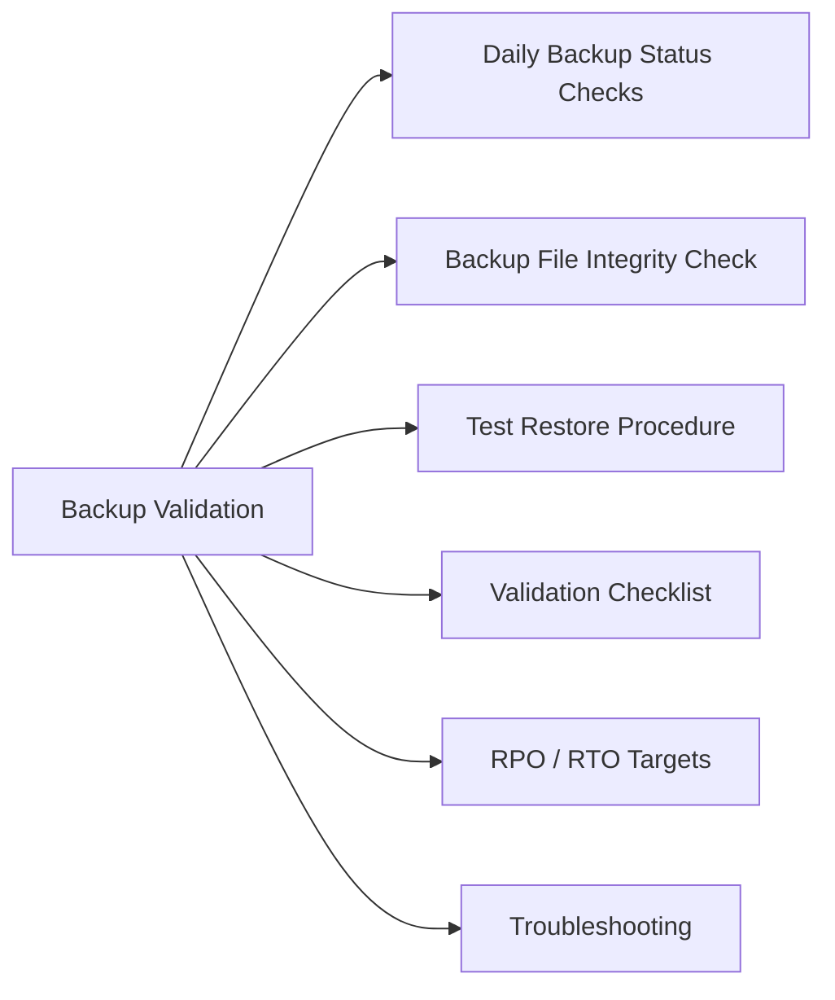

# Database Backup Validation

Confirm database backups are completing successfully, files are intact, and restores work before they are needed in an actual incident.



## Daily Backup Status Checks

### PostgreSQL (pg_basebackup / pgBackRest)

```bash
# pgBackRest — check latest backup info
pgbackrest --stanza=<stanza-name> info

# List backup files
pgbackrest --stanza=<stanza-name> info --output=json | jq '.[] | .backup[-1]'

# Check WAL archiving is current
psql -U postgres -c "SELECT last_archived_wal, last_archived_time, last_failed_wal FROM pg_stat_archiver;"
```

### MySQL / MariaDB

```bash
# Check recent backup files
ls -lht /backup/mysql/ | head -10

# Verify binary log position captured in backup
cat /backup/mysql/xtrabackup_binlog_info

# MySQLdump backup log
tail -50 /var/log/mysql-backup.log | grep -E "(Error|Completed|Failed)"
```

### SQL Server

```sql
-- Last backup per database
SELECT d.name AS database_name,
       MAX(b.backup_finish_date) AS last_backup,
       b.type AS backup_type
FROM sys.databases d
LEFT JOIN msdb.dbo.backupset b ON d.name = b.database_name
WHERE d.database_id > 4  -- exclude system DBs
GROUP BY d.name, b.type
ORDER BY d.name, b.type;

-- Failed backup jobs last 24h
SELECT j.name AS job_name, h.run_date, h.run_time, h.message
FROM msdb.dbo.sysjobs j
JOIN msdb.dbo.sysjobhistory h ON j.job_id = h.job_id
WHERE j.name LIKE '%backup%'
  AND h.run_status = 0  -- 0 = failed
  AND h.run_date >= CONVERT(int, CONVERT(varchar, GETDATE()-1, 112));
```

## Backup File Integrity Check

```bash
# PostgreSQL — verify backup with pgBackRest
pgbackrest --stanza=<stanza-name> check

# MySQL — verify xtrabackup integrity
xtrabackup --prepare --target-dir=/backup/mysql/latest/

# SQL Server — verify backup file checksum
RESTORE VERIFYONLY FROM DISK = '/backup/mssql/mydb_full.bak' WITH CHECKSUM;
```

## Test Restore Procedure

Perform test restores to a non-production target on a defined schedule (weekly for critical DBs).

### PostgreSQL Test Restore

```bash
# Restore to test instance
pgbackrest --stanza=<stanza-name> --pg1-path=/var/lib/pgsql/test-restore restore
# Start test instance and verify
pg_ctl -D /var/lib/pgsql/test-restore start
psql -p 5433 -U postgres -c "SELECT count(*) FROM pg_stat_user_tables;"
```

### MySQL Test Restore

```bash
# Copy backup to test directory
xtrabackup --prepare --target-dir=/restore/mysql-test/
rsync -a /restore/mysql-test/ /var/lib/mysql-test/
chown -R mysql: /var/lib/mysql-test/
mysqld_safe --datadir=/var/lib/mysql-test --socket=/tmp/mysql-test.sock &
mysql -S /tmp/mysql-test.sock -e "SHOW DATABASES;"
```

### SQL Server Test Restore

```sql
RESTORE DATABASE [TestRestore] FROM DISK = '/backup/mssql/prod_full.bak'
WITH MOVE 'proddb' TO '/var/opt/mssql/data/TestRestore.mdf',
     MOVE 'proddb_log' TO '/var/opt/mssql/data/TestRestore_log.ldf',
     REPLACE, STATS = 10;
-- Verify table counts match expected
USE TestRestore;
SELECT COUNT(*) FROM important_table;
```

## Validation Checklist

- [ ] Full backup completed successfully within last 24h
- [ ] Backup file size is within expected range (not zero, not anomalously small)
- [ ] Backup integrity verified (checksum / prepare passed)
- [ ] WAL/binary log archiving current (within 15 min of now)
- [ ] Test restore performed and database queryable
- [ ] RPO validated: backup age does not exceed recovery point objective
- [ ] Backup storage has > 20% free space remaining
- [ ] Backup job alert cleared in monitoring system

## RPO / RTO Targets

| Backup Type | Frequency | Retention | RPO Target |
|---|---|---|---|
| Full backup | Daily | 30 days | 24 hours |
| Incremental / differential | Every 4–6h | 7 days | 4–6 hours |
| WAL / binlog archiving | Continuous | 7 days | < 5 minutes (PITR) |

## Troubleshooting

| Symptom | Check | Action |
|---|---|---|
| Backup job not running | Scheduler (cron/SQL Agent) enabled? | Verify cron entry or SQL Server Agent job enabled |
| Backup size unexpectedly small | Partial backup / excluded tables | Review backup command excludes; check tablespace |
| Restore fails with corruption | Backup file corrupt or incomplete | Restore from prior day's backup; review disk errors |
| WAL archiving lagging | Disk space or permissions | Check archive target disk space; check pg_wal directory size |
| Test restore DB inconsistent | Point-in-time alignment | Apply WAL/binlogs to correct point; verify LSN/SCN |
