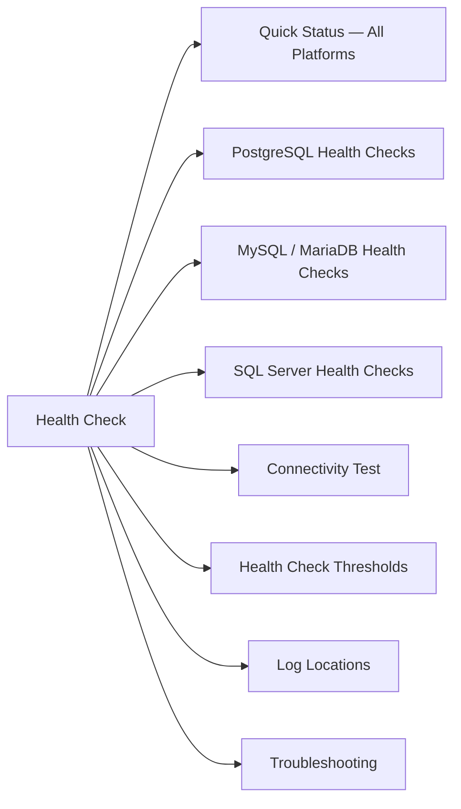

# Database Health Check

Verify database availability, connectivity, replication status, and resource utilization across common platforms.



## Quick Status — All Platforms

```bash
# PostgreSQL
systemctl status postgresql
psql -U postgres -c "SELECT version();"
psql -U postgres -c "SELECT pg_is_in_recovery();"  # true = standby

# MySQL / MariaDB
systemctl status mysqld
mysql -u root -e "SHOW STATUS LIKE 'Uptime';"
mysql -u root -e "SHOW STATUS LIKE 'Threads_connected';"

# SQL Server
systemctl status mssql-server   # Linux
# Windows:
Get-Service -Name MSSQLSERVER
```

## PostgreSQL Health Checks

```sql
-- Active connections vs max
SELECT count(*) AS active, max_conn, max_conn - count(*) AS available
FROM pg_stat_activity, (SELECT setting::int AS max_conn FROM pg_settings WHERE name='max_connections') s
GROUP BY max_conn;

-- Long-running queries (> 60s)
SELECT pid, now() - pg_stat_activity.query_start AS duration, query, state
FROM pg_stat_activity
WHERE state != 'idle' AND (now() - query_start) > interval '60 seconds'
ORDER BY duration DESC;

-- Bloat / dead tuples
SELECT relname, n_dead_tup, n_live_tup, last_autovacuum
FROM pg_stat_user_tables
ORDER BY n_dead_tup DESC LIMIT 10;

-- Replication lag (on primary)
SELECT client_addr, state, sent_lsn, write_lsn, replay_lsn,
       (sent_lsn - replay_lsn) AS replication_lag_bytes
FROM pg_stat_replication;
```

## MySQL / MariaDB Health Checks

```sql
-- Connection status
SHOW STATUS LIKE 'Threads_%';
SHOW STATUS LIKE 'Max_used_connections';

-- Replication status (on replica)
SHOW SLAVE STATUS\G
-- Key fields: Seconds_Behind_Master, Slave_IO_Running, Slave_SQL_Running

-- Slow queries
SHOW STATUS LIKE 'Slow_queries';
SHOW VARIABLES LIKE 'slow_query_log%';

-- InnoDB buffer pool hit ratio (target > 99%)
SHOW STATUS LIKE 'Innodb_buffer_pool_reads';
SHOW STATUS LIKE 'Innodb_buffer_pool_read_requests';
```

## SQL Server Health Checks

```sql
-- Instance uptime
SELECT sqlserver_start_time FROM sys.dm_os_sys_info;

-- Active sessions and blocking
SELECT session_id, status, blocking_session_id, wait_type, wait_time/1000 AS wait_sec, text
FROM sys.dm_exec_requests
CROSS APPLY sys.dm_exec_sql_text(sql_handle)
WHERE status != 'background'
ORDER BY wait_time DESC;

-- Database file sizes and free space
SELECT DB_NAME(database_id) AS db_name, name, type_desc,
       size * 8 / 1024 AS size_mb,
       fileproperty(name, 'SpaceUsed') * 8 / 1024 AS used_mb
FROM sys.master_files;

-- AG replica health (Always On)
SELECT ag.name, ar.replica_server_name, rs.synchronization_state_desc, rs.synchronization_health_desc
FROM sys.dm_hadr_availability_replica_states rs
JOIN sys.availability_replicas ar ON rs.replica_id = ar.replica_id
JOIN sys.availability_groups ag ON ar.group_id = ag.group_id;
```

## Connectivity Test

```bash
# PostgreSQL
psql -h <host> -U <user> -d <dbname> -c "SELECT 1 AS alive;"

# MySQL
mysql -h <host> -u <user> -p<pass> -e "SELECT 1 AS alive;"

# SQL Server
sqlcmd -S <host> -U <user> -P <pass> -Q "SELECT 1 AS alive"

# Port reachability
nc -zv <db-host> 5432    # PostgreSQL
nc -zv <db-host> 3306    # MySQL
nc -zv <db-host> 1433    # SQL Server
```

## Health Check Thresholds

| Metric | Warning | Critical |
|---|---|---|
| Active connections | > 80% of max_connections | > 90% of max_connections |
| Replication lag | > 30 seconds | > 5 minutes |
| Long-running queries | > 5 minutes | > 30 minutes |
| Dead tuple ratio (PG) | > 20% | > 50% (vacuum required) |
| Buffer pool hit ratio | < 99% | < 95% |

## Log Locations

| Platform | Log Path |
|---|---|
| PostgreSQL | `/var/log/postgresql/` or `pg_lsclusters` |
| MySQL | `/var/log/mysql/error.log` |
| MariaDB | `/var/log/mariadb/mariadb.log` |
| SQL Server (Linux) | `/var/opt/mssql/log/errorlog` |

## Troubleshooting

| Symptom | Check | Action |
|---|---|---|
| Cannot connect | Port reachable? Service running? | `nc -zv`; `systemctl status` |
| High connection count | Application connection pool leak? | Check app logs; restart connection pool |
| Replication stopped | I/O or SQL thread stopped | `SHOW SLAVE STATUS\G`; check relay log errors |
| Slow queries | Missing indexes? Locking? | Run explain plan; check `pg_stat_activity` / `dm_exec_requests` |
| High dead tuples (PG) | Autovacuum falling behind | Run `VACUUM ANALYZE <table>` manually |
