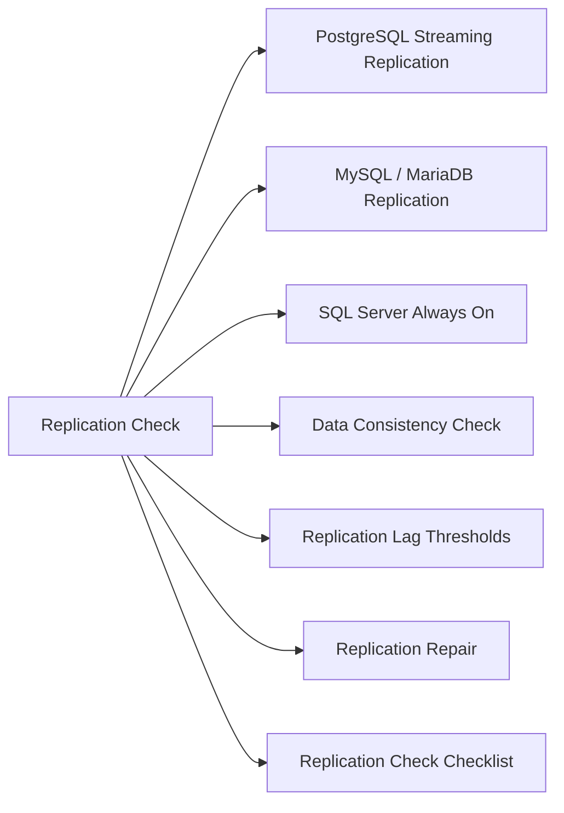

# Database Replication Check

Verify replication health, lag, and data consistency across primary and replica nodes.



## PostgreSQL Streaming Replication

```sql
-- On PRIMARY: show connected replicas and lag
SELECT client_addr, application_name, state,
       sent_lsn, write_lsn, flush_lsn, replay_lsn,
       (sent_lsn - replay_lsn) AS replication_lag_bytes,
       sync_state
FROM pg_stat_replication;

-- On STANDBY: confirm it is a replica and check lag
SELECT pg_is_in_recovery() AS is_standby;
SELECT now() - pg_last_xact_replay_timestamp() AS replay_lag;
SELECT pg_last_wal_receive_lsn(), pg_last_wal_replay_lsn();

-- Replication slots — check for inactive slots holding WAL
SELECT slot_name, active, restart_lsn, pg_wal_lsn_diff(pg_current_wal_lsn(), restart_lsn) AS lag_bytes
FROM pg_replication_slots;
```

### pgBackRest WAL Archiving

```bash
# Check archiving status
psql -U postgres -c "SELECT last_archived_wal, last_archived_time, last_failed_wal, last_failed_time FROM pg_stat_archiver;"
# last_failed_wal should be NULL; last_archived_time should be recent
```

## MySQL / MariaDB Replication

```sql
-- On REPLICA: full replication status
SHOW SLAVE STATUS\G

-- Key fields to check:
-- Slave_IO_Running: Yes
-- Slave_SQL_Running: Yes
-- Seconds_Behind_Master: 0 (or < threshold)
-- Last_IO_Error / Last_SQL_Error: empty

-- On PRIMARY: show connected replicas
SHOW SLAVE HOSTS;

-- Binary log position on primary
SHOW MASTER STATUS;
```

```bash
# Quick one-liner — show lag and thread status
mysql -u root -e "SHOW SLAVE STATUS\G" | grep -E "Slave_(IO|SQL)_Running|Seconds_Behind|Last_(IO|SQL)_Error"
```

### MySQL GTID Replication

```sql
-- Check GTID position on replica vs primary
SHOW VARIABLES LIKE 'gtid_mode';
SELECT @@GLOBAL.gtid_executed;
SELECT @@GLOBAL.gtid_purged;
-- Compare GTID sets between primary and replica to calculate drift
```

## SQL Server Always On

```sql
-- Replica synchronization health
SELECT ag.name AS ag_name,
       ar.replica_server_name,
       rs.role_desc,
       rs.synchronization_state_desc,
       rs.synchronization_health_desc,
       rs.last_commit_time
FROM sys.dm_hadr_availability_replica_states rs
JOIN sys.availability_replicas ar ON rs.replica_id = ar.replica_id
JOIN sys.availability_groups ag ON ar.group_id = ag.group_id;

-- Database-level lag
SELECT drs.database_id, DB_NAME(drs.database_id) AS db_name,
       drs.synchronization_state_desc,
       drs.log_send_queue_size AS send_queue_kb,
       drs.redo_queue_size AS redo_queue_kb,
       drs.last_commit_time
FROM sys.dm_hadr_database_replica_states drs;
```

## Data Consistency Check

```bash
# PostgreSQL — compare row counts between primary and replica
psql -h <primary-host> -U postgres -c "SELECT relname, n_live_tup FROM pg_stat_user_tables ORDER BY relname;" > /tmp/primary-counts.txt
psql -h <standby-host> -U postgres -c "SELECT relname, n_live_tup FROM pg_stat_user_tables ORDER BY relname;" > /tmp/standby-counts.txt
diff /tmp/primary-counts.txt /tmp/standby-counts.txt

# MySQL — pt-table-checksum (Percona Toolkit)
pt-table-checksum --host=<primary> --user=root --password=<pass> --databases=<dbname>
# Then on replica:
pt-table-sync --sync-to-master h=<replica>,u=root,p=<pass> --print  # --execute to fix
```

## Replication Lag Thresholds

| Lag | Status | Action |
|---|---|---|
| 0–10 seconds | Normal | No action |
| 10–60 seconds | Warning | Investigate — high load? network? |
| 1–5 minutes | Alert | Escalate; check disk I/O and replication threads |
| > 5 minutes | Critical | Notify DBA lead; assess failover risk |
| Replication stopped | Critical | Immediate investigation and repair |

## Replication Repair

### MySQL — Fix stopped replication

```sql
-- Check error
SHOW SLAVE STATUS\G
-- If duplicate key / skip error (use with caution)
STOP SLAVE;
SET GLOBAL sql_slave_skip_counter = 1;
START SLAVE;
SHOW SLAVE STATUS\G
```

### PostgreSQL — Replica fallen too far behind

```bash
# If replay lag is huge and WAL is no longer available on primary,
# rebuild the replica from a fresh base backup
pg_basebackup -h <primary-host> -U replication -D /var/lib/postgresql/data-new -P -R
# -R writes recovery.conf / standby.signal automatically
```

## Replication Check Checklist

- [ ] All replicas showing `Slave_IO_Running: Yes` / `Slave_SQL_Running: Yes` (MySQL)
- [ ] Standby `pg_is_in_recovery()` = true; replay lag < 10s (PostgreSQL)
- [ ] AG replicas in SYNCHRONIZED state (SQL Server)
- [ ] No replication errors (Last_IO_Error / Last_SQL_Error empty)
- [ ] Inactive replication slots reviewed (PostgreSQL)
- [ ] WAL archiving current (last_archived_time < 15 min ago)
