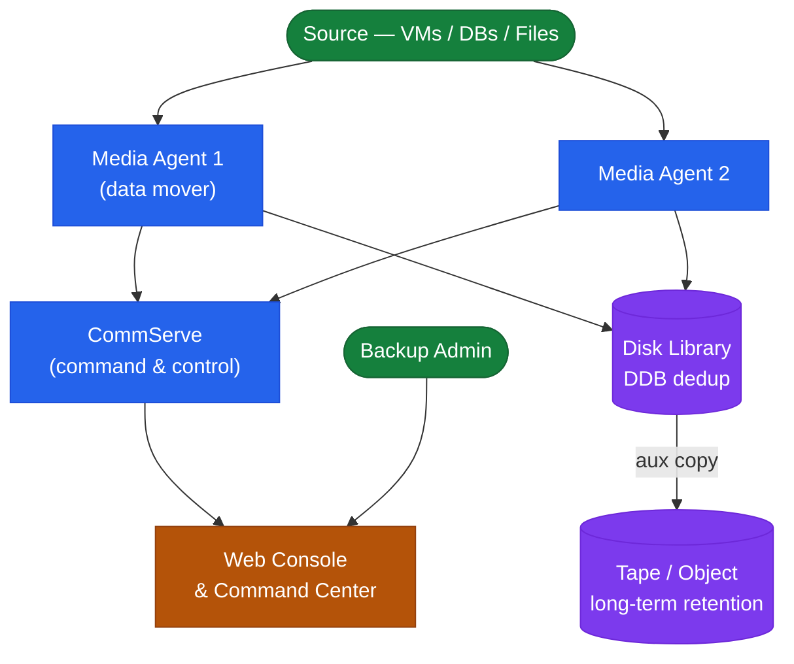
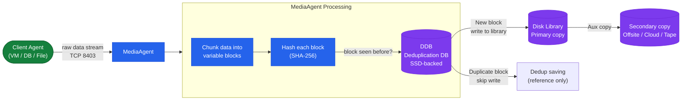

# Commvault — How It Works

## Overview

Commvault provides enterprise backup, recovery, replication, archive, and data protection management. The CommServe is the single command-and-control server — it holds the configuration database (SQL Server) mapping every backup job, client, and storage policy. MediaAgents perform data movement and host the Deduplication Database (DDB). Clients are the protected hosts (VMs, databases, filesystems).

## Component Topology



## Components

| Component | Role | Notes |
|---|---|---|
| CommServe | Management, scheduling, SQL DB | HA pair (passive standby) for critical environments |
| MediaAgent | Data movement, deduplication (DDB) | Multiple; one DDB per storage pool |
| Client | Backup agent (Windows, Linux, VSA) | VSA agent for VMware vSphere |
| Command Center | Web UI for administration | Replaces legacy Java GUI in FR32+ |
| Storage Policy | Job-to-storage mapping | Primary copy + secondary (offsite) copy |

## CommServe High Availability

- **Passive standby**: Second CommServe instance with SQL log shipping; manual failover
- **CommServe Failover (active/passive HA)**: Automated failover via CommServe HA option

```powershell
# Verify CommServe DB backup job status
qlist job -j CommServeDB_Backup -detail
```

## MediaAgent and Deduplication



MediaAgent best practices:
- Deploy one MediaAgent per site for local backups
- Place DDB on SSD-backed storage — IOPS are critical for large dedup pools
- DDB free space: maintain ≥ 20% free at all times
- Single DDB should not manage more than 60 TB of deduped data

## Storage Library Types

| Type | Use Case | Notes |
|---|---|---|
| Disk Library (Dedup) | Primary backup target | SSD recommended for DDB |
| Cloud Library (S3) | Long-term retention | AWS S3, Azure Blob, GCP |
| Tape Library | Offsite/archival | Via SAN-attached or NDMP |
| Hyperscale X | Integrated scale-out | CommVault managed hardware; minimum 3-node cluster |

## Port Requirements

| Source | Destination | Port | Purpose |
|---|---|---|---|
| Clients | CommServe | 8400 | Job requests |
| Clients | MediaAgent | 8403 | Data movement |
| CommServe | MediaAgent | 8400 | Job orchestration |
| Browser (admin) | Command Center | 443 | Web UI |

## Multi-Site Topology


