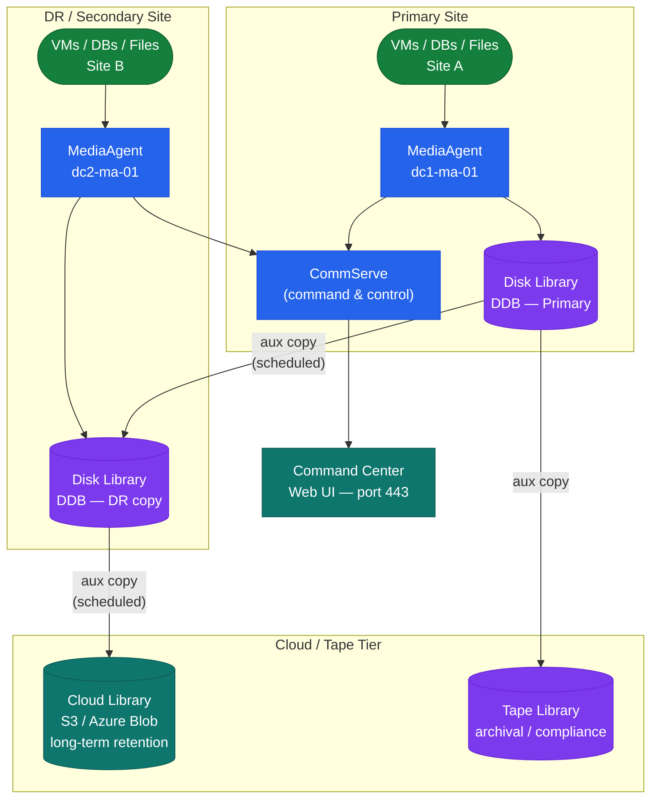

# Commvault — How It Works

## Overview

Commvault provides enterprise backup, recovery, replication, archive, and data protection management. The CommServe is the single command-and-control server — it holds the configuration database (SQL Server) mapping every backup job, client, and storage policy. MediaAgents perform data movement and host the Deduplication Database (DDB). Clients are the protected hosts (VMs, databases, filesystems).

## Component Topology

┌─────────────────────────────── Commvault — How It Works: Job Lifecycle ───────────────────────────────┐
│                                                                                                       │
│   ┌───────────────────────────────────────────────────────────────────────────────────────────────┐   │
│   │                                          Job Trigger                                          │   │
│   │         Backup initiated by schedule (storage policy window) or on-demand from GUI/CLI        │   │
│   │             CommServe Job Manager evaluates resource availability (MA, bandwidth)             │   │
│   │        Priority queue: queued if resource slots full; max concurrent jobs configurable        │   │
│   │             Subclient pre-post scripts execute before/after data collection phase             │   │
│   └───────────────────────────────────────────────────────────────────────────────────────────────┘   │
│                                                                                                       │
│    Step 1: CommServe assigns MediaAgent and dispatches job control packets to client iDA              │
│                                                                                                       │
│                                                   ▼                                                   │
│                                                                                                       │
│   ┌───────────────────────────────────────────────────────────────────────────────────────────────┐   │
│   │                                  Data Collection (Client iDA)                                 │   │
│   │          File iDA: changed-block tracking (CBT) via journal or full scan on first run         │   │
│   │                VM iDA: VMware CBT API or Hyper-V RCT for incremental VM backup                │   │
│   │         DB iDA: Oracle RMAN / SQL VDI / SAP BR*Tools integration for consistent backup        │   │
│   │          IntelliSnap: array-level snapshot via storage array API before data transfer         │   │
│   └───────────────────────────────────────────────────────────────────────────────────────────────┘   │
│                                                                                                       │
│    Step 2: iDA streams changed data to assigned MediaAgent over TCP 8403 data tunnel                  │
│                                                                                                       │
│                                                   ▼                                                   │
│                                                                                                       │
│   ┌───────────────────────────────────────────────────────────────────────────────────────────────┐   │
│   │                                   Data Pipeline (MediaAgent)                                  │   │
│   │           Deduplication: SHA-256 fingerprint per 64-128 KB block checked against DDB          │   │
│   │                 Compression: LZ4 or gzip applied to unique blocks before write                │   │
│   │                Encryption: AES-256 with key managed by CommServe Key Management               │   │
│   │               Chunks written to library (disk path, tape, or cloud object store)              │   │
│   │             Chunk metadata (size, offset, dedup refs) sent back to CommServe CSDB             │   │
│   └───────────────────────────────────────────────────────────────────────────────────────────────┘   │
│                                                                                                       │
│    Step 3: MA writes data to library; CommServe records metadata for catalog/restore                  │
│                                                                                                       │
│                                                   ▼                                                   │
│                                                                                                       │
│   ┌──────────────────────────────────────────────┐  ┌─────────────────────────────────────────────┐   │
│   │         Auxiliary Copy (Replication)         │  │                 Restore Flow                │   │
│   │       Aux copy job replicates primary        │  │        User browses CommCell catalog        │   │
│   │        copy to secondary (tape/cloud)        │  │      CS locates chunk locations in CSDB     │   │
│   │       MA-to-MA direct transfer (no CS)       │  │         MA reads chunks from library        │   │
│   │       Schedules: continuous or weekly        │  │      Data decompressed/decrypted in MA      │   │
│   │         Cloud: S3 / Azure Blob / GCS         │  │          Streams back to client iDA         │   │
│   └──────────────────────────────────────────────┘  └─────────────────────────────────────────────┘   │
│                                                                                                       │
│  Physical Infrastructure:                                                                             │
│  Data tunnel: client NIC → switch → backup VLAN → MA NIC (10/25 GbE recommended)                      │
│  Disk library: NAS share (NFS/CIFS) or SAN LUN formatted with NTFS/ext4                               │
│  Tape library: FC-attached via HBA; media management through CommServe tape manager                   │
│                                                                                                       │
│  Key terms:                                                                                           │
│                                                                                                       │
│  CBT            = Changed Block Tracking; OS/hypervisor mechanism to identify modified blocks         │
│  RCT            = Resilient Change Tracking; Hyper-V equivalent of VMware CBT                         │
│  DDB            = Deduplication Database; stores block fingerprints for dedup lookup                  │
│  IntelliSnap    = Pre-backup hardware snapshot at array level for application consistency             │
│  Chunk          = Variable-size data segment (64-128 KB) written as unit to library                   │
│  Aux Copy       = Secondary replication job moving primary copy to another destination                │
│  RMAN           = Oracle Recovery Manager; used by Oracle iDA for consistent DB backup                │
│  VDI            = SQL Server Virtual Device Interface; used by SQL iDA for hot backups                │
│  Subclient      = Named subset of client data with its own schedule and storage policy                │
│  Synthetic Full = Full backup built from incremental chains on MA (no client re-read)                 │
│  Job Queue      = CommServe priority queue; throttles concurrent jobs per resource                    │
│  Catalog        = CommCell browse index enabling file-level restore from any backup                   │
└───────────────────────────────────────────────────────────────────────────────────────────────────────┘

## MediaAgent and Deduplication

MediaAgent best practices:
- Deploy one MediaAgent per site for local backups
- Place DDB on SSD-backed storage — IOPS are critical for large dedup pools
- DDB free space: maintain ≥ 20% free at all times
- Single DDB should not manage more than 60 TB of deduped data

## Storage Library Types

| Type | Use Case | Notes |
|---|---|---|
| Disk Library (Dedup) | Primary backup target | SSD recommended for DDB |
| Cloud Library (S3) | Long-term retention | AWS S3, Azure Blob, GCP |
| Tape Library | Offsite/archival | Via SAN-attached or NDMP |
| Hyperscale X | Integrated scale-out | CommVault managed hardware; minimum 3-node cluster |

## Port Requirements

| Source | Destination | Port | Purpose |
|---|---|---|---|
| Clients | CommServe | 8400 | Job requests |
| Clients | MediaAgent | 8403 | Data movement |
| CommServe | MediaAgent | 8400 | Job orchestration |
| Browser (admin) | Command Center | 443 | Web UI |

## Multi-Site Topology

