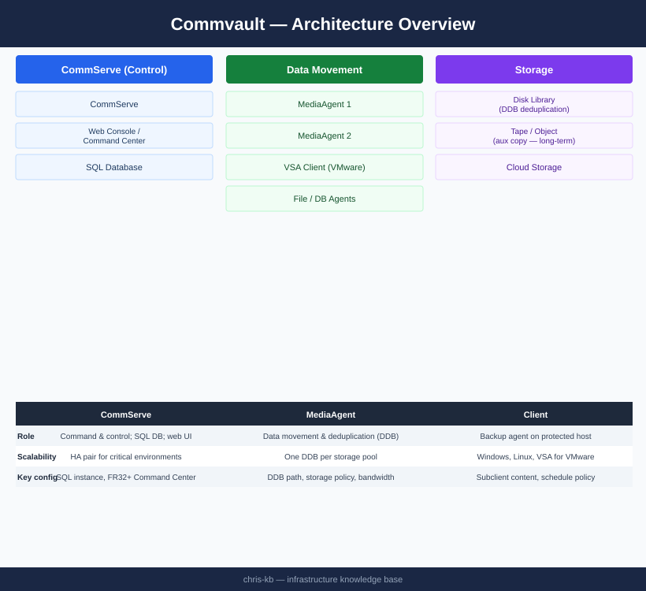
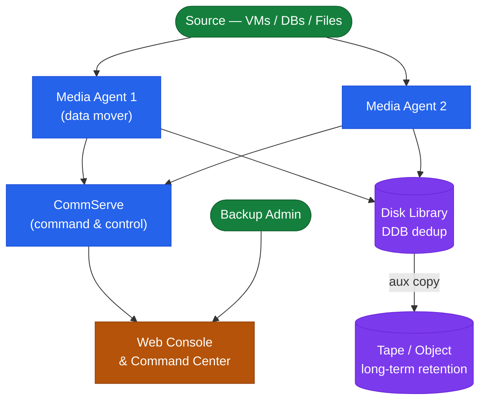

# Commvault — Architecture

Commvault architecture reference — CommServe topology, MediaAgent deduplication, storage library types, multi-site design, and port requirements.

<a class="kb-card" href="how-it-works/"><strong>How It Works</strong>CommServe topology, MediaAgent dedup, storage library types, multi-site design, and port requirements.</a>
<a class="kb-card" href="integrations/"><strong>Integrations</strong>VMware, cloud storage, NDMP, and third-party integrations.</a>
<a class="kb-card" href="design-standards/"><strong>Design Standards</strong>Naming conventions, retention schedule, DDB standards, and VMware backup settings.</a>

| Component | Role |
|---|---|
| CommServe | Command and control; SQL DB; HA pair for critical environments |
| MediaAgent | Data movement and deduplication (DDB); one DDB per storage pool |
| Client | Backup agent (Windows, Linux, VSA for VMware vSphere) |
| Command Center | Web UI (port 443); replaces legacy Java GUI in FR32+ |

