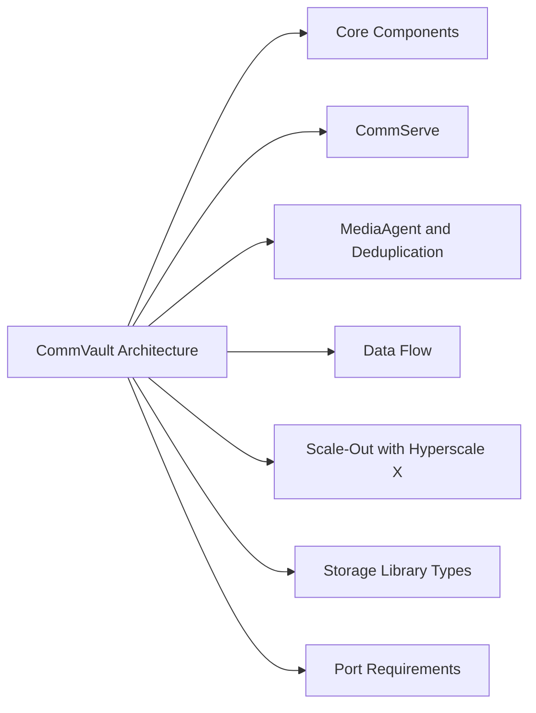

# CommVault Architecture



## Core Components

| Component | Role | Notes |
|---|---|---|
| CommServe | Management, scheduling, SQL DB | HA pair (passive standby) for critical environments |
| MediaAgent | Data movement, deduplication (DDB) | Multiple; one DDB per storage pool |
| Client | Backup agent (Windows, Linux, VSA) | VSA agent for VMware vSphere |
| Command Center | Web UI for administration | Replaces legacy Java GUI in FR32+ |
| Storage Policy | Job-to-storage mapping | Primary copy + secondary (offsite) copy |

## CommServe

The CommServe is the single most critical component — it holds the configuration database (SQL Server) that maps every backup job, client, and storage policy. CommServe failure means no new jobs run.

High availability options:
- **Passive standby**: Second CommServe instance with SQL log shipping; manual failover
- **CommServe Failover (active/passive HA)**: Automated failover via CommServe HA option

CommServe SQL backup should run every 4 hours:
```powershell
# Verify CommServe DB backup job status
qlist job -j CommServeDB_Backup -detail
```

## MediaAgent and Deduplication

MediaAgents perform data movement and host the Deduplication Database (DDB):

```
MediaAgent placement best practices:
  - Deploy one MediaAgent per site for local backups
  - Place DDB on SSD-backed storage — IOPS are critical for large dedup pools
  - DDB free space: maintain ≥ 20% free at all times
  - Single DDB should not manage more than 60TB of deduped data
```

Monitor DDB health via Command Center: Storage → Disk Libraries → DDB Status

## Data Flow

```
Client (backup agent)
    │
    ▼ CVLT network (TCP 8403)
MediaAgent (reads data, applies dedup, writes to storage)
    │
    ├── Primary copy (disk/dedup, performance tier)
    └── Secondary copy (offsite/cloud/tape, retention tier)
    │
CommServe (orchestrates job, tracks metadata in SQL DB)
```

## Scale-Out with Hyperscale X

Hyperscale X integrates CommServe + MediaAgent + storage into scale-out nodes:
- Minimum 3-node cluster; add nodes for capacity/throughput
- Built-in object storage using erasure coding
- Managed via Command Center — no separate storage administration

## Storage Library Types

| Type | Use Case | Notes |
|---|---|---|
| Disk Library (Dedup) | Primary backup target | SSD recommended for DDB |
| Cloud Library (S3) | Long-term retention | AWS S3, Azure Blob, GCP |
| Tape Library | Offsite/archival | Via SAN-attached or NDMP |
| Hyperscale X | Integrated scale-out | CommVault managed hardware |

## Port Requirements

| Source | Destination | Port | Purpose |
|---|---|---|---|
| Clients | CommServe | 8400 | Job requests |
| Clients | MediaAgent | 8403 | Data movement |
| CommServe | MediaAgent | 8400 | Job orchestration |
| Browser (admin) | Command Center | 443 | Web UI |
