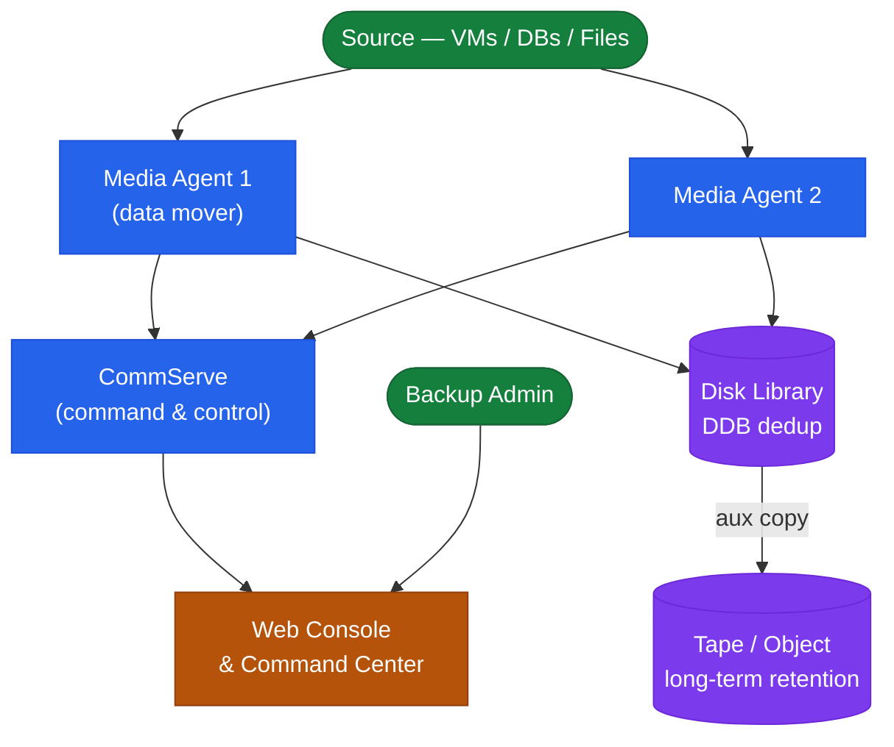

# Commvault — Architecture Overview

Commvault provides enterprise backup, recovery, replication, archive, and data protection management.

## Component Topology



## Data Flow

```
Client (backup agent)
    │
    ▼ CVLT network (TCP 8403)
MediaAgent (reads data, applies dedup, writes to storage)
    │
    ├── Primary copy (disk/dedup, performance tier)
    └── Secondary copy (offsite/cloud/tape, retention tier)
    │
CommServe (orchestrates job, tracks metadata in SQL DB)
```

## Scale-Out with Hyperscale X

Hyperscale X integrates CommServe + MediaAgent + storage into scale-out nodes:
- Minimum 3-node cluster; add nodes for capacity/throughput
- Built-in object storage using erasure coding
- Managed via Command Center — no separate storage administration

## Port Requirements

| Source | Destination | Port | Purpose |
|---|---|---|---|
| Clients | CommServe | 8400 | Job requests |
| Clients | MediaAgent | 8403 | Data movement |
| CommServe | MediaAgent | 8400 | Job orchestration |
| Browser (admin) | Command Center | 443 | Web UI |
