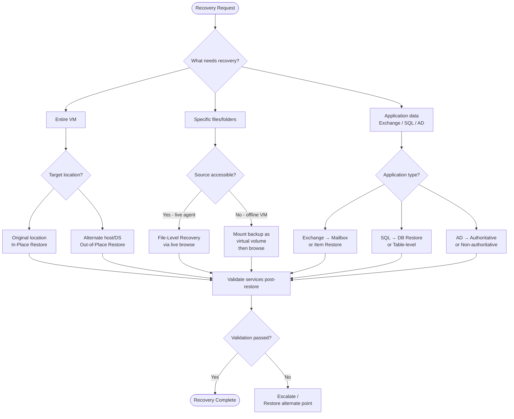

# Commvault — Backup & Restore


<div class="kb-summary">
Backup & Restore reference covering Backup Types, Backup Job Execution, Restore Types, DR Copy Verification, Restore Decision Flowchart and 1 more sections.
</div>

## Backup Types

Commvault supports a tiered backup schedule model. Understanding backup types is essential for designing RPO-aligned protection policies.

| Backup Type | Data Written | Basis | Typical Frequency |
|---|---|---|---|
| **Full** | All data in the subclient | Independent | Weekly |
| **Incremental** | Changed since last backup (any type) | Previous backup | Daily |
| **Differential** | Changed since last full | Last full | Optional mid-week |
| **Synthetic Full** | Merged virtual full from existing media | Previous full + incrementals | Weekly (replaces full) |
| **Transaction Log** | DB transaction logs only | Last log backup | Every 15–60 min |

Synthetic Full backups avoid reading from the production source — the CommServe reconstructs the full from existing backup streams. Use these to reduce backup window impact.

---

## Backup Job Execution

### Via CommCell Console (GUI)

1. Open **CommCell Console** → expand the client tree.
2. Navigate to **Client > Agent > Backup Set > Subclient**.
3. Right-click the subclient → **Backup**.
4. Select backup type and confirm.
5. Monitor the job in **Job Controller** (Ctrl+J).

For a scheduled policy:

1. Right-click the subclient → **Properties** → **Schedules** tab.
2. Add or modify a schedule → assign backup type, frequency, and storage policy.

### Via REST API

Commvault exposes a full REST API (v4 preferred for CV 2024+).

**Authenticate:**

```bash
curl -s -X POST "https://commserve.example.com/webconsole/api/Login" \
  -H "Content-Type: application/json" \
  -d '{"username":"admin","password":"<password>"}' | jq '.token'
```
```
┌────────────────────────────── Commvault Backup and Restore — Procedures ──────────────────────────────┐
│                                                                                                       │
│   ┌──────────────────────────────────────────────┐  ┌─────────────────────────────────────────────┐   │
│   │               Backup Job Types               │  │                Restore Types                │   │
│   │      Full: all data in subclient scope       │  │      In-place: restore to original path     │   │
│   │       Incremental: changed since last        │  │     Out-of-place: alternate path/client     │   │
│   │       Differential: changed since Full       │  │     Cross-client: different target host     │   │
│   │     Synthetic Full: built on MA from inc     │  │    Granular: item-level from VM/Exchange    │   │
│   │     Snap backup: array snapshot + backup     │  │     Live Browse: mount backup for reads     │   │
│   └──────────────────────────────────────────────┘  └─────────────────────────────────────────────┘   │
│                                                                                                       │
│    Full backup cycle: Full (weekly) → Incrementals (daily) → Synthetic Full (next week)               │
│                                                                                                       │
│                                                   ▼                                                   │
│                                                                                                       │
│   ┌───────────────────────────────────────────────────────────────────────────────────────────────┐   │
│   │                               On-Demand Backup (Command Center)                               │   │
│   │              1. Navigate: Protect → Virtualization (or File Servers / Databases)              │   │
│   │            2. Select subclient → right-click → Backup Now → choose Full/Incremental           │   │
│   │             3. Monitor job in Job Activity pane; check logs if status ≠ Completed             │   │
│   │                4. Verify protected size and dedup savings in job summary report               │   │
│   │            5. CLI: qoperation execschedule -clientName HOST -subclientName default            │   │
│   └───────────────────────────────────────────────────────────────────────────────────────────────┘   │
│                                                                                                       │
│    Restore: right-click subclient → Browse and Restore → select files → Restore                       │
│                                                                                                       │
│                                                   ▼                                                   │
│                                                                                                       │
│   ┌───────────────────────────────────────────────────────────────────────────────────────────────┐   │
│   │                                      Restore Verification                                     │   │
│   │         After restore: verify file checksums, check application startup, validate data        │   │
│   │            VM restore: power on, run OS checks, verify application services running           │   │
│   │            DB restore: validate row counts, run DBCC CHECKDB (SQL) or RMAN validate           │   │
│   │           Scheduled restore tests: monthly verified restore to isolated environment           │   │
│   │           SLA reporting: track %backup success; target ≥ 99% weekly completion rate           │   │
│   └───────────────────────────────────────────────────────────────────────────────────────────────┘   │
│                                                                                                       │
│  Physical Infrastructure:                                                                             │
│  Restore target must have iDA agent; network path from MA to target must be open                      │
│  VM restores: target datastore must have sufficient free space (source VM size + 20%)                 │
│                                                                                                       │
│  Key terms:                                                                                           │
│                                                                                                       │
│  Synthetic Full = Full backup constructed on MA from existing incrementals; no client I/O             │
│  Snap Backup    = IntelliSnap array-level snapshot followed by backup-from-snap to library            │
│  Live Browse    = Mount backup copy as NFS/CIFS share for direct file browsing                        │
│  Granular Recov = Item-level restore (e.g., single email, SQL row, VM disk file)                      │
│  DBCC CHECKDB   = SQL Server command to verify database consistency after restore                     │
│  Browse Window  = Time range visible in CommCell browse based on retention settings                   │
│  Cross-client   = Restore to a different machine than the original backup source                      │
│  Job Activity   = Real-time view of all running, queued, and recently completed jobs                  │
│  Protected Size = Total data covered by backup policy on a given client/subclient                     │
│  qoperation     = CLI to trigger on-demand backup: execschedule or backup subcommand                  │
│  SLA Report     = Commvault report showing backup success rate vs configured targets                  │
│  Retention Copy = Backup copy kept for extended period (monthly/yearly) on tape/cloud                 │
└───────────────────────────────────────────────────────────────────────────────────────────────────────┘
```
```sql

### File-Level Recovery (Guest Files)

Mounts the backup as a virtual volume and presents individual files.

1. Right-click the VM → **Browse and Restore** → **Guest Files and Folders**.
2. Browse to the path, select files → **Restore**.
3. Choose destination: original location or alternate path/client.

### In-Place Restore

Overwrites the existing data at the original location. Requires the production VM/volume to be offline or protected by an exclusion list.

```text
Subclient → Restore → In-Place → Overwrite existing data: Yes
```

### Out-of-Place Restore

Restores to an alternate destination — different VM, datastore, or file path.

```text
Subclient → Restore → Out-of-Place → Specify destination client and path
```

---

## DR Copy Verification

Commvault DR copies (secondary/tertiary storage) should be validated regularly.

**Verify a DR copy:**

1. **Storage** → **Storage Policies** → select the policy.
2. **Copies** tab → right-click the DR copy → **Validate Copy**.
3. Select the backup jobs or date range to validate.
4. Review the validation report for missing, corrupt, or aged jobs.

**Command line (via `qoperation`):**

```bash
qoperation execscript -sn QS_ValidateCopy -si "StoragePolicyName" -si "CopyName"
```

---

## Restore Decision Flowchart



---

## Post-Restore Validation Checklist

| # | Check | Method |
|---|---|---|
| 1 | VM/server powered on and reachable | `ping` / vCenter console |
| 2 | OS boots without errors | Console screenshot |
| 3 | Services started (application, DB) | `Get-Service` / `systemctl status` |
| 4 | Data integrity verified | Application-level query / checksums |
| 5 | Backup agent communicating | CommCell Console → client status |
| 6 | Network IP / DNS correct | `ipconfig /all` / `nslookup` |
| 7 | Antivirus / EDR re-enrolled | AV console check |
| 8 | Backup job resumed on schedule | CommCell → Job History next day |
| 9 | DR copy validated post-restore | Storage Policy → Validate Copy |
| 10 | Recovery documented in ITSM | Incident/change ticket updated |
