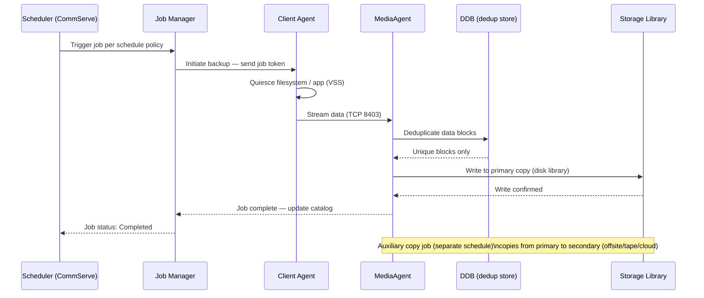
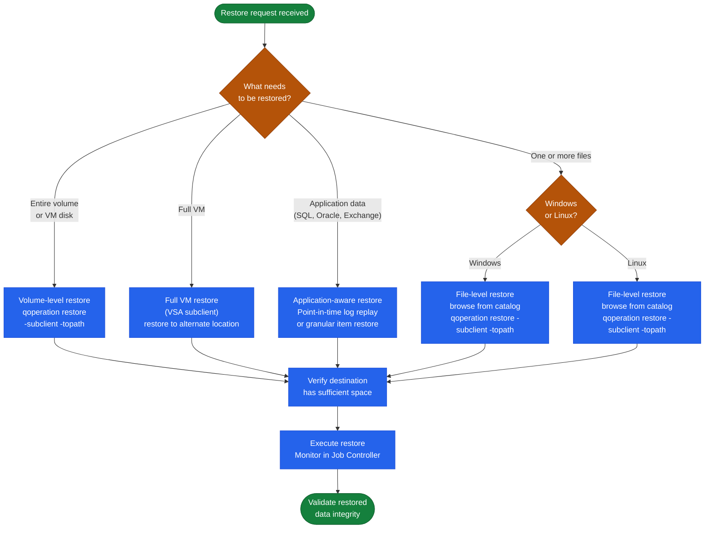

# Commvault — CLI Reference

## Backup Job Lifecycle

From schedule trigger to media write, every CommVault backup job moves through a defined sequence of states.


┌──────────────────────── Commvault CLI Reference — qoperation, qlist, qmodify ─────────────────────────┐
│                                                                                                       │
│   ┌──────────────────────────────────────────────┐  ┌─────────────────────────────────────────────┐   │
│   │           qoperation — Job Control           │  │              qlist — Read/Query             │   │
│   │         execschedule: run backup now         │  │       qlist jobs: show all active jobs      │   │
│   │        restore: initiate restore job         │  │        qlist client: list all clients       │   │
│   │        auxcopy: trigger aux copy job         │  │       qlist subclient: list subclients      │   │
│   │         release: release held media          │  │      qlist storage: disk/tape libraries     │   │
│   │          kill: abort a running job           │  │      qlist jobdetails: verbose job info     │   │
│   └──────────────────────────────────────────────┘  └─────────────────────────────────────────────┘   │
│                                                                                                       │
│    qoperation and qlist run on CommServe; add -cs <host> for remote CommServe target                  │
│                                                                                                       │
│                                                   ▼                                                   │
│                                                                                                       │
│   ┌──────────────────────────────────────────────┐  ┌─────────────────────────────────────────────┐   │
│   │       qmodify — Configuration Changes        │  │                REST API (v4)                │   │
│   │       subclient: update content paths        │  │     Base URL: https://CS/webconsole/api     │   │
│   │        schedule: change backup window        │  │        Auth: POST /Login → authtoken        │   │
│   │        storagepolicy: edit retention         │  │        GET /Client: list all clients        │   │
│   │        client: enable/disable backup         │  │       POST /CreateTask: trigger backup      │   │
│   │        mediaagent: enable/disable MA         │  │        GET /Job/{id}: poll job status       │   │
│   └──────────────────────────────────────────────┘  └─────────────────────────────────────────────┘   │
│                                                                                                       │
│    Common qoperation examples:                                                                        │
│      qoperation execschedule -clientName myhost -subclientName default -backuptype full               │
│      qoperation restore -clientName myhost -subclientName default -fromtime "01/01/2026"              │
│      qlist jobs -jobtype backup -status running                                                       │
│      qmodify subclient -clientName myhost -subclientName default -content /data/new                   │
│                                                                                                       │
│  Physical Infrastructure:                                                                             │
│  CLI runs on CommServe host; PATH must include CV installation bin directory                          │
│  REST API accessible from any host with HTTPS 443 reach to CommServe                                  │
│                                                                                                       │
│  Key terms:                                                                                           │
│                                                                                                       │
│  qoperation     = Command-line tool for submitting Commvault operations from shell/scripts            │
│  qlist          = Read-only query tool for listing CommCell objects and job status                    │
│  qmodify        = Configuration change tool for subclients, schedules, and policies                   │
│  execschedule   = qoperation subcommand to immediately run a scheduled backup                         │
│  authtoken      = Session token returned by REST /Login; included in all API headers                  │
│  CreateTask     = REST API endpoint for submitting backup, restore, and aux copy jobs                 │
│  -cs flag       = Specifies remote CommServe hostname for cross-CS CLI operations                     │
│  backuptype     = full | incremental | differential | synthetic_full                                  │
│  Job ID         = Integer assigned to each job; used for status polling and log lookups               │
│  auxcopy        = qoperation subcommand to immediately trigger a secondary copy job                   │
│  jobdetails     = qlist subcommand returning verbose per-phase timing and error codes                 │
│  CV Python SDK  = Commvault.sdk Python package wrapping REST API with OOP interface                   │
└───────────────────────────────────────────────────────────────────────────────────────────────────────┘
```

---

## Backup Operations

Trigger backups manually or validate subclient configuration.

```bash
# Run a full backup on a subclient
qoperation backup -subclient <name> -backuptype full

# Run an incremental backup
qoperation backup -subclient <name> -backuptype incremental

# Run backup for all subclients in a client
qoperation backup -c <client_name> -a

# List subclients for a client
qlist subclient -c <client_name>
```

---

## Restore Operations

### Restore Workflow Decision Tree



Always verify destination and time range before executing a restore.

```bash
# Restore to original location at a point in time
qoperation restore -subclient <name> -totime "2024-01-01 12:00:00"

# Restore to alternate path
qoperation restore -subclient <name> -topath /restore/destination

# List recent restore jobs
qlist jobs -d 1 -restore
```

---

## Clients & Policies

Manage client registration, storage policies, and schedules.

```bash
# List all clients
qlist client

# List storage policies
qlist storagepolicy

# List schedules
qlist schedule

# List deduplication databases
qlist ddb

# Check client connectivity readiness
qoperation execscript -sn QS_CheckReadiness

# List backup sets for a client
qlist backupset -c <client_name>
```

---

## CommServe Maintenance

Database backup and health tasks for CommServe.

```bash
# Trigger CommServe database backup
qsystem dbbackup

# Commit pending configuration changes
qcommit

# Check CommServe services status
qlist services

# Check license usage
qlist license
```

---

## REST API

All operations are also available via REST API for automation.

```bash
# Authenticate and get token
curl -X POST "https://<CommServe>/webconsole/api/Login" \
  -H "Content-Type: application/json" \
  -d '{"username":"admin","password":"<password>","domain":""}'

# List all clients
curl -X GET "https://<CommServe>/webconsole/api/Client" \
  -H "Authtoken: <token>"

# List active jobs
curl -X GET "https://<CommServe>/webconsole/api/Job?jobFilter=Active" \
  -H "Authtoken: <token>"
```
