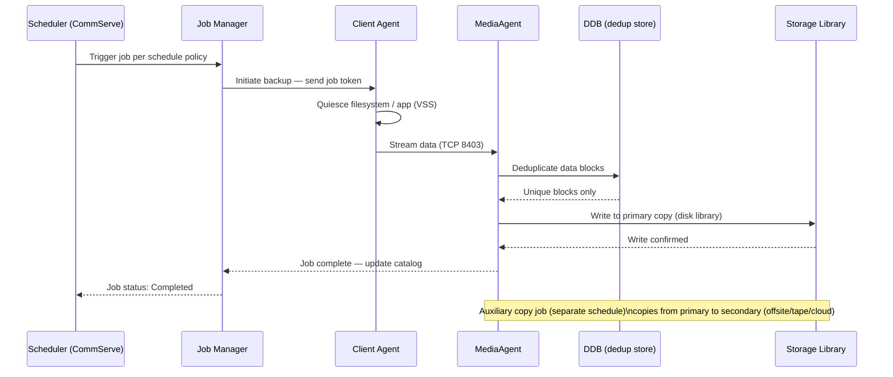

# Commvault — CLI Reference

## Backup Job Lifecycle

From schedule trigger to media write, every CommVault backup job moves through a defined sequence of states.



CommVault provides the `qcommand` CLI toolkit installed with CommServe and MediaAgent. The `q*` commands connect to CommServe using OS credentials or an explicit login. The REST API base URL is `https://<CommServeHostname>/webconsole/api/` and requires token-based authentication via `POST /Login`.

---

## Authentication

Authenticate before running any CLI operations. On Windows run from `C:\Program Files\Commvault\ContentStore\Base\`. On Linux, commands are in `/opt/commvault/Base/`.

```bash
# Login to CommServe
qlogin -cs <CommServe> -u admin

# Login non-interactively
qlogin -cs <CommServe> -u admin -p <password>

# Verify current session
qlist userid

# Logout
qlogout
```

---

## Jobs

Jobs are the core operational unit. Monitor with `qlist jobs`, control with `qoperation`.

```bash
# List active jobs
qlist jobs

# List jobs from last 24 hours
qlist jobs -d 1

# List failed jobs from last 24 hours
qlist jobs -d 1 -failed

# Kill a running job
qdelete job -j <jobid>

# List jobs for a specific client
qlist jobs -c <client_name>
```

---

## Backup Operations

Trigger backups manually or validate subclient configuration.

```bash
# Run a full backup on a subclient
qoperation backup -subclient <name> -backuptype full

# Run an incremental backup
qoperation backup -subclient <name> -backuptype incremental

# Run backup for all subclients in a client
qoperation backup -c <client_name> -a

# List subclients for a client
qlist subclient -c <client_name>
```

---

## Restore Operations

### Restore Workflow Decision Tree


Always verify destination and time range before executing a restore.

```bash
# Restore to original location at a point in time
qoperation restore -subclient <name> -totime "2024-01-01 12:00:00"

# Restore to alternate path
qoperation restore -subclient <name> -topath /restore/destination

# List recent restore jobs
qlist jobs -d 1 -restore
```

---

## Clients & Policies

Manage client registration, storage policies, and schedules.

```bash
# List all clients
qlist client

# List storage policies
qlist storagepolicy

# List schedules
qlist schedule

# List deduplication databases
qlist ddb

# Check client connectivity readiness
qoperation execscript -sn QS_CheckReadiness

# List backup sets for a client
qlist backupset -c <client_name>
```

---

## CommServe Maintenance

Database backup and health tasks for CommServe.

```bash
# Trigger CommServe database backup
qsystem dbbackup

# Commit pending configuration changes
qcommit

# Check CommServe services status
qlist services

# Check license usage
qlist license
```

---

## REST API

All operations are also available via REST API for automation.

```bash
# Authenticate and get token
curl -X POST "https://<CommServe>/webconsole/api/Login" \
  -H "Content-Type: application/json" \
  -d '{"username":"admin","password":"<password>","domain":""}'

# List all clients
curl -X GET "https://<CommServe>/webconsole/api/Client" \
  -H "Authtoken: <token>"

# List active jobs
curl -X GET "https://<CommServe>/webconsole/api/Job?jobFilter=Active" \
  -H "Authtoken: <token>"
```
