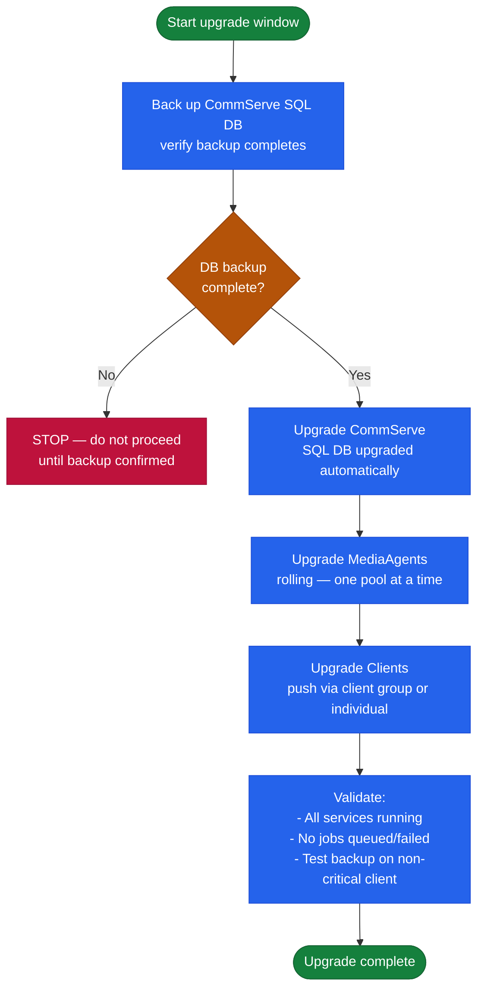

# Commvault — Install & Upgrade

## Release Cadence

CommVault releases Feature Releases (FRs) quarterly, each receiving Maintenance Releases (MRs/SPs) for approximately 12 months post-GA.

| Release Type | Cadence | Support Window |
|---|---|---|
| Feature Release (FR) | Quarterly | ~12 months of maintenance releases |
| Maintenance Release (MR) | As needed | Cumulative for the FR branch |
| Hotfix | On demand | Targeted; requires SR for delivery |

Check current version EOL: [documentation.commvault.com](https://documentation.commvault.com) → Product Lifecycle.

## Upgrade Order

### CommVault Upgrade Dependency Chain


┌───────────────────────────── Commvault Install and Upgrade — Procedures ──────────────────────────────┐
│                                                                                                       │
│   ┌──────────────────────────────────────────────┐  ┌─────────────────────────────────────────────┐   │
│   │               New Installation               │  │            Upgrade (Service Pack)           │   │
│   │1. Download CV software from cloud.commvault.c│  │   1. Download SP from cloud.commvault.com   │   │
│   │       2. Run prerequisite checker tool       │  │        2. Backup CSDB before upgrade        │   │
│   │     3. Install CommServe first (SQL req)     │  │          3. Upgrade CommServe first         │   │
│   │         4. Install MediaAgents next          │  │         4. Upgrade MediaAgents next         │   │
│   │     5. Push client agents from CommServe     │  │       5. Push agent updates to clients      │   │
│   └──────────────────────────────────────────────┘  └─────────────────────────────────────────────┘   │
│                                                                                                       │
│    Always upgrade CommServe before MAs and Clients; never skip more than 2 SP versions                │
│                                                                                                       │
│                                                   ▼                                                   │
│                                                                                                       │
│   ┌───────────────────────────────────────────────────────────────────────────────────────────────┐   │
│   │                                     Pre-Upgrade Checklist                                     │   │
│   │        [ ] Full CSDB backup completed and verified (SQL backup + CV CommServe DR sync)        │   │
│   │          [ ] All running jobs quiesced or completed; maintenance window communicated          │   │
│   │        [ ] Prerequisite checker: .NET version, SQL version, OS patch level, disk space        │   │
│   │           [ ] Rollback plan documented: restore CSDB SQL backup, reinstall prior SP           │   │
│   │        [ ] Post-upgrade tests: run backup and restore job on representative subclients        │   │
│   └───────────────────────────────────────────────────────────────────────────────────────────────┘   │
│                                                                                                       │
│  Physical Infrastructure:                                                                             │
│  Upgrade requires CommServe downtime (~30-90 min); plan during off-peak window                        │
│  MA upgrade can be pushed silently from CommServe; minimal impact to running jobs                     │
│  Client agent upgrades: push from CommCell Console or deploy via software distribution                │
│                                                                                                       │
│  Key terms:                                                                                           │
│                                                                                                       │
│  Service Pack   = Commvault cumulative patch bundle (SP30, SP31, SP32, SP33...)                       │
│  SP Hotfix      = Targeted fix for critical issues between Service Pack releases                      │
│  Prereq Checker = Commvault tool validating environment readiness before installation                 │
│  Silent Install = MSI-based client push from CommServe with no user interaction                       │
│  CSDB Backup    = SQL Server backup of CommCell database; critical upgrade prerequisite               │
│  Rollback       = Restore prior SP by reinstalling from backup media + CSDB SQL restore               │
│  Upgrade Order  = CommServe → MediaAgents → Clients (never reverse this sequence)                     │
│  cloud.commvault.com = Commvault download portal for software and service packs                       │
│  CommServe Upgrade = Core upgrade updating SQL schema and all CV services simultaneously              │
│  iDA Upgrade    = Client-side agent update; backward compatible with CS one SP behind                 │
│  Maintenance Win = Scheduled downtime window communicated to stakeholders for upgrades                │
│  Post-Upgrade   = Mandatory validation: run backup + restore test before returning to prod            │
└───────────────────────────────────────────────────────────────────────────────────────────────────────┘
```

Verify in Command Center: Jobs → Active Jobs — confirm no jobs stuck in queued state.

## CommVault to Metallic SaaS Migration

For cloud migration of on-premises CommVault to Metallic (SaaS):
1. Deploy Metallic Gateway appliance or Cloud Connector
2. Re-register existing clients to Metallic CommCell
3. Initial full backup to Metallic; daily incrementals going forward
4. Decommission on-premises CommServe after retention requirements satisfied

## EOL Tracking

| Item | Action |
|---|---|
| FR version | Alert when within 60 days of EOL; upgrade planning starts 90 days before |
| Windows Server OS (CommServe host) | Align CommServe OS lifecycle with CommVault support matrix |
| SQL Server (CommServe DB) | Track SQL Server EOL; upgrade requires CommVault testing |
| Hyperscale X firmware | Annual review against CommVault recommended firmware versions |
