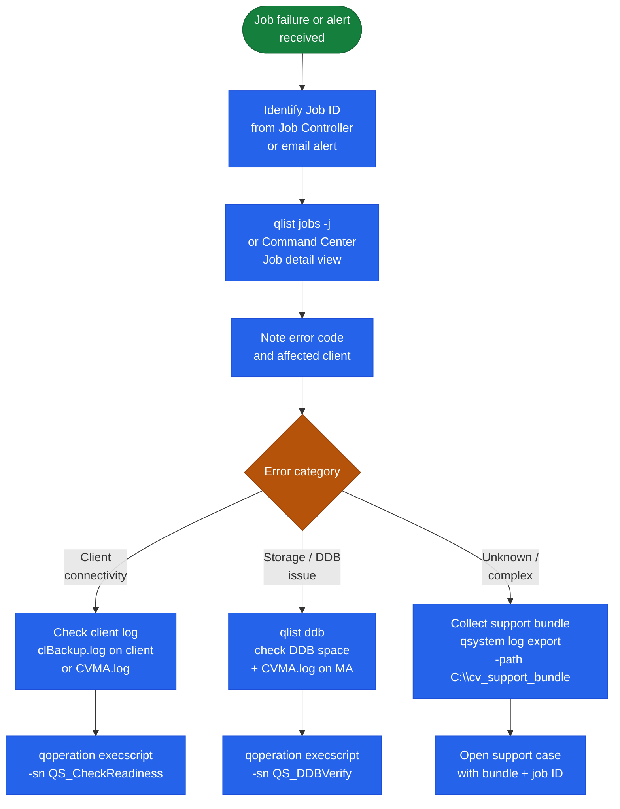

# Commvault — Diagnostics

## Diagnostic Flow



## Support Bundle Collection

Before opening a support case, collect the support bundle on the CommServe:

```bash
# On CommServe (run as administrator)
qsystem log export -path C:\cv_support_bundle

# Alternatively via Command Center:
# Settings > Support > Generate Support Bundle
```
