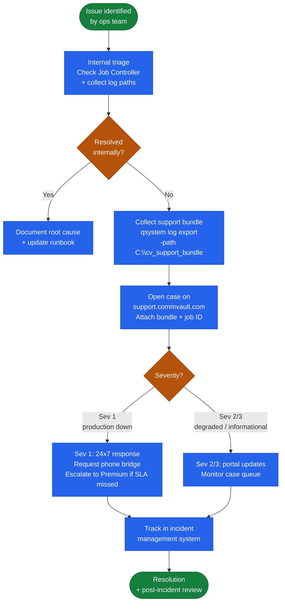

# Commvault — Escalation

CommVault support is accessed via the CommVault Support Portal at support.commvault.com. Cases are raised by selecting the product component, severity, and providing initial diagnostic information. Before opening a case, collect the support bundle using the `qsystem log export` command on the CommServe — this packages CommServe, MediaAgent, and client logs into a single archive for upload. Metallic SaaS support escalation follows a separate path via the Metallic portal for cloud-managed deployments.

**Collecting the diagnostic bundle**

```bash
# On CommServe (run as administrator)
qsystem log export -path C:\cv_support_bundle

# Alternatively via Command Center:
# Settings > Support > Generate Support Bundle
```

**Required information for a support case**

- CommServe version and Feature Release number (Command Center > Settings > Version)
- MediaAgent version(s) for affected storage pools
- Failing job ID(s) and error code from the Job Controller
- Client name, OS version, and CommVault agent version
- Storage policy and subclient configuration (screenshots or export)
- Log bundle from `qsystem log export`

**Support tiers**

| Tier | Sev 1 SLA | Availability | Notes |
|---|---|---|---|
| Standard | 4 hours | Business hours | Per-incident or subscription |
| Priority | 2 hours | 24x7 | Enterprise subscription |
| Premium | 1 hour | 24x7 | TAM + proactive health checks |

## Escalation Workflow


