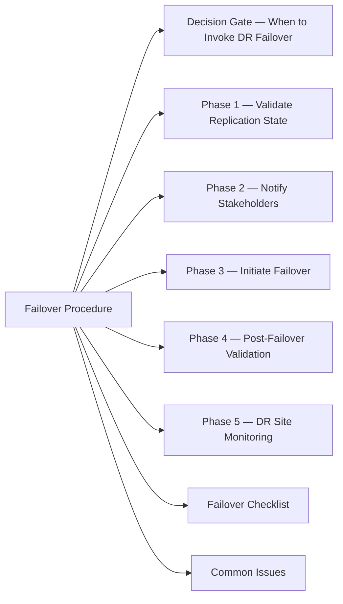

# Disaster Recovery Failover Procedure

A controlled process for moving production workloads to the recovery site during an outage or declared disaster.



## Decision Gate — When to Invoke DR Failover

Before initiating failover, confirm:
- [ ] Primary site is confirmed unavailable or severely degraded (not a transient blip)
- [ ] Incident severity declared by management or incident commander
- [ ] RPO/RTO requirements reviewed — is failover the right action vs. wait-and-restore?
- [ ] Change authority (CAB emergency or delegated approver) has approved

## Phase 1 — Validate Replication State

**SRDF (PowerMax):**
```bash
symrdf -g <rdfgroup> query
# Confirm R2 volumes are Synchronized or Consistent before failing over
```

**NetApp SnapMirror:**
```bash
snapmirror show -destination-path <svm>:<vol>
# Confirm relationship is SnapMirrored (not broken or lagging >RPO)
```

**Veeam — check last successful backup:**
Navigate to: Home → Jobs → check Last Result and Last Run columns

**VMware SRM:**
- Protection Groups → check replication state of all protected VMs
- Recovery Plan → Review plan before executing

## Phase 2 — Notify Stakeholders

- Application owners (impact notification)
- Service desk (user-facing message, expected RTO)
- Management chain
- Vendor TAC if array/fabric fault is involved

## Phase 3 — Initiate Failover

### Storage Failover

**NetApp SnapMirror — break and make R2 writeable:**
```bash
# Break mirror (R2 becomes writable, R1 no longer replicating)
snapmirror break -destination-path <dr-svm>:<dr-vol>

# Verify
snapmirror show -destination-path <dr-svm>:<dr-vol>
# State should show: Broken-off
```

**SRDF — failover to R2:**
```bash
# Planned failover (R1 accessible)
symrdf -g <rdfgroup> failover -force

# Unplanned (R1 unavailable)
symrdf -g <rdfgroup> failover -noprompt -immediate
```

### VM Failover — VMware SRM

1. vCenter → Site Recovery → Recovery Plans
2. Select plan → **Run** → choose **Disaster Recovery** (not test)
3. Monitor progress in Recovery Steps panel
4. SRM will: power off protected VMs at primary, register VMs at recovery, start VMs in priority order

### VM Failover — Manual (PowerCLI)

```powershell
# Register and power on VM from replica datastore
$ds = Get-Datastore -Name "<dr-datastore>"
$vmx = "[<dr-datastore>] <vm-name>/<vm-name>.vmx"
$vm = New-VM -VMFilePath $vmx -VMHost (Get-VMHost "<dr-host>") -Datastore $ds -RunAsync
Start-VM -VM "<vm-name>"
```

## Phase 4 — Post-Failover Validation

```bash
# Confirm storage volumes visible to DR hosts
multipath -ll
lsblk

# Confirm filesystems mounted
df -h | grep <expected-mount>

# Start application services
systemctl start <service>
systemctl status <service>
```

**Application health checks:**
```bash
# HTTP health check
curl -vk https://<dr-app-url>/health

# DB connectivity
psql -h <dr-db-host> -U <user> -c "SELECT 1;"
```

**Windows:**
```powershell
# Confirm services started
Get-Service | Where-Object { $_.Status -ne 'Running' -and $_.StartType -eq 'Automatic' }

# Test connectivity
Test-NetConnection -ComputerName <dr-app-server> -Port 443
```

## Phase 5 — DR Site Monitoring

- Update monitoring targets to DR site IPs/hostnames
- Confirm alerts are firing to correct on-call
- Validate backup jobs are redirected to DR protection

## Failover Checklist

- [ ] DR decision approved by incident commander
- [ ] Replication state validated — acceptable lag
- [ ] Stakeholders notified (users, app owners, management)
- [ ] Storage mirrors broken / SRDF failed over
- [ ] VMs registered and powered on at DR site
- [ ] Applications responding on DR endpoints
- [ ] DNS cutover completed (if required)
- [ ] Monitoring updated to DR targets
- [ ] RTO met — time from decision to application available documented
- [ ] Incident ticket updated with timeline

## Common Issues

| Issue | Check | Action |
|---|---|---|
| SnapMirror lag > RPO | Last successful transfer time | Break anyway; note data loss window in ticket |
| SRDF volumes not in sync | R-link state | Check SRDF link; break and activate R2 |
| VMs fail to start at DR | Datastore not presented | Present LUN to DR hosts; rescan |
| Application config points to primary | App config files | Update DB/app configs to DR endpoints |
| DNS still resolving to primary | TTL cached | Flush DNS or update DNS at registrar/AD |
